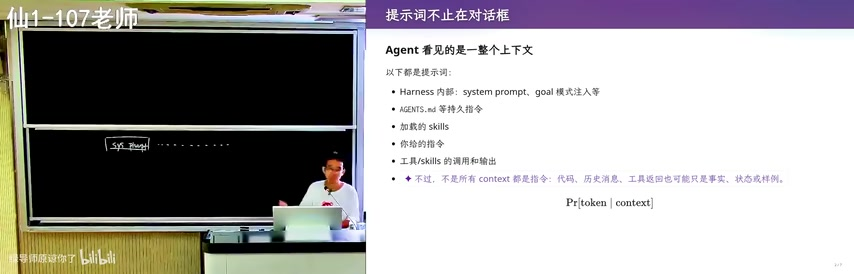
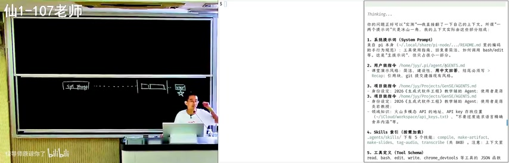

## 一、课程背景：站在历史的交叉路口

我们站在一个非常重要的交叉路口。作为Computer Science的学生，从进入学校开始，就需要理解计算机发展的历史。在计算机发展历史上，经历了多次非常重要的变革，核心都是**把昂贵的能力变成日用品**。

### 1.1 四次技术革命

| 时间 | 事件 | 革命性变化 |
|------|------|-----------|
| 1975年 | PC（Altair 8800） | 计算能力从大型机房→个人桌面 |
| 1993年 | 互联网（Mosaic浏览器） | 信息获取从图书馆→每个人的屏幕 |
| 2007年 | 移动互联网（iPhone） | 联网能力从固定地点→随时随地 |
| 2022年 | AI（ChatGPT） | 智能能力从专家团队→每个普通人 |

**WHY：** 真正的拐点不是"机器又强了一点"，而是某种昂贵能力突然变成了日用品。这就是为什么在当前人类命运的交叉路口，需要一个非常实验性的课程——我们正在经历AI带来的能力民主化。

> 老师回忆：当年装了ICQ软件，腾讯的山寨版还叫OICQ，后来改成了QQ。那时候可以随机加到世界上另一端的人，对方是native speaker，打字非常快，而我们只会hello、good morning。

### 1.2 AI时代的焦虑

AI是人类历史上增长最快的产品。在这样的背景下，老师决定开设这门web coding课程。

#### 焦虑一：AI替我上大学

- 老师用豆包出题
- 大家用豆包做作业
- **只有学生没有受到训练**

现在的coding很厉害，所有作业可以直接丢到Codex里。比如蒋老师的操作系统课第八个实验，甚至不需要复制粘贴链接，直接说"那个蒋老师的操作系统课，第八个实验能不能帮我实现"就结束了。

#### 焦虑二：学会的东西AI都会做

有些同学延续了中学时很听老师话的状态，老师说什么就做什么，每堂课认真听，作业认真做。结果4年毕业时发现：**你确实学会了点什么，但你学会的东西AI都会做**。

#### 焦虑三：简历同质化

老师展示了一份"完美简历"：
- CCF期刊论文
- Accepted
- 一堆实习、奖项、论文

**但这份简历被老师评为零分简历**，因为：
- 没有额外的信息
- 没有GitHub链接
- 没有个人主页
- 没有preprint

更糟糕的是：老师收到过无数份这样的简历。**你和你的竞争者已经无法区分了**。

---

## 二、课程定位：软件工程实践课

这门课不是传统的"听课型"课程，而是一门**软件工程实践课**。目标是带大家找回web coding的快乐，在快乐中理解软件工程是怎么工作的，能做出一些有趣的东西。

### 2.1 为什么是web coding

老师说："我觉得在web coding中我得到了很多的快乐，然后在这个快乐当中，你们又能一定程度上去理解软件工程是怎么工作的。"

对于简历来说，有一篇发表论文可能是加分项，但**做出一个实际可用的项目**可能更有说服力。

### 2.2 课程Policy：Token自费

> "没有token的CS学生应该立即退学"——这是个人观点。

**Token是AI时代的实验耗材：** 亲自使用，才能形成成本—质量—延迟意识。

**真正稀缺的不是token，而是：**
- 值得花token的问题
- 清晰的约束
- 可靠的验收

**WHY：** 为什么要求token自费？因为只有当你需要为每个token付费时，你才会真正思考：这个问题值得问吗？约束条件够清晰吗？验收标准够明确吗？这就像实验室里的试剂——免费的东西不会被珍惜，只有付费才能培养成本意识和质量意识。

课程课堂全程使用**deepseek-v4-flash**模型。

---

## 三、LLM的本质：token预测而非记忆

### 3.1 你（LLM）为什么还"知道"生成式软件工程？

这是一个值得拆开的"元问题"。分两层回答：

#### 第一层：训练时学的——背景知识

模型的参数里编码了大量文本语料库中的统计规律。"生成式软件工程"这个词汇在训练数据里反复出现，所以模型"懂"这个概念。就像模型"懂"操作系统、C语言一样——这是语言模型训练阶段获得的**背景知识**。

#### 第二层：现在看到的——临时记忆

模型之所以知道这门课、这个仓库，不是训练数据里有的，而是每次对话开始时被注入的**上下文**——包括课程介绍、AGENTS.md配置。这部分是"临时记忆"，对话结束就没了。

### 3.2 模型没有"记忆"，只有"相关性"

模型的行为是：**根据输入，预测下一个token最合理的序列**。你说"生成式软件工程"，模型预测出与之最相关的表述——因为语料里这两者频繁共现。这更像搜索引擎的倒排索引，而非大脑的记忆。

**核心概念：** 模型的"知识" = 训练语料中的统计规律（背景知识） + 对话上下文注入（临时记忆），**本质是token预测而非真实的记忆**。

---

## 四、什么是生成式软件工程

### 4.1 软件工程的多维视角

软件工程不仅仅是技术，还包括：
- **技术**：程序分析、测试、代码审查等
- **人类学**：人如何与软件交互
- **社会学**：团队协作、沟通
- **管理学**：风险控制、人员流动

在生成式软件工程里，这些"人"变成了AI。AI不会和你抬杠，只会说"You are absolutely right"。但在传统软件工程里，需要研究：人不听你话怎么办？这个人离职了怎么办？跳槽了怎么办？到竞争对手去怎么办？

### 4.2 软件工程研究领域

- AI for SE：用AI辅助软件工程
- SE for AI：为AI系统做软件工程
- 架构设计
- 可靠性
- 演化：软件能不能长期生存下去
- Human/Social Aspects
- **需求**：这是特别重要的，因为越早的阶段，差距会被放大。在这里微微小小的变一点，会在后期产生巨大的变化。

### 4.3 教育体系的问题

> "你们从高考过来到现在，你们所有的考试题都是5分钟能解决的。"

假设大众音乐也可以用豆包摸鱼，那你所有上了考场的题目都是：**如果人5分钟解决不了，那这个题一般来说就不会出了**。

长久以来训练的就是解决"lower level"的问题。AI有更多的数据、更明确的反馈信号，所以它做的比你更好。

**如果你没有一种很强的好奇心**，想知道这个世界是怎么运行的，一个产品到底是怎么开发的，你就没有self motivation去训练自己解决这种lower level的问题。最后就是你解决lower level的问题还不如AI。

---

## 五、软件工程失败的本质

### 5.1 Intent → Specification → Implementation

在大语言模型的时代，**软件工程失败的定义没有变**：
- 从intent到specification到implementation的翻译错了
- 要么就是intent和specification之间不满足
- 我做了一个东西，其实不是我要的
- 我做了一个实现，但是不满足我的specification（比如正确性或者性能）

### 5.2 AI的局限性

今天模型因为reinforcement learning，对于真正的长程信号的reward还是做的不够好的。它更多还是在**机械的完成任务**。

不管是GPT、Claude、Gemini还是DeepSeek，在面对复杂问题时，都不会像人一样先去设计一个DSL（领域特定语言）。虽然模型有足够的智能可以设计一个非常好的中间语言来把问题干净漂亮、可维护地解决，但是**AI的第一反应就像做题家一样**——已经被训练成做题家了。

> "大家都说AI现在最缺失的是品位——好的工程品位。但同时我也觉得，既然它能做题家，它为什么不能有好的品位呢？"

---

## 六、核心问题：为什么我要招你而不是买一个200刀的Claude Max？

这是保研时导师可能问的问题。GPT-5.6的回答是：

> "能找到能值得解决的问题，把未知拆成便宜的实验，用证据让坏方向及时停下，并对长期结果负责。"

这是一个好的回答，但GPT-5.6还做不到。

### 6.1 古法编程已经死了

AI正在完成单个任务上已经无人能敌了。软件工程暂时还没有死。

### 6.2 这门课的目标

试图回答一个问题：**在保研的时候，你的导师问你，为什么我要招你而不是买一个200刀的Claude Max？**

---

## 课堂实践：系统监控与开发

课堂上展示了真实的系统开发环境，包括：

- **系统监控：** 使用btop等工具实时监控CPU、内存、磁盘、网络等系统资源
- **进程管理：** 查看哪些程序正在运行，占用了多少资源
- **开发工具：** Chrome DevTools用于网页自动化和调试

图中展示了典型的开发环境：CPU使用率1%，内存15.3GiB总量，13.0GiB可用，obs、chromium等进程正在运行。这让学生直观理解软件运行时的资源消耗。

---

## 本节要点总结

1. **课程核心：** 探索AI时代下软件工程的新范式
2. **Token是AI时代的实验耗材：** 亲自使用才能形成成本-质量-延迟意识
3. **真正稀缺的不是token：** 而是值得花token的问题、清晰约束和可靠验收
4. **四次技术革命：** PC→互联网→移动互联网→AI，每次都是昂贵能力变成日用品
5. **LLM的"知识"本质：** 是token预测，而非真正的记忆
6. **软件工程失败的本质：** Intent→Specification→Implementation的翻译错误
7. **AI的局限：** 做题家思维，缺乏工程品位
8. **核心竞争力：** 找到值得解决的问题，把未知拆成便宜的实验，用证据让坏方向及时停下
