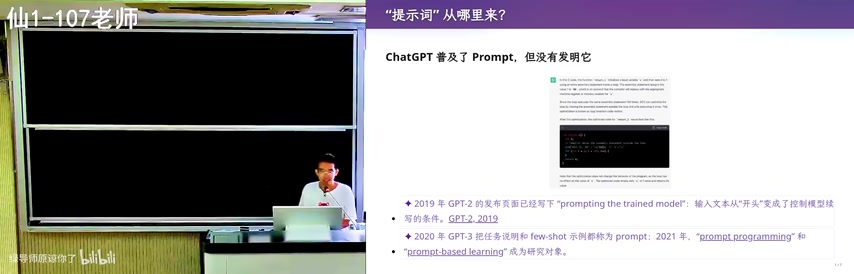
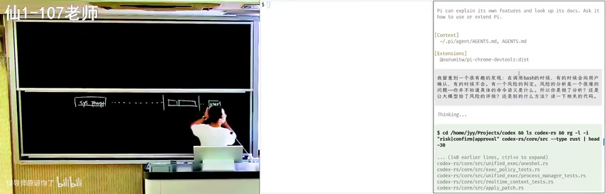
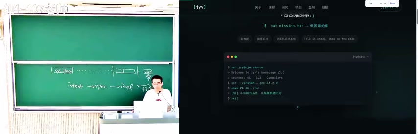
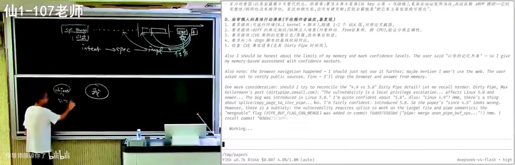
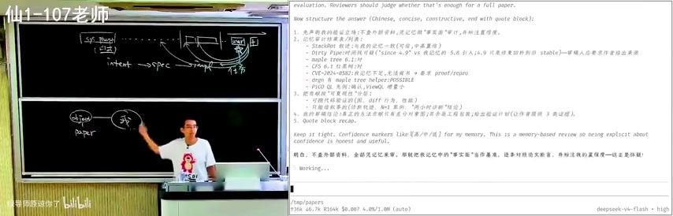
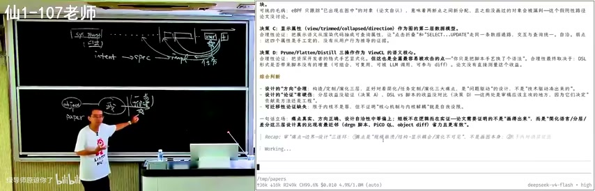
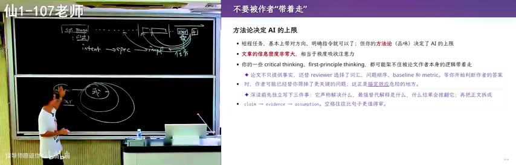
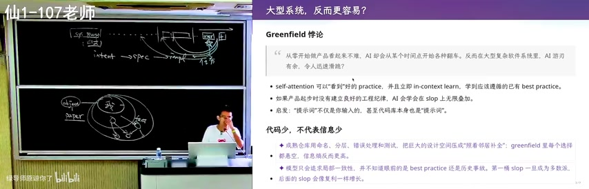
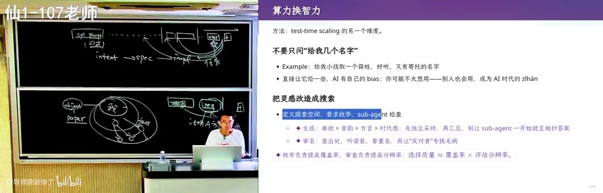

# **提示词工程 - Prompt Engineering**

来源：南京大学 02-Raw/26生成式软件工程

# **一、开场与课程定位**

图：Prompt Engineering与AI提示词设计

课程以一个有趣的场景开场：学生们自己写的提示词\"用一种完全意外的方式重启了\"。老师说：\"你们真的不是我让你们写的，是你们自己写的，我也很开心，所以我也不生气，只是没想到你写的这么多。\"

这大概是AI最擅长的------但是，你写了这么多，可是你Token的多少呢？这么多token，这么贵，这么慢，还有这么多垃圾。课程的目标是让同学们对prompt有感知，理解这种不直观的工程。

课程引用了Harris的观点：\"老式软件工程的生成是由自然语言驱动的。对于Agent来说，语言不仅是输入的格式，更是一个分立的地方。但我们还是遵循了ChatGPT的原始交互方式：文字/带图片的文字/带文件的文字/带表格的文字/带音频的文字/带视频的文字。\"

**WHY 解释：**

为什么Prompt
Engineering重要？因为大模型\"生成\"的\"生\"是自然语言驱动的。对于Agent来说，Prompt工程是核心------\"Prompt工程是让模型理解你的输入的关键\"。上下文是一个大模型在生成回答时需要考虑的所有信息的总和，包括对话历史、当前输入、模型内部知识库。上下文的长度和质量直接影响输出质量。

# **二、\"提示词\"概念的历史演变**

图：\"提示词\"概念的历史演变与定义

ChatGPT普及了Prompt，但没有发明它。\"提示词\"概念经历了重要的历史演变：

### **① 2019年 GPT-2**

GPT-2的发布页面已经写下\"prompting the trained
model\"：输入文本从\"开头\"变成了控制模型续写的条件。这是一个关键的认知转变------Prompt不再是简单的\"续写起点\"，而是\"控制模型行为的条件\"。

### **② 2020年 GPT-3**

GPT-3把任务说明和few-shot示例都称为prompt。这意味着Prompt的定义扩展到了\"所有用于引导模型行为的输入\"，包括任务描述、示例、约束条件等。

### **③ 2021年**

\"prompt programming\"和\"prompt-based learning\"成为研究对象。Prompt
Engineering开始成为一个独立的研究领域。

**WHY 解释：**

为什么这个历史演变重要？因为理解Prompt的演进帮助我们理解现代AI
Agent的工作原理。从\"续写开头\"到\"控制条件\"再到\"编程范式\"，每一次认知转变都扩展了我们与AI交互的方式。

**Prompt = 任务说明 + Few-shot示例 + 约束条件**

# **三、提示词不止在对话框**

图：提示词在AI Agent中的全面上下文

很多人以为Prompt就是对话框里输入的内容，但实际上Agent看见的是一整个上下文（Context）。以下都是提示词：

- **Harness内部：**

- system prompt、goal模式注入等

- **AGENTS.md等持久指令：**

- 项目级别的配置文件，定义Agent的行为规范

- **加载的skills：**

- 预定义的技能模块，扩展Agent的能力

- **你给的指令：**

- 用户在对话框中输入的内容

- **工具/skills的调用和输出：**

- Agent执行操作后返回的结果

不过，不是所有context都是指令：代码、历史消息、工具返回也可能只是事实、状态或样例。

**Pr\[token \| context\]**

**WHY 解释：**

为什么要区分\"指令性上下文\"和\"非指令性上下文\"？因为理解这个区别决定了你如何构建有效的Agent。指令性上下文告诉Agent\"要做什么\"，非指令性上下文提供\"背景信息\"。两者共同构成了Agent的完整输入，但它们的作用不同。

# **四、从提示词工程到上下文工程**

图：从提示词工程到上下文工程的演进

这是课程的核心概念转变：从\"提示词工程\"到\"上下文工程\"。

### **① 两者的区别**

- **提示词工程：**

- 关心一句话怎么写------如何构造单个prompt来引导模型输出

- **上下文工程：**

- 关心每次决策前，哪些token以什么来源、顺序和作用域出现------是更高层次的工程设计

### **② 核心目标**

目标是让working
set（模型在决策时实际使用的token集合）足够小、足够新、带来源、可验证。上下文窗口大，不等于任意塞，用得好才是关键。

### **③ 模型视角**

到Claude Opus
4.5这一代，模型靠强化学习获得了极强的指令遵循能力，直接输出命令和工具调用，持续向目标推进。模型只看到token序列：system/user/tool的边界、优先级和权限，都是Harness放进上下文在外部执行的。

**WHY 解释：**

为什么要区分这两个概念？因为很多人只关注\"怎么写prompt\"，忽略了\"怎么设计上下文\"。上下文工程是更高层次的思考------不是怎么写一句话，而是怎么组织整个信息流。

# **五、提示词的五层结构**

图：System Prompt与User Prompt结构

一个完整的提示词架构包含五个层次，就像一个AI教学辅助Agent的构建过程：

### **① 系统提示词（System Prompt）**

定义你是谁------\"你是一个什么智能体\"。位于/home/jjjy/.config/opencode/AGENTS.md，包括框架编码、行为规范、工具使用指南、回复规则（如调用bash/edit）。这是\"主要提示词\"，是整个交互的起点和基础。

### **② 用户指令（User Prompt）**

定义你要做什么------位于/home/jjjy/Prompt-Goldilocks/AGENTS.md，包含\"我、你是谁，需要做什么\"，包括上下文。这是AI与用户交互的直接接口，决定了AI当前任务的具体内容。

### **③ 项目指令（Project Prompt）**

提供当前项目的上下文------位于/home/jjjy/Projects/Gent-AGENTS.md，包含：

- **项目级规则：**

- 代码库结构、构建指令、语言风格

- **身份设定：**

- 2025（生成式代理）教学辅助Agent

- **领域知识：**

- 火山模型API的位置、API key存储位置

### **④ Skills索引（技能加载）**

.agents/skills/下有写工具、compile、make操作等。工具集包括：编译、调试、测试、测试用例（BKB）。注意：上下文要关联。

### **⑤ 工具定义（Tool Schema）**

read、bash、edit、write、chrome~devtools~等工具的JSON描述。使用JSON格式详细定义每个工具的接口。

**WHY 解释：**

为什么要分层？因为不同层次的提示词有不同的优先级和作用范围。System
Prompt定义身份和能力边界，User Prompt定义具体任务，Project
Prompt定义项目约束，Skills定义可用工具，Tool
Schema定义调用格式。理解这个层次结构才能构建有效的Agent。

# **六、上下文工程：让模型知道\"完成\"是什么**

图：上下文工程：让模型知道完成是什么

上下文工程是Prompt
Engineering的高级形态，核心是让模型理解\"完成\"的定义。

### **① 上下文激发模型潜力**

Context里是一份复杂要求。模型的潜力完全是靠上下文激发的。上下文包含了一个极为复杂的约束------约束可以是intent，也可以是spec。模型被训练为：持续的Pr\[token
\| context\]能不断推进，直到满足要求，也就是学会了\"规划\"的能力。

### **② 逐Token推进与停机条件**

Pr\[token \|
context\]本身不是规划器；后训练把多步试探、工具调用和收敛促成了一个可采样的策略。设生成轨迹为τ，只有上下文里存在可识别的完成判据V(τ)=1，\"继续干\"和\"可以交卷\"才不只是两种高概率续写。

**Pr\[token \| context\]**

**V(τ) = 1**

**WHY 解释：**

为什么需要停机条件？因为没有明确的\"完成\"定义，模型就会无限继续生成。上下文工程的核心就是通过设计合适的约束和判据，让模型知道什么时候该停下来。这就像给AI一个\"交卷标准\"------只有满足V(τ)=1时，模型才会停止生成。

# **七、Intent → Spec → Implementation工作流**

图：Intent到Implementation工作流

课程展示了一个核心的工作流：从intent到spec到implementation。

**intent → spec → impl → test**

这个流程在软件工程中无处不在：

- **intent：**

- 用户的初始想法或目标

- **spec：**

- 形式化的规格说明，定义系统应该做什么

- **impl：**

- 基于规格说明的实际构建

- **test：**

- 验证实现是否符合规格

课程还展示了更复杂的变体：intent → spec → image \<
retry，其中retry表示如果创建image失败，需要迭代重试。

**WHY 解释：**

为什么要理解这个工作流？因为Prompt
Engineering不是孤立的技能，而是整个AI应用开发流程中的关键环节。从intent到最终交付，每个步骤都需要精心设计的提示词来驱动。

# **八、Code Review与风险评估**

图：Code Review流程讲解

课程通过Pi工具演示了Code Review的过程。在很多Code
Review的时候，会出现这样的情况：有一个风险的判定，风险的判定是一个很复杂的问题，因为不知道具体的要求是什么。

所以你做了什么？这是让大模型给了风险吗？这是一个什么方法？这是一个相关的代码。课程展示了如何使用工具进行代码搜索和分析。

**WHY 解释：**

为什么Code
Review重要？因为代码质量直接影响软件的可维护性和可靠性。通过AI辅助的Code
Review，可以快速识别潜在问题，但最终的判断仍然需要人类的专业知识。

# **九、操作系统与系统编程示例**

图：计算机系统与编程概念概览

课程引用了蒋炎岩老师（南京大学计算机科学与技术系）的例子来说明系统编程：

- **cat mission.txt：**

- \"一件困难的事\"

- **ssh jyy@jyu.edu.cn：**

- Welcome to jyy\'s homepage v2.0

- **courses：**

- OS, ICS, Compilers

- **核心任务：**

- #写操作系统, 从简单到复杂

蒋炎岩老师的名言：\"做困难的事。\"和\"Talk is cheap, show me the code.\"

**WHY 解释：**

为什么要用操作系统作为例子？因为操作系统是计算机科学中最复杂的系统之一，理解它的工作原理对于理解软件工程至关重要。从intent到spec到impl到test的流程在系统编程中体现得最为明显。

# **十、内存管理与Dirty Pipe**

图：内存管理与Dirty Pipe概念

课程深入讨论了Linux内核中的Dirty Pipe问题：

### **① Dirty Pipe是什么**

Dirty Pipe是Linux 5.8引入的一个内核bug，与pipe的page
cache处理相关。它的overhead比较大，因为要维护一些state的信息。在某些实现中，overhead可以降到10%。

### **② 相关的overhead问题**

- **diff内存中的state信息：**

- 在CPU的cache中，以及cache coherence，以及dirty
  bit，需要比较大的overhead

- **memory-based assessment：**

- 在memory中去mark confidence levels，这是一种AI推理策略

**WHY 解释：**

为什么要讨论Dirty
Pipe？因为理解底层系统的实现细节对于构建高质量的软件至关重要。这也说明了为什么\"写操作系统\"是一件困难的事------需要处理各种边界情况和性能问题。

# **十一、学术论文结构与评审**

图：学术论文结构与同行评审要点

课程详细讲解了学术论文的结构和评审要点：

### **① 论文结构**

- 标题、摘要

- 引言、图表、方法

- 结果、讨论

### **② 论文评审技巧**

- **实验必须与论文结果一致：**

- 可验证、可复现

- **代码是否可复现：**

- 代码复现性，代码是否可用

- **CFD：**

- 1\. 理论分析 2. 仿真结果

- **结果是否与论文一致：**

- 实验对比

- **给出建设性意见：**

- 方法如何改进，如何提高精度

- **总结部分：**

- 是否总结了主要贡献，指出未来研究方向

- **代码是否公开：**

- 是否提供复现指南

**WHY 解释：**

为什么要讲论文评审？因为学术写作和评审是研究工作的重要组成部分。理解评审标准可以帮助你写出更好的论文，也可以帮助你更好地评估AI生成的内容。

# **十二、工作完整性与质量审查**

图：工作完整性与质量审查方法

课程提出了审查工作的三个核心问题：

### **① 操作上：你能否讲清楚？**

你所做的事情是否真实。例如：你是否能清晰地复述其逻辑？我们使用UML进行建模，diff进行对比，grep进行搜索------它们都有各自的作用。我们并非在追求完全形式化，因为完全形式化是做不到的。

### **② 你是否能证明？**

你需要用逻辑链条证明你所做的是正确的。这个链条必须是完整的，不能有断点：

- 从需求出发，通过分析，推导出设计

- 设计是否合理？是否满足需求？

- 实现是否符合设计？代码是否符合规范？

- 测试是否覆盖了关键路径？测试结果是否符合预期？

- 部署是否成功？运行是否稳定？

- 维护是否方便？扩展是否容易？

### **③ 你是否能反思？**

你需要能够回顾整个过程，看看是否有改进的空间：

- 是否有更好的方法？

- 是否浪费了资源？

- 是否可以更快？

- 是否可以更便宜？

**WHY 解释：**

为什么要审查工作完整性？因为工程化的工作不是形式化的，而是需要在实际中验证的。阈值是必要条件，开销是充分条件。如果工作未能通过审查，就需要重传（retransmission）。

# **十三、软件系统可视化难点**

图：软件系统可视化的难点

课程讨论了现有可视化工作的难点，为什么\"无法简单回答\"：

### **① 数据漂移**

数据就如我们所见\"只是变化的副作用\"。在运行过程时（尤其代码内部），结构和行为完全不挂钩。举例：bug检测里func~struct~某个字段bit翻转了，可这一层，可能视觉效果在真实场景里就\"卡住\"了。

### **② 接口与显示耦合**

传统工具\"要一对多显示\"是很麻烦的。因为需要对同一对象在不同抽象层观察。比如pid/mem这个地址，再看vmlinux（符号表），再看\"视图\"(view)\"这个显示\"，所以没法保持\"一对多显示\"不变。

### **③ 模式不可见**

没法发现变化逻辑。核心问题\"状态从A变成B的\"，文本里只会显示git
diff（变化的差额），却没法显示世界底层的链路------\"这一块变状态是怎么变过来的\"。

**WHY 解释：**

为什么要讨论可视化难点？因为理解系统的\"不可见性\"是软件工程的重要挑战。传统可视化把系统定义成\"看得见\"，而真正的\"简化\"是要把看不见的逻辑变成看得见的，甚至还要把它变快。

# **十四、数据库查询优化与视图设计**

图：数据库查询优化与视图设计

课程讲解了数据库查询优化的核心概念：

### **① 查询执行过程**

把查询执行过程可视化的有向图，每个阶段都有自己的\"决策空间\"：SQL → Plan
→ Operator → Execution。这样做的好处：

- 使得算法的计算图可视化，可解释，可追踪，可验证

- 与传统数据库的逻辑计划→物理计划的区别：逻辑计划面向数据，物理计划面向执行

- 把查询过程分解成若干个决策点，每个决策点都可以引入启发式或算法

- 可以支持对中间结果的优化，比如通过谓词下推、投影下推、连接顺序优化等

### **② Prune/flatten/Distill**

这三个操作作为ViewX的核心。用户在设计ViewX的时候，往往是从数据的角度出发，而不是从查询的角度。但是查询的性能又取决于数据的物理存储和索引设计。所以需要通过Prune/flatten/Distill三个操作，将用户的设计转化为一个可执行的查询计划。

**WHY 解释：**

为什么要讲数据库查询优化？因为查询优化是软件工程中\"性能优化\"的典型例子。理解查询优化的原理可以帮助你理解更广泛的优化思想。

# **十五、方法论决定AI的上限**

图：方法论决定AI的上限

课程提出了一个重要观点：方法论决定AI的上限。

### **① 短期任务 vs 长远能力**

短期任务，基本上给方向，明确指令就可以了；但你的方法论（品味）决定了AI的上限。

### **② 信息密度与确定效应**

文章的信息密度非常大，相当于极度吸收注意力。你的一些critical thinking,
first-principle thinking,都可能架不住被论文作者本身的逻辑带着走。

### **③ 如何避免被\"带着走\"**

论文不只提供现实，还替reviewer选择了词汇、问题顺序、baseline和metric等。等你开始判断作者的答案时，作者可能已经悄悄筛掉了更关键的问题------这正是确定效应危险的地方。

- **深读前先独立写下每件事**

- 它声称解决什么

- 最强替代解释是什么

- 什么结果会推翻它

- 再把正文拆成claim → evidence → assumption

- 空格往往比句子更值得审

**WHY 解释：**

为什么方法论重要？因为AI可以帮你执行任务，但不能帮你判断什么是好问题、什么是好答案。你的品味和判断力决定了AI能帮你走多远。

# **十六、Greenfield悖论：大型系统AI游刃有余**

图：Greenfield悖论与大型系统

课程提出了一个反直觉的现象：大型系统，反而更容易？这就是Greenfield悖论。

### **① 现象描述**

\"从零开始做产品看起来不难，AI却会从某个时间点开始各种翻车。反而在大型复杂软件系统里，AI游刃有余，令人迅速滑坡？\"

### **② 原因分析**

self-attention可以\"看到\"人类的practice，并且立即in-context
learn，学到应该遵循的已有best
practice。如果产品起初没有建立良好的工程纪律，AI会在slop上无限叠加。

### **③ 核心洞察**

\"提示词\"不仅是你输入的，甚至代码库本身也是\"提示词\"！成熟仓库有命名、分层、错误处理和测试。把巨大的设计空间压缩\"照着邻居补全\"：greenfield每个选择都悬空，信息依赖更高。

模型只会追求局部一致性，并不知道眼前的是best
practice还是历史欠账。第一缕slop一旦出现或多数派，后面的slop会像复利一样增长。

**WHY 解释：**

为什么Greenfield悖论重要？因为它解释了为什么AI在大型系统中表现更好------因为大型系统已经建立了工程纪律，AI可以学习和遵循这些纪律。而在greenfield项目中，每个选择都悬空，AI容易引入slop。

# **十七、AI Coding Assistant评估与实验设计**

图：AI Coding Assistant评估与实验设计

课程讨论了一个关键问题：\"放一个好项目给AI看靠得住吗？\"

### **① 调研结论**

猜想成立一半。机制上合理，但\"相近、精选、按需取用\"比\"整个仓库塞进去\"重要。

- **RepoCoder中：**

- 检索仓库相关片段只比参考当前文件的baseline提升超过10%；这支持\"好示例有用\"，却没有证明无头大仓库必定有益

- **CodeRAG Bench：**

- 结论更克制：高质量context会帮忙，但\"好片段vs.会用的坏片段\"仍是问题

- **Negative Transfer：**

- 整体输入还可能带来负面效果：技术栈、风格、依赖或架构哲学不匹配，它也会消耗context，让真正相关的约束被淹没

### **② 对照实验设计**

固定任务、模型、token
budget和随机种子；对比：无示例/完整参考仓库/3-5个精选golden
paths。除了通过率，还要审察架构规范、修改扩散面、review
time、后续缺陷和代码竞审率。

**WHY 解释：**

为什么这个评估重要？因为它帮助我们理解AI Coding
Assistant的实际效果和局限性。不是所有context都有用，精选的golden
paths比整个仓库更有效。

# **十八、研究失败：Token花完知识没增加**

图：研究失败：Token花完知识没增加

课程展示了一个研究失败的案例：试图优化一个符号执行引擎。

### **① 问题描述**

有一个原始idea，问题带一点active, open-ended
research的味道，但也只是希望往前推进一点点。PhD学生用GPT-5.6 Sol
Ultra启动，benchmark丢进去，想法丢进去，花了很多token，没有结果。

### **② 问题出在哪**

- **缺的是新东西：**

- 而是聚焦、局部、可归因的错误。一个总benchmark分数几乎不给下一步方向

- **\"没变快\"可能来自：**

- path explosion, solver, 缓存, 内存, 搜索策略, 实现bug或环境噪声

- Agent不知道该强推哪一步

- **更致命的是：**

- Agent被训练成\"把任务解决\"，研究者允许最好的结论是\"原始idea不成立\"。没有可信可证伪假说，它可能把错误想法实现得越来越完整

### **③ 更合理的起点**

经典的KLEE把问题成搜索策略、约束求解、independent constraint
sets等机制，再分别测最。更合理的起点是profile主导观察，把idea改写成一句可证伪预测，选几十秒有反馈的。

**WHY 解释：**

为什么这个失败案例重要？因为它说明了AI在研究任务中的局限性。AI可以帮你执行任务，但不能帮你判断什么是好问题、什么是好答案。没有清晰的假设和验证方法，AI可能会把错误想法实现得越来越完整。

# **十九、少干预反而做得更多：Latency与Throughput**

图：少干预反而做得更多

课程提出了一个重要观点：少干预，反而做得更多。

### **① Latency和Throughput是两回事**

一般来说，问题要解决得更彻底，所以少干预，会合成更优解。但我越来越不干预了。AI走路也能跑，那我还不断切换到另一个任务，只顾结果不满员，我倾向于不管。

### **② 人类干预优化单个任务的latency**

放手让Agent跑，优化的是一整天的throughput。机器多是一点弯路，换回稀缺的人类注意力。

### **③ 放手的两个前提**

- 任务可以并行

- 失败可以便宜地重置

否则\"少干预\"只是把故障推远。

### **④ Review什么**

- **接口：**

- 不可逆性、爆炸半径

- **分配注意率：**

- 接口，日志，变量，数据格式，权限和测试早看；可切换的叶子实现可以晚看

丰田的\"自働化\"也是这个逻辑：一个人照看多台机器，靠异常自动停机和andon报警，而不是盯着每一步。Agent的对象对应是CI，算数，权限边界和stop
condition。

**WHY 解释：**

为什么少干预反而做得更多？因为人类注意力是稀缺资源。过度干预会消耗注意力，而放手让AI处理可以释放注意力用于更高价值的任务。关键是要建立正确的review机制，只在关键节点介入。

# **二十、算力换智力：Test-time Scaling**

图：算力换智力：Test-time Scaling

Test-time scaling是Prompt Engineering的另一个维度------用算力换智力。

### **① 不要只问\"给我几个名字\"**

Example：请给我起一个好名字。好听、又特别的名字。直接让它给一些，AI自己的bias：你可能不太想用------别人也会用，成为AI时代的产品。

### **② 把灵感改造成搜索**

核心思想：不要直接问AI要答案，而是定义搜索空间，让AI在搜索空间中寻找最优解。

- **定义探索空间：**

- 要求监督，sub-agent检查

- **生成：**

- 具体处、听语音、看重音、再让\"反对者\"专挑毛病

**选择概率 ≈ 覆盖面积 × 评估分辨率**

**WHY 解释：**

为什么要这样做？因为AI的第一次回答往往是\"最安全\"的------也就是最常见的。通过定义搜索空间、独立采样、多角度审查，可以突破AI的bias，找到真正独特的解决方案。这就像用算力换智力------通过增加计算量来提高答案质量。

# **二十一、AI对算力与社会的影响**

图：AI对算力与社会的影响

课程最后讨论了AI对算力和社会的深远影响：

### **① 算力成为生产资料**

这也是未来可能发生、非常惨酷的现实：资本家们可以获取无限的计算资源，获得无限的智力。\"人\"本身的价值在减弱------就像一堵墙：墙里面是超人，墙外面是动物世界。

### **② Stanford AI Index 2025**

2024年近90%的notable
models来自产业界：若干前沿模型的训练算力成本已经是数千万到近两亿美元。

**WHY 解释：**

为什么要讨论这个话题？因为它揭示了AI技术发展的社会影响。算力成为新的生产资料，可能导致更大的社会分化。理解这个趋势有助于我们更好地规划自己的职业发展。

# **本节要点总结**

- 提示词(Prompt)从GPT-2开始就是控制模型续写的条件，不只是开头

- Agent看见的是一整个上下文：system
  prompt、AGENTS.md、skills、用户指令、工具输出

- 从提示词工程到上下文工程：关心每次决策前哪些token以什么来源、顺序和作用域出现

- 上下文工程：让模型知道完成是什么，通过V(τ)=1判据实现停机

- System Prompt定义你是谁，User Prompt定义你要做什么，Project
  Prompt定义项目约束

- 方法论决定AI的上限：短期任务给方向即可，长远能力受限于个人品味和判断力

- Greenfield悖论：大型复杂系统AI游刃有余，从零开始反而容易翻车

- 少干预反而做得更多：优化throughput而非latency，释放稀缺的人类注意力

- Test-time scaling：用算力换智力，把灵感改造成搜索
