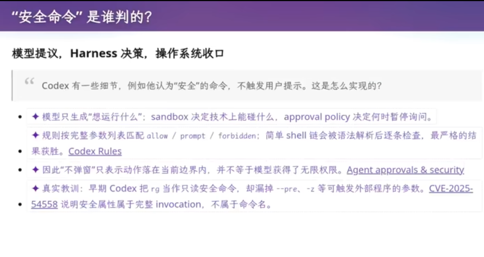
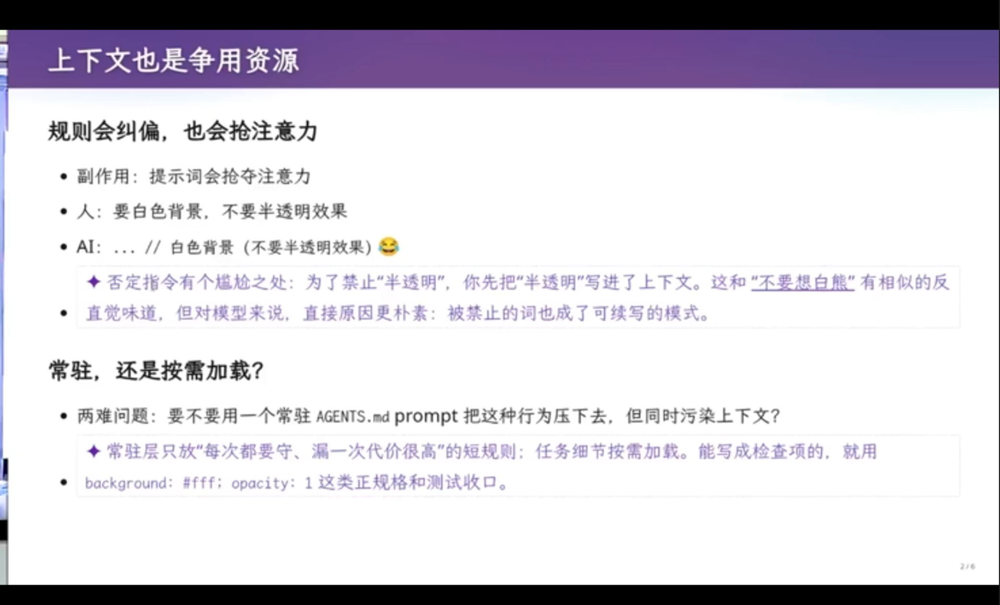
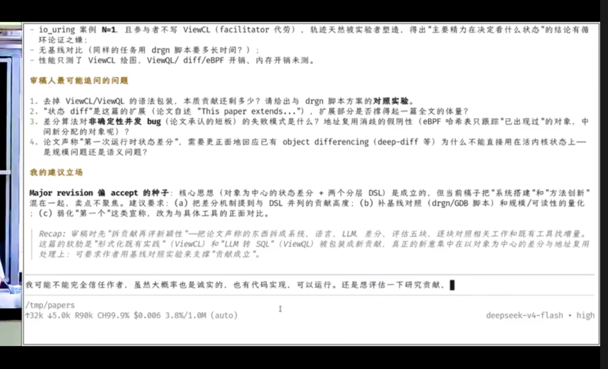
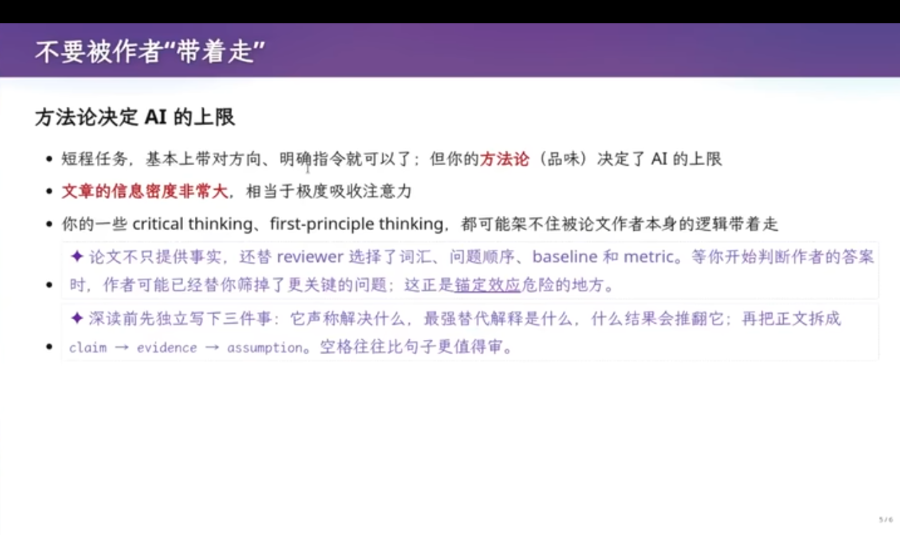
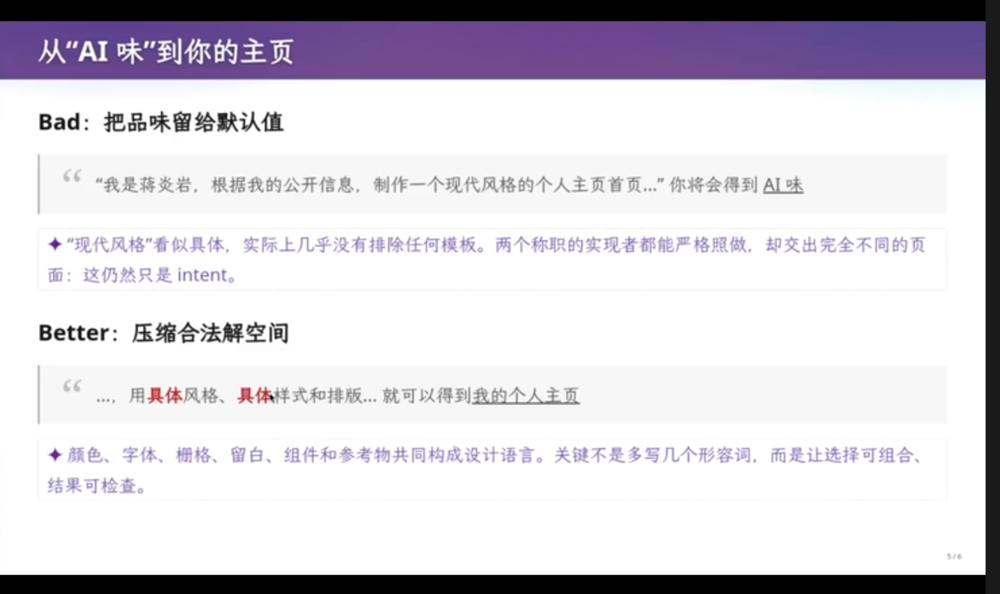
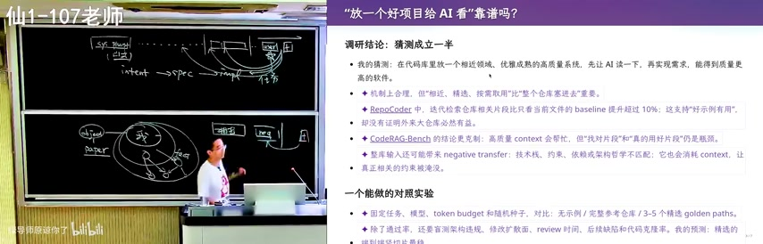
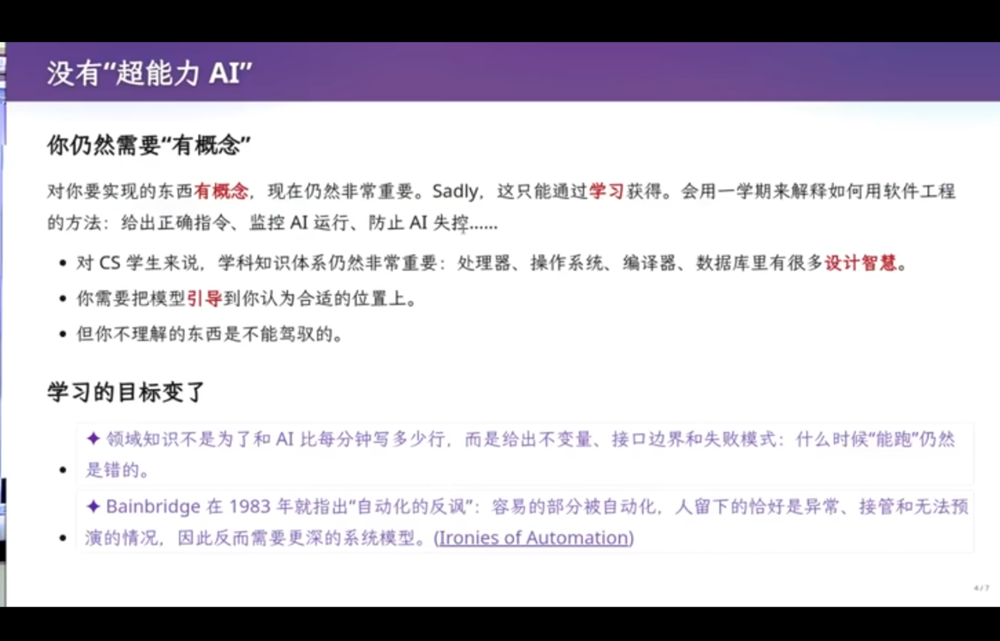
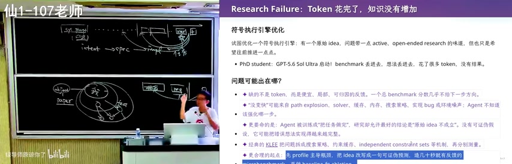
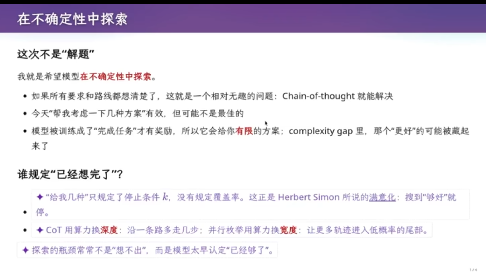
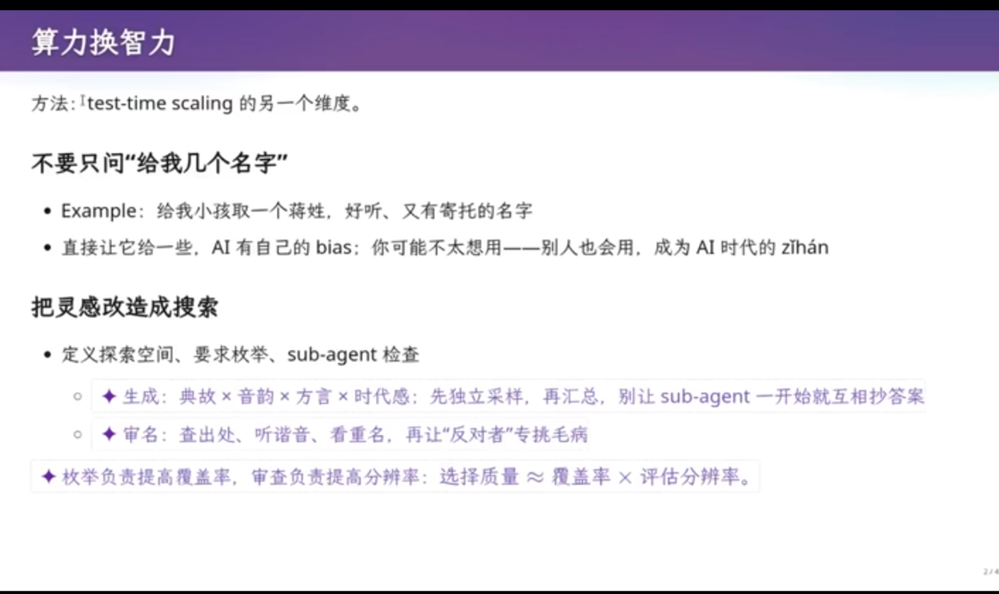

# **一、prompt为何重要**


为什么Prompt
Engineering重要？因为大模型\"生成\"的\"生\"是自然语言驱动的。对于Agent来说，Prompt工程是核心------\"Prompt工程是让模型理解你的输入的关键\"。上下文是一个大模型在生成回答时需要考虑的所有信息的总和，包括对话历史、当前输入、模型内部知识库。上下文的长度和质量直接影响输出质量。

# **二、\"提示词\"概念的历史演变**


ChatGPT普及了Prompt，但没有发明它。\"提示词\"概念经历了重要的历史演变：

## **① 2019年 GPT-2**

GPT-2的发布页面已经写下\"prompting the trained
model\"：输入文本从\"开头\"变成了控制模型续写的条件。这是一个关键的认知转变------Prompt不再是简单的\"续写起点\"，而是\"控制模型行为的条件\"。

## **② 2020年 GPT-3**

GPT-3把任务说明和few-shot示例都称为prompt。这意味着Prompt的定义扩展到了\"所有用于引导模型行为的输入\"，包括任务描述、示例、约束条件等。

## **③ 2021年**

\"prompt programming\"和\"prompt-based learning\"成为研究对象。Prompt
Engineering开始成为一个独立的研究领域。

**Prompt = 任务说明 + Few-shot示例 + 约束条件**

# **三、提示词不止在对话框**


很多人以为Prompt就是对话框里输入的内容，但实际上Agent看见的是一整个上下文（Context）。以下都是提示词：

- **Harness内部：**

- system prompt、goal模式注入等

- **AGENTS.md等持久指令：**

- 项目级别的配置文件，定义Agent的行为规范

- **加载的skills：**

- 预定义的技能模块，扩展Agent的能力

- **你给的指令：**

- 用户在对话框中输入的内容

- **工具/skills的调用和输出：**

- Agent执行操作后返回的结果

不过，不是所有context都是指令：代码、历史消息、工具返回也可能只是事实、状态或样例。


我调用了我的AI,询问了它的上下文提示词（**使用opencode/deepseek-harness + deepseek flash v4**）
```opencode
+ Thought: 4.3s
实际读取完毕。我无法把原始 token 流 dump 出来，但可以把"喂给我上下文的源文件"一个个读给你看。这是真实核对结果：
我的上下文 = 我上面收到的 system prompt 里已注入的内容。它分四块，来源文件如下：
1. 平台/工具内建提示（opencode 引擎直接注入，无本地文件）——回复风格、工具策略、代码规范、GitHub 工作流等。
2. /home/cloudygirl/AGENTS.md（2462 字节，7月11日）——NixOS 工作站架构表、关键规则、重建命令、Git 身份。这是本会话唯一加载的 AGENTS.md（cwd 不是 git repo，全局无其他生效）。
3. MCP 指令（来自 opencode.jsonc:22-49）——github、nixos、caiyun-weather、chrome-devtools。注意：只有 github 和 nixos 的指令出现在我上下文里，caiyun-weather 存在但未注入。配置文件里还带两组明文 token（GitHub PAT、彩云 API key）。
4. 技能清单（available skills）——这里最能说明问题：
位置	磁盘实际	我上下文实际暴露
.claude/skills	818 个	仅 2 个
.agents/skills	8 个	8 个
.config/opencode/skills	7 个	6 个 + customize-opencode
磁盘上有 833 个技能目录，但我的 system prompt 里只列了约 19 个（8 agents + 2 claude + 6 openspec + bilibili + customize）。关键点：技能文件本身也不在上下文里——只注入名称+描述+路径，内容要等我调用 skill 工具才读取。
结论：我"常驻"的上下文其实是：内建规则 + 你那份 AGENTS.md + 2 组 MCP 指令 + 19 个技能描述。818 个 .claude 技能是"候选弹药库"（由 .agents/.skill-lock.json 记录来源），平时不占 token，按需加载。你老师说的"不止一两个提示词"——对，我收到的是这 4 层拼起来的系统提示，逐字内容我无法打印给你，但上面每个源文件你都可以自己打开核实。
```

```deepseek_harness

19:44

上下文注入
AGENTS.md
上下文注入
@deepseek-ai/dsh-system-prompt
上下文注入
skill-catalog
Think
The user (speaking Chinese) says: "老师说aiagent上下文里不止一两个提示词，你可以读取你的文件，检查你的上下文里有什么吗" — Translation: "The teacher said that in an AI agent's context there are more than one or two prompts. Can you read your files and check what's in your context?"
失败
Bash
Error: sandbox mode "workspace-write" is requested but no sandbox backend is usable on this host; refusing to run the command unconfined. Install bubblewrap or run a Landlock-enforcing kernel (Linux), ensure sandbox-exec is usable (macOS), or ensure the ACL restricted-token runner can start (Windows) — otherwise switch the consumer to danger-full-access.
Glob
AGENTS.md
Think
The bash sandbox is not usable (no backend) — commands must run confined or escalation; it refused. So shell is basically unavailable unless danger-full-access approval. Rather than escalate, prefer read/glob/grep tools which are governed by fs-observation policy and allowed under workspace-write presumably. The read tool resolves paths via filesystem backend — reading files should be OK.
bash 沙箱在当前主机不可用，没关系——我用只读工具来检查。先确认工作区里哪些文件会进入我的上下文，以及 DSH 是怎么把提示词组装起来的：

Read
AGENTS.md
失败
Glob
Error: glob search failed (exit 2): rg: /home/cloudygirl/.local/share/waydroid/data: IO error for operation on /home/cloudygirl/.local/share/waydroid/data: Permission denied (os error 13)
Grep
AGENTS\.md
Think
The grep results confirm there's a package `packages/context/agent-instructions` responsible for loading AGENTS.md files into context, with budgets (truncation/omission), nested AGENTS.md, user-global `~/.dsh/AGENTS.md`, etc.
bash 沙箱不可用，但只读工具足够。grep 已经确认了关键点：DSH 里有个专门的包 packages/context/agent-instructions 负责把 AGENTS.md 注入上下文。再读几个相关文件确认细节：

Read
deepseek-harness/packages/context/agent-instructions/src/config.ts
Read
deepseek-harness/packages/context/agent-instructions/src/render.ts
Glob
**/*
上下文注入
deepseek-harness/AGENTS.md, deepseek-harness/packages/AGENTS.md
Think
Interesting — as I read files under deepseek-harness, the harness dynamically injected the deepseek-harness/AGENTS.md and packages/AGENTS.md into my context as "Additional instructions from: ..." system reminders. That's a live demonstration! This is exactly what the teacher means: the context is dynamically composed.
好问题——而且就在你问的时候，这件事刚刚在我身上"直播"了一次。我边查边给你看我上下文里到底有什么。

先看一个现场证据
我刚才用只读工具读了 /home/cloudygirl/deepseek-harness 下的几个源码文件，结果系统立即往我的上下文里动态注入了两份新指令（本对话里多出的两条 <system-reminder>）：

deepseek-harness/AGENTS.md（仓库级规则：代码规范、测试策略、防御模式……）
deepseek-harness/packages/AGENTS.md（子目录级规则）
也就是说：AI Agent 的上下文不是写死的"一两条提示词"，而是随着我的操作实时拼装的。这套机制在 DSH 源码里有对应实现，我读到的证据：

/home/cloudygirl/deepseek-harness/packages/context/agent-instructions/src/config.ts：按目录向上找 .git 定位项目根；候选指令文件是 AGENTS.md、CLAUDE.md，还支持 AGENTS.local.md 覆盖层；maxBytes 做字节预算。
.../src/render.ts：拼装格式就是 Instructions from: <路径> / Additional instructions from: <路径>（和你看到的一模一样）；文件中途变化会注入 Updated instructions from:；超预算的文件会被截断或省略。
测试里有一条 loads a nested AGENTS.md after the real read tool touches a descendant file —— 我刚才就是触发了这条路径：一读子目录里的文件，该目录的 AGENTS.md 就被加载进上下文。
我这个会话的上下文现在包含什么（逐层盘点）
层	内容	说明
① 系统提示	DSH 框架生成的身份与行为规则	工作目录、工具调用纪律、后台任务/子代理/goal 礼仪、Web GUI 环境说明等，一大段
② 运行时上下文快照	本轮动态注入	文件策略（workspace-write）、审批策略（ask）、当前可用技能目录
③ 工作区指令	/home/cloudygirl/AGENTS.md（72 行）	开头那条 Instructions from: AGENTS.md：NixOS 工作站架构、铁律（不许直接改系统、nixpkgs 只读……）
④ 嵌套指令（动态）	deepseek-harness/AGENTS.md + packages/AGENTS.md	上面说的"现场注入"，还有用户全局 ~/.dsh/AGENTS.md 一层
⑤ 技能目录 + 技能全文	12 个可用技能（bootkit 分析、rootkit 检测、kaoyan-408、kaoyan-english……）	目前只注入了一行摘要；一旦匹配，会调用 skill 工具把全文拉进来；技能还能挂知识库（kaoyan-408 挂 9 份文档、kaoyan-english 挂 161 份，检索时把原文段落带进来）
⑥ 工具定义	300 多个工具函数的 JSON Schema	这是每轮最大的固定开销：光开发平台系列（github_/gitlab_/npm_/pypi_…）就 197 个（工具 github_help 自己的说明），加上 vision_、browser_、web_search 族、kb_、deepread、vibe_math_、goal/workflow/subagent 等
⑦ 对话历史	你我的每一轮消息 + 所有工具调用与结果	我刚才读的 config.ts、render.ts 全文文本现在也在我上下文里；会话超长时会触发压缩（compaction）
⑧ 运行状态提醒	后台任务结束、goal 状态、子代理通知、文件变更提醒	动态插入，比如刚才那两条 AGENTS.md 注入
所以怎么回答老师
老师说得对，而且可以更精确地表述为：Agent 的"提示词"是一个上下文工程产物，每一轮请求都由这几块拼成——

系统提示（框架模板，不是一两条，是一套模块化的规则）；
数百个工具的函数签名与说明（模型必须"知道有什么工具、怎么调"，这是巨大的常量成本）；
分层文件指令（用户全局 ~/.dsh/AGENTS.md → 工作区 AGENTS.md → 各子目录 AGENTS.md，还有 CLAUDE.md、.local 覆盖层，带字节预算与去重）；
技能系统（先给目录摘要，按需加载全文，全文还能再引用磁盘上的知识库文档）；
运行时快照（文件/审批策略、环境事实）；
完整对话历史 + 所有工具输入输出；
动态注入（读哪个目录的文件，就可能把哪个目录的规则带进来——刚才就发生了）。
其中很大一部分是每轮重算的动态内容，所以才有"上下文预算""截断""压缩""变化后重新注入"这些工程机制——如果只是写死一两条提示词，根本不需要这些东西。

顺带一提：我"读取自己的文件"和"检查自己的上下文"其实是两回事——我的上下文就是上面这份清单本身（我能直接看见）；而磁盘上的文件（如 /home/cloudygirl/AGENTS.md、DSH 源码）是我按需读取后才会进入上下文的，默认并不全量装载。
```


**Pr\[token \| context\]**

**WHY 解释：**

为什么要区分\"指令性上下文\"和\"非指令性上下文\"？因为理解这个区别决定了你如何构建有效的Agent。指令性上下文告诉Agent\"要做什么\"，非指令性上下文提供\"背景信息\"。两者共同构成了Agent的完整输入，但它们的作用不同。

**启示**



费曼学习法：让自己和AI的身份转变，在自己理解过知识后，关上教材，把自己的理解讲给AI,让AI来追问，补齐自己的漏洞

# **四、从提示词工程到上下文工程**


图：从提示词工程到上下文工程的演进

这是课程的核心概念转变：从\"提示词工程\"到\"上下文工程\"。

## **① 两者的区别**

- **提示词工程：**

- 关心一句话怎么写------如何构造单个prompt来引导模型输出

- **上下文工程：**

- 关心每次决策前，哪些token以什么来源、顺序和作用域出现------是更高层次的工程设计

## **② 核心目标**

目标是让working
set（模型在决策时实际使用的token集合）足够小、足够新、带来源、可验证。上下文窗口大，不等于任意塞，用得好才是关键。

## **③ 模型视角**

到Claude Opus
4.5这一代，模型靠强化学习获得了极强的指令遵循能力，直接输出命令和工具调用，持续向目标推进。模型只看到token序列：system/user/tool的边界、优先级和权限，都是Harness放进上下文在外部执行的。

**WHY 解释：**

为什么要区分这两个概念？因为很多人只关注\"怎么写prompt\"，忽略了\"怎么设计上下文\"。上下文工程是更高层次的思考------不是怎么写一句话，而是怎么组织整个信息流。

# **五、提示词的五层结构**


一个完整的提示词架构包含五个层次，就像一个AI教学辅助Agent的构建过程：

## **① 系统提示词（System Prompt）**

定义你是谁------\"你是一个什么智能体\"，包括框架编码、行为规范、工具使用指南、回复规则（如调用bash/edit）。这是\"主要提示词\"，是整个交互的起点和基础。

## **② 用户指令（User Prompt）**

定义你要做什么，包含\"我、你是谁，需要做什么\"，包括上下文。这是AI与用户交互的直接接口，决定了AI当前任务的具体内容。

## **③ 项目指令（Project Prompt）**

提供当前项目的上下文，包含：

- **项目级规则**


- **身份设定**


- **领域知识**

## **④ Skills索引（技能加载）**

## **⑤ 工具定义（Tool Schema）**


# **六、上下文**


图：上下文工程：让模型知道完成是什么

上下文工程是Prompt
Engineering的高级形态，核心是让模型理解\"完成\"的定义。

## **1 上下文激发模型潜力**

Context里是一份复杂要求。模型的潜力完全是靠上下文激发的。上下文包含了一个极为复杂的约束------约束可以是intent，也可以是spec。模型被训练为：持续的Pr\[token
\| context\]能不断推进，直到满足要求，也就是学会了\"规划\"的能力。

## **2 逐Token推进与停机条件**

Pr\[token \|
context\]本身不是规划器；后训练把多步试探、工具调用和收敛促成了一个可采样的策略。设生成轨迹为τ，只有上下文里存在可识别的完成判据V(τ)=1，\"继续干\"和\"可以交卷\"才不只是两种高概率续写。


**WHY 解释：**

为什么需要停机条件？因为没有明确的\"完成\"定义，模型就会无限继续生成。上下文工程的核心就是通过设计合适的约束和判据，让模型知道什么时候该停下来。这就像给AI一个\"交卷标准\"------只有满足V(τ)=1时，模型才会停止生成。


## **3 精确的intent**

给予ai更加精准的提示词，可以让用户需求得到满足，如果只说做个应用，而不说好架构，语言，用户需求很难得到满足


## **4 AI注意力和上下文资源争用**



当上下文本过长时，ai会忘记你的需求，因为每次询问调用token,ai都在让其与上下文产生关联
当前文你给出了一个附加的否定命令，因为ai以前有时候不会遵守指令，之后的强化学习训练让其成为了类似于高中做题家的模式。ai会非常害怕错误，导致其注意力过度被移到否定指令，在之后的使用中也会延续上一个任务用户的否定指令，导致ai注意力被前文过度争夺。
虽然skill能解决，但是skill的agent.md还是会以同样的方式争夺注意力，污染上下文

### 例子：读论文


老师让ai先总结一篇论文，再让ai作为审稿人评估论文，会出现严重的问题：

* 第一次总结论文时，ai已经顺着论文的逻辑走了一遍，该任务进入上下文后，第二次任务要求评估论文时，ai会出现两边抓的情况：由于上下文对论文的正确性的描述，ai审稿时必定受到之前的影响，导师其犹如墙头草一样回答，落在了一些无关紧要的问题上
  
* 和人审稿的区别：立场不一样，ai的“立场”被上下文竞争而“污染”
  
* 解决：提示ai让他站在人类的立场上，目前已有的知识上来审稿，论文必须是接近知识的边界，先和用户达成共识

* 把自己蒸馏为skill,让ai通过agent.md和你同步立场



老师提出：方法论决定AI的上限。

## **① 短期任务 vs 长远能力**

短期任务，基本上给方向，明确指令就可以了；但你的方法论（品味）决定了AI的上限。

## **② 信息密度与确定效应**

文章的信息密度非常大，相当于极度吸收注意力。你的一些critical thinking,
first-principle thinking,都可能架不住被论文作者本身的逻辑带着走。

## **③ 如何避免被\"带着走\"**

论文不只提供现实，还替reviewer选择了词汇、问题顺序、baseline和metric等。等你开始判断作者的答案时，作者可能已经悄悄筛掉了更关键的问题------这正是确定效应危险的地方。

- **深读前先独立写下每件事**

- 它声称解决什么

- 最强替代解释是什么

- 什么结果会推翻它

- 再把正文拆成claim → evidence → assumption

- 空格往往比句子更值得审

# **七、大模型的工作流**


用让AI制作赛车游戏的案例举例子：核心的工作流：**intent → spec → impl → test**

这个流程在软件工程中无处不在：

- **intent：**

- 用户的初始想法或目标

- **spec：**

- 形式化的规格说明，定义系统应该做什么

- **impl：**

- 基于规格说明的实际构建

- **test：**

- 验证实现是否符合规格

# **八、ai执行的命令风险是如何评估的**


使用ai会出现这样的情况：有一个风险的判定，风险的判定是一个很复杂的问题，因为不知道具体的要求是什么。

所以你做了什么？这是让大模型给了风险吗？这是一个什么方法？这是一个相关的代码。课程展示了如何使用工具进行代码搜索和分析。

**WHY 解释：**

为什么Code
Review重要？因为代码质量直接影响软件的可维护性和可靠性。通过AI辅助的Code
Review，可以快速识别潜在问题，但最终的判断仍然需要人类的专业知识。

# **九、AI味**


老师让ai根据他的风格去制作一个个人博客，但是这个博客AI味很足，因为提示词给的仅仅是“根据蒋老师的风格制作博客”，没有要求其他的方面，导致ai在各种地方使用了“默认选择”

去除AI味，需要去仔细告诉AI作为用户的选择，不能在数个步骤中让ai自己选择，否则实际产品与用户的理想差距极大，承担**不明确的风险**



指令给的越清楚，AI味就越低，如何**设计需要掌握在自己的手里**


# **十六、AI更擅长大型系统工程**


## **① 现象**

\"从零开始做产品看起来不难，AI却会从某个时间点开始各种翻车。反而在大型复杂软件系统里，AI反而做得很好\"

## **② 原因分析**

这是“上下文污染的另一方面”

self-attention可以\"看到\"人的写的代码，ai会学习人的代码，将其作为自己接下来的标准（上下文）

但如果产品起初没有建立良好的工程纪律，AI会在slop上无限叠加。

AI一定会满足用户的指令，对于ai,项目代码也属于提示词，代码本身就在通过ai的上下文读取规范ai

## **③ 核心洞察**

\"提示词\"不仅是你输入的，甚至代码库本身也是\"提示词\"！成熟仓库有命名、分层、错误处理和测试。把巨大的设计空间压缩\"照着邻居补全\"


模型只会追求局部一致性，并不知道眼前的是best


**解释：**

这个悖论解释了为什么AI在大型系统中表现更好------因为大型系统中其它代码已经建立了工程纪律，AI可以学习和遵循这些纪律。而在小项目中，每个选择都悬空，AI容易引入slop。

## **应用：让ai先阅读一个好的系统的代码再帮我工作？**



### \"放一个好项目给AI看靠得住吗？\"

## **① 结论**

猜想成立一半。机制上合理，但\"相近、精选、按需取用\"比\"整个仓库塞进去\"重要。

- **RepoCoder中：**

- 检索仓库相关片段只比参考当前文件的baseline提升超过10%；这支持\"好示例有用\"，却没有证明无头大仓库必定有益

- **CodeRAG Bench：**

- 结论更克制：高质量context会帮忙，但\"好片段vs.会用的坏片段\"仍是问题

- **Negative Transfer：**

- 整体输入还可能带来负面效果：**技术栈、风格、依赖或架构哲学不匹配**，它也会消耗context，让真正相关的约束被淹没

## **② 如何趋利避害**

  让ai去多看几个风格的项目代码，让其参照多个好的代码结构


# **十八、没有超能力AI**



- **使用正确的，简练的提示词，让模型看到，把它引导到正确的方向**

- CS基础知识仍然必要

## **案例：证明AI并没有超能力**



案例：优化一个符号执行引擎

## **① 白花了token**

有一个原始idea，问题带一点active, open-ended
research的味道，但想法丢进去，花了很多token，没有结果。

## **② 没有正确的引导**

- Agent被训练成\"把任务解决\"，研究者允许最好的结论是\"原始idea不成立\"。没有可信可证伪假说，它可能把错误想法实现得越来越完整

## **③ 更合理的起点**

经典的KLEE把问题成搜索策略、约束求解、independent constraint
sets等机制，再分别测最。更合理的起点是profile主导观察，把idea改写成一句可证伪预测，选几十秒有反馈的。

**解释：**

缺少相应的知识，也就无法去引导AI走向正确的方向

# **十九、在保证自己拥有相关知识时，少干预更好**


注意，这句话必须是在你拥有相关技术知识的前提下才成立，而且任务可以恢复

## **学会放手**

- 一直盯着AI的thought,发现它方向错了，然后干预引导，这种行为可以给人提供多巴胺，让自己感觉很爽

- 但是这样会浪费自己的注意力，比起监视AI，不如把自己不懂的知识弄懂学会，这样花费时间比把时间花在监视AI上更好

- **学习，搞懂知识，花费在这上面的时间是绝对不能缺少的**，不放手，只是一种新时代假努力


# **二十、AI为了奖励，不会深度探索**


- 如果让AI在不确定中探索，会有很多问题
  
- AI已经被训练成做题家，训练成了用户的舔狗。训练时它完成任务会被奖励
  
- 如果让AI给出几种方案，是不会给你最好的几个的，它只在乎完成任务，类比应试做题时学生的态度

### **缓解办法**

- 给AI限定探索空间的范围
- 具体说出自己的想法，排除掉或者考虑XXX方案
# **二十一、AI对算力与社会的影响**


## **算力成为生产资料**

这也是未来可能发生、非常惨酷的现实：资本家们可以获取无限的计算资源，获得无限的智力。\"人\"本身的价值在减弱------就像一堵墙：墙里面是超人，墙外面是动物世界。

