# **一、GPT-6发布**

老师评价GPT-6：代码推理更快,但仍未学会\"有经验工程师的品味\"，写出的代码越来越紧凑,人类无法review

但是gpt-6的空间感知能力得到巨大提升，老师吐槽自己带的博士生小半年研究工作直接被取代了

老师提到有人问他：\"还要不要学操作系统、数据库这类基础知识\"的问题。

答案是仍然需要学习，因为拥有了相关概念和知识，是发散，创造思维的前提，**AI只是执行力强**
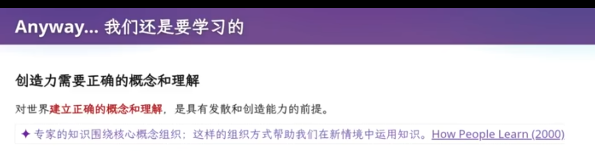

# **二、什么是软件工程项目**

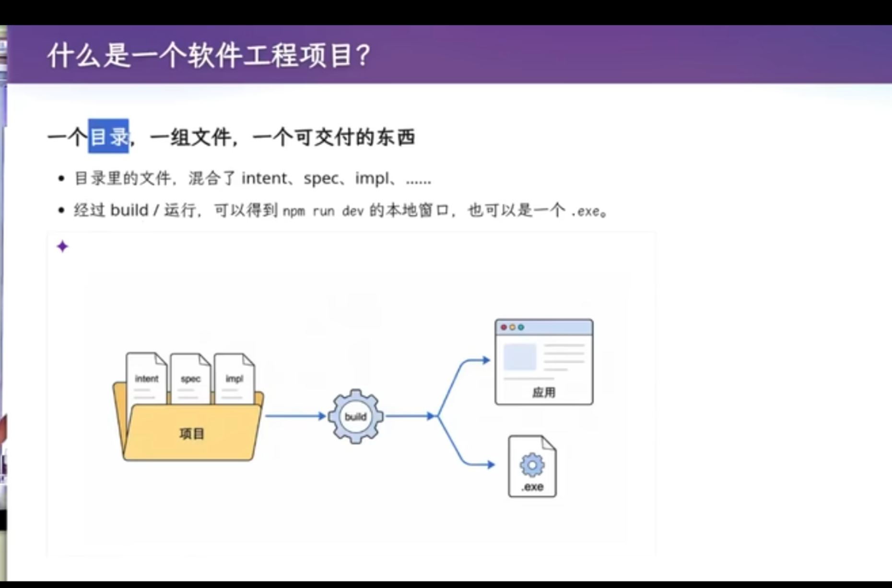

开始做软件工程，第一件事不是写代码，而是\"建一个目录、起个名字\"，往里放文件。一个软件工程项目
= 一个目录 + 一堆文件，这堆文件共同构成一个可交付的东西，最终变成产品。

软件的定义：软件是人类世界的需求在信息世界里的\"投影\"；今天这个投影就是一个目录。目录里有源码

老师提出了个反例：**\"网上会有人说，GPT-6 帮我做了个杀手级产品，它们都在localhost:5173\"------本机能打开，但别人打不开，因为不知道 localhost
是本机；这就是缺失的知识。**

# **三、为什么需要版本管理**

古早时期，使用U盘，邮件管理代码项目，U盘一坏数据就全部丢失，现在可以使用git,github

github上都是可以学习的项目，学习变得更容易,但是信息密度太大，传统课堂没有教我们去怎么学
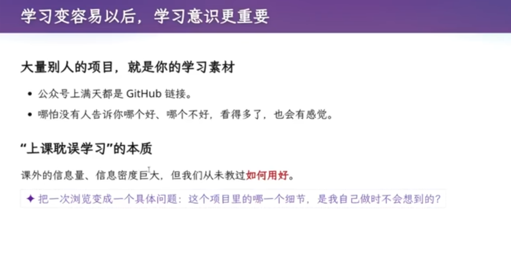

多留意，感知细节，其中都是学习的机会。学习时，需要先自己想一遍，自己会怎么做，再来和项目，课本对比方案

- 如果自己的方案不好，那就学习
- 如果自己的方案好，那就是对自己的巨大鼓舞

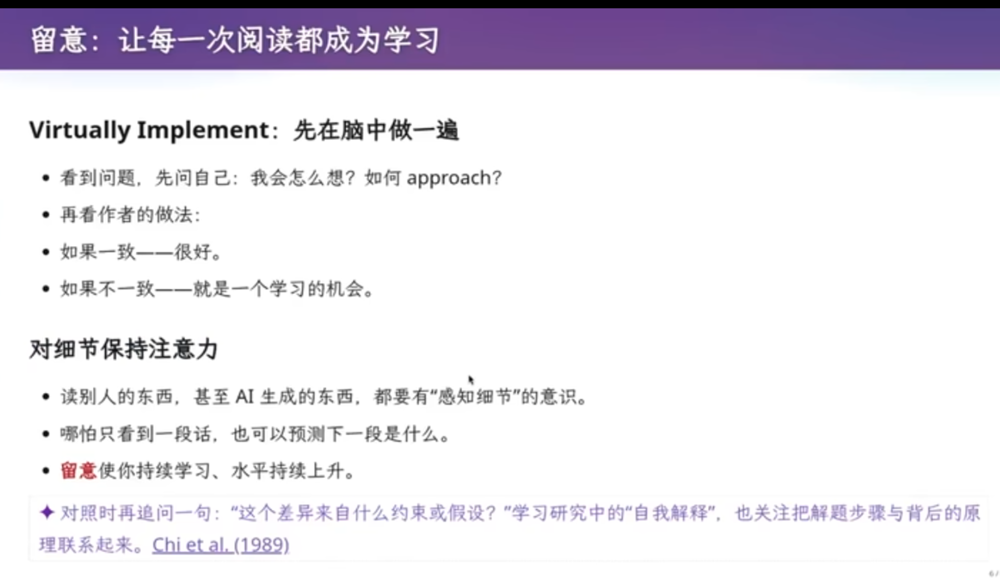

Git 的诞生：作者是 Linux 的作者 Linus Torvalds，2005 年。此前维护 Linux
靠\"邮件列表发补丁\"（1991-2002），后来又用过 BitKeeper 等工具，最终
Linus 决定造一个\"绝对简单、概念正确\"的版本控制工具。

**Git 的初心 =
项目级时间回溯：人人都会犯错，要能从历史里把旧版本捞回来。**

# **四、Git 的基本操作**

> *由于本人会git一些操作，这里简略记录*

git init：初始化项目，得到一个 .git 目录

git add \<file\>：添加指定改动

git status：查看工作区状态

git commit：创建带\"消息\"的快照。必须描述\"这次改了什么\"。

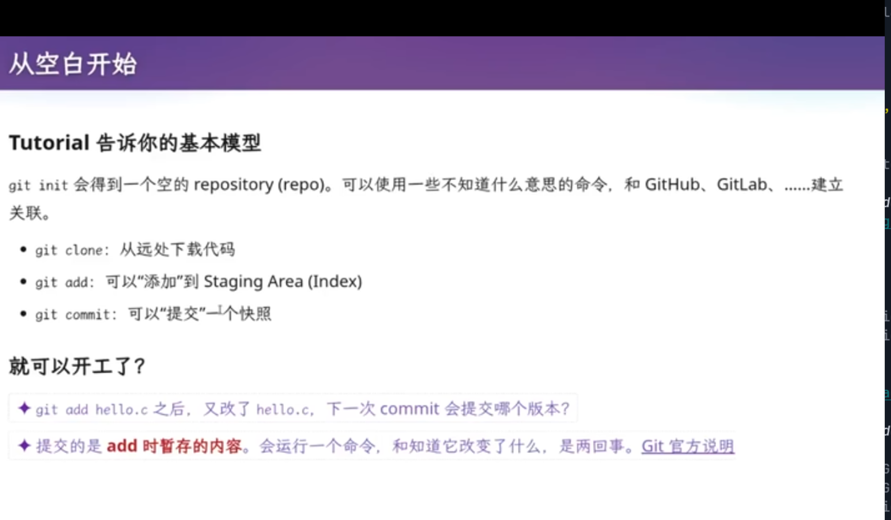

**学习git不能依赖agent帮你做，要知其所以然，为什么要这样，什么时候使用**

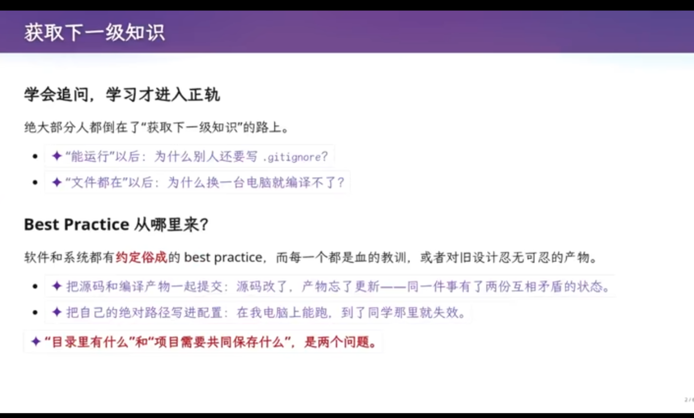

- 学会追问，利用我们那**惊人的注意力**，向大模型精准提问。老师在回答问题时并不比大模型好。

- 附带技巧：在 message 里写 \"fix #3\"，GitHub 会自动关闭对应的 issue #3。

- 不要无脑``git add .``:编译产物 / 二进制（hello、dist、log 等）不该提交，应加进 .gitignore。

- git add . 的坑：会把 .DS~Store~、个人配置、硬编码路径、甚至处于 active
状态的 API key 一并提交。

- 空提交（empty commit）：偶尔有用（触发 CI、finalize/freeze 一个
release），但不能大量制造。

- ``git blame <file>``:展示file文件种，每一行文件是哪次提交更改的
  
- 使用.gitingroe让编译产物 / 二进制（hello、dist、log ，大模型的api key等）不被跟踪。规定是活的，不是

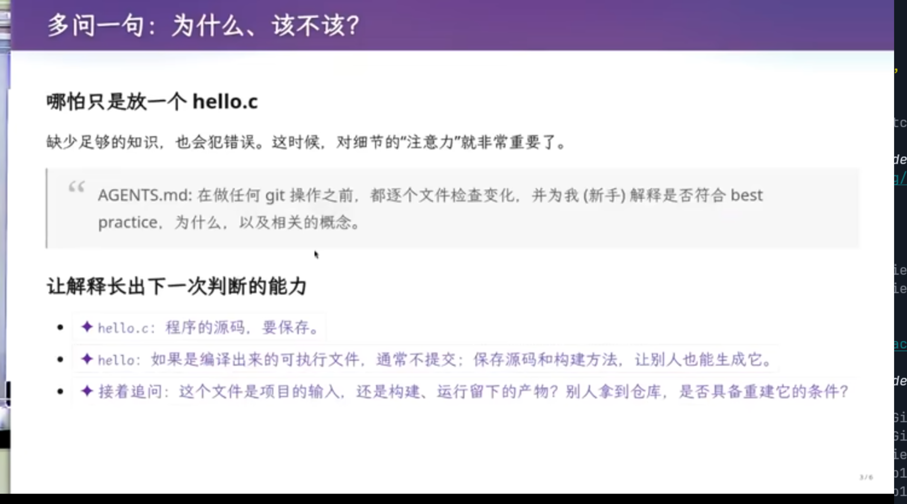

利用大模型学习，多问几句，为什么，该不该
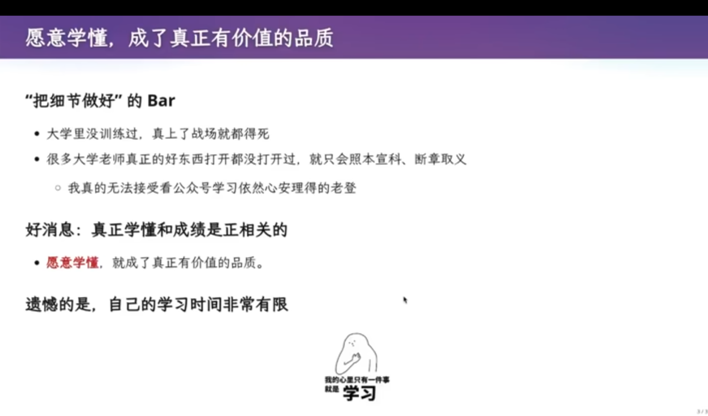
# **七、Git 底层原理**

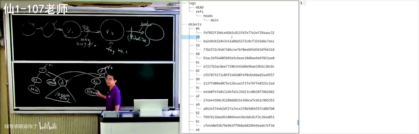

Git 是一个\"持久化的数据结构\"，它持久化的是目录树（快照）。

- blob：字节序列（文件内容）。

- tree：目录节点。

- commit：提交节点。

高效存储：改一个文件（如b.txt），只需复制\"到根的路径\"上的节点，其余不变子树用指针指回旧版本。即便项目有一百万个文件，每次快照也只需极小的增量。

对象按 SHA-1 哈希索引，存放在 .git/objects/。

**分支 = 指针（refs/heads/\<name\>）；HEAD = 指向指针的指针。**

# **九、更多的best practice**

**小步提交（atomic change）：**

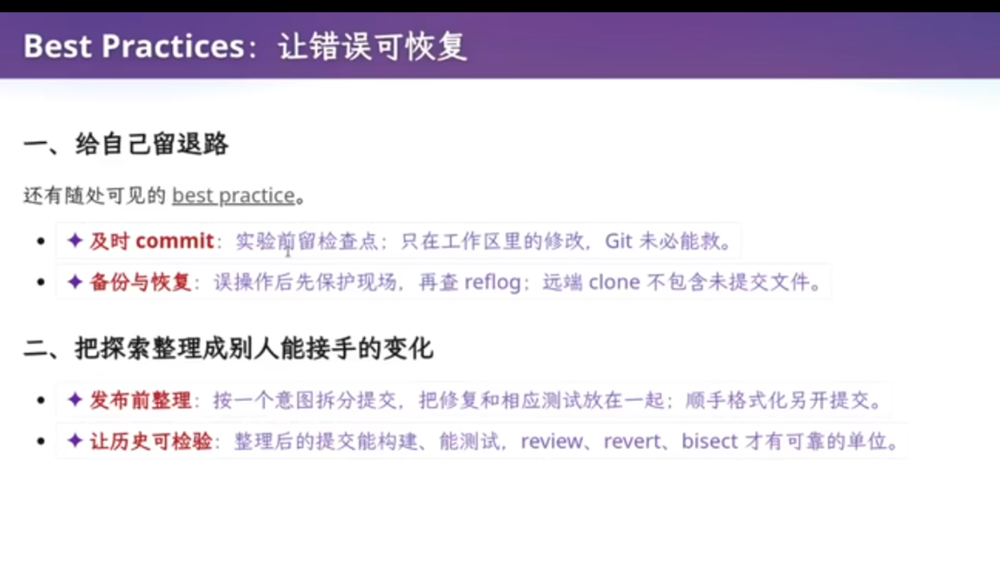

- 大 commit 一次改很多，容易引入多个 bug，修不过来、难以审计；小 commit
  每个只做一件事，冤有头债有主。

- 支持 git bisect：把提交历史当成有序数组做二分查找，定位引入 bug
  的那一次提交。

- 支持 git blame：定位每一行代码是何时、由谁改的。

- 小步提交立即 push 可获得云端备份，本地电脑损坏也不怕。

linear history（rebase）：让历史保持线性，更易追溯，对 ChatGPT / git
blame 更友好、更省 token。

hooks（如 pre-commit 检查）与 CI：在提交前自动做检查。

gh / glab：Git 之外的部分（GitHub/GitLab 上的 issue、PR/MR、CI
状态）不随 Git tree 持久化，用 gh/glab 命令行工具来管理，让人和 Agent
都能从命令行完成协作。

**更好的 message：**

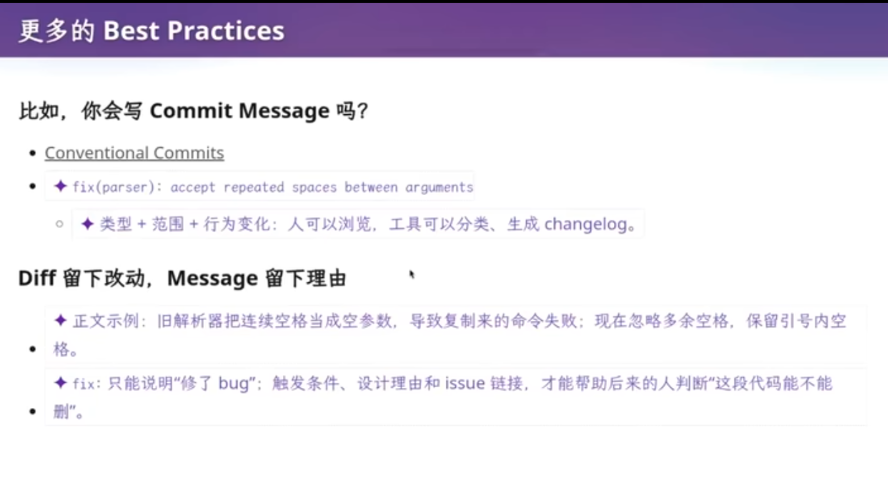

这些细节是为了工程师在更大的项目里，有一致的规范性，可以阅读[https://sethrobertson.github.io/GitBestPractices/]

# **十、回到软件工程**

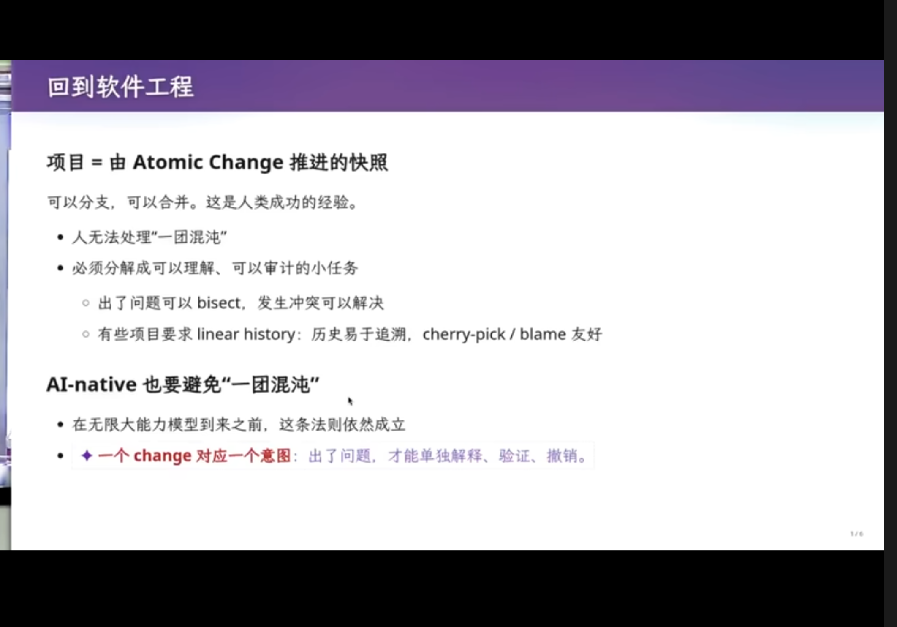

**Git 本质 = 把项目组织成\"用 atomic change（原子变更）推进的快照\"。**

项目管理的本质：人无法处理\"一团混沌\"------
许多需求、许多代码一次做一大波。所以要把需求分解成可理解、可审计的小任务，**一小步一小步推进**。

- 随时开新分支做尝试：失败就安全丢弃，成功就合并进来。

- 小任务之间的冲突容易解决（能定位到具体哪个提交冲突）。

