# **一、课程作业：会成长的个人助手**

## **1.1 要求：实现一个会成长的个人助手**

-  [要求详见老师个人网站](https://jyywiki.cn/GSE/2026/lab1.md])

## **1.2 为什么要布置这个实验**

- 当AI不了解你,它会陷入混乱,不知道你的习惯,想法.或许AI能干活,但是会消耗更多的token
- AI和用户的这种**交流坑**,一定需要去尝试踩一下
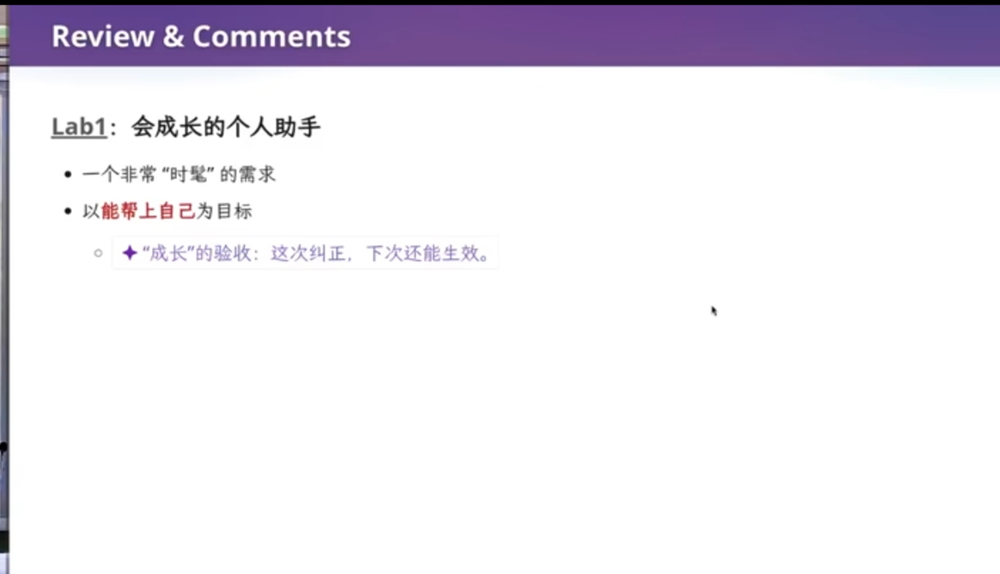

# **二、文件是需求的投影**

## **2.1回顾上节课**


- 项目是各种文件的集合 
- 老师提到,他不喜欢AI写的超长README,他喜欢简单精炼,只需从README体现自己的想法,初衷,产品最终效果
- 各种intent,spec,code的要求,都是属于项目的一部分
- 因此,需要学会管理这些项目

## **2.2 文件系统并不便利**
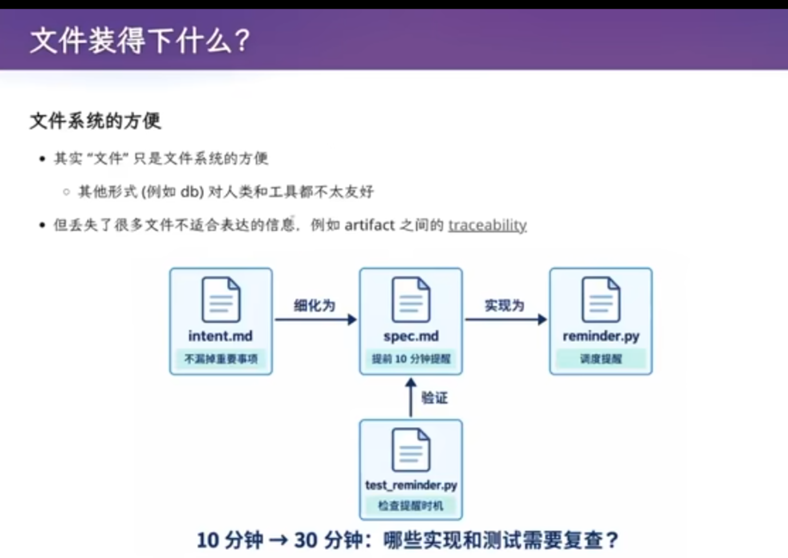
- 用文件系统来管理项目，其实是图方便。
- 在1950--60年代，操作系统能提供的存储抽象只有文件，关系型数据库还没有发明，程序员别无选择，只能把项目以文件的形式存进去。
老师进一步判断：文件系统可能不是组织项目的正确方式，因为它丢失了许多难以用文件表达的信息。
- 举例:一开始在文档里说明使用link list关联,但是在随后的开发中,却没有实现,随着开发向前,与文档的不一致只会越来越多,最后陷入了,技术维护的泥潭
- 让AI看,AI都不知道是文档说得对还是代码说得对,更别提自己了
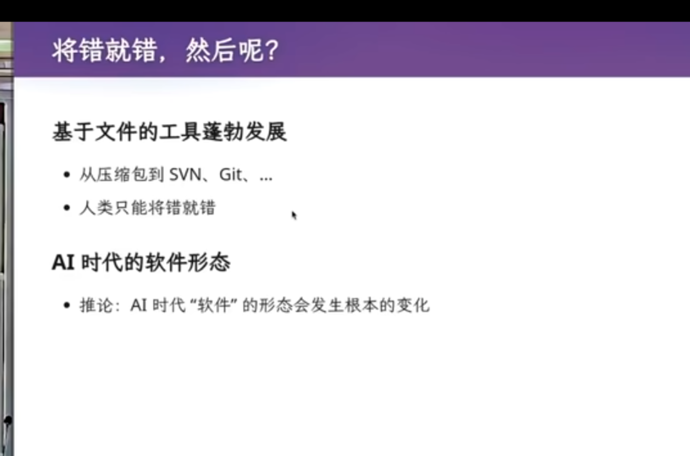
- 文件系统的「将错就错」，由此引出软件工程里研究非常久的一个问题：traceability（可追溯性）。
- 一篇2014年的论文回顾了更早的工作，它的摘要指出：
  `软件可追溯性是软件密集系统中一种「被追求却又常常难以捉摸」的质量属性；在安全攸关系统中，它是美国联邦航空局（FAA）等认证机构强制要求的要素，是软件开发过程不可分割的一部分。`
- 核心问题还是前面那个：一个软件项目中各种各样的测试用例、文档，哪怕是文档里的一行代码，它们之间的关联是什么？能否在软件系统的演进过程中，始终维持这些关联？

## **3.3 未来设想：一个比git更强的管理工具与AI共同维护项目**

- 文件系统很糟糕,于是有了SVN，有了 Git。但在AI时代:下一个是什么？
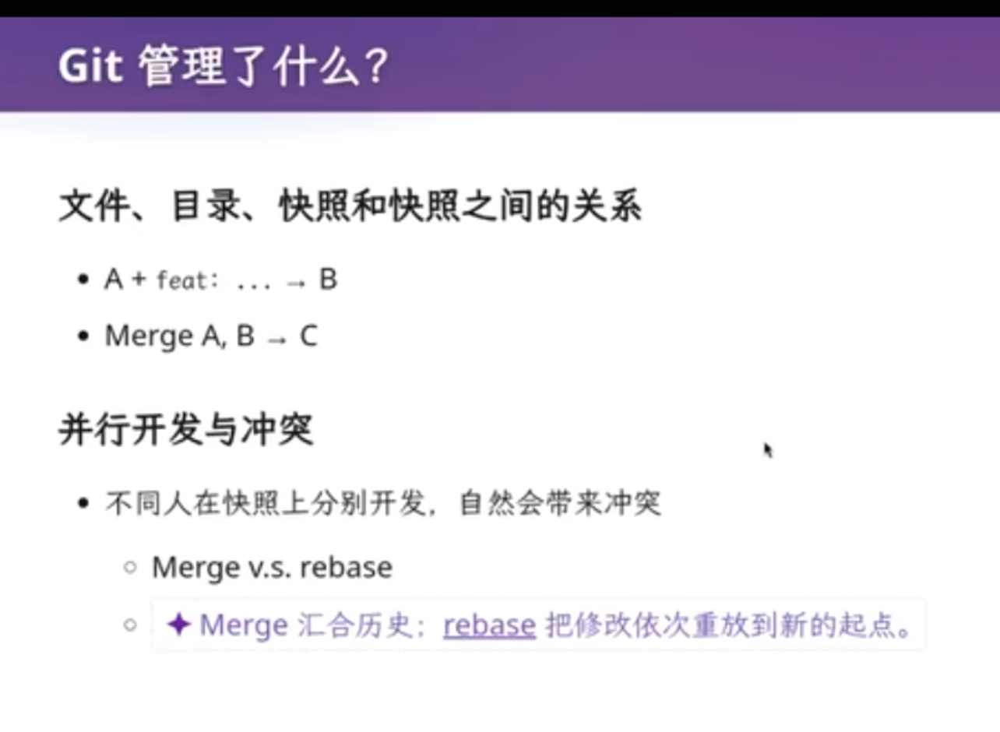
- 老师的设想未来的软件把每个软件部件变成对象或实体，再用关系把它们连接起来
- 文档「实现了」某段代码，某条测试用例「验证」了某条文档，文档又和文档互相引用。这会形成一个带环的图（graph），而不再是文件系统能表达的树。
- 这样的东西可以放进一个数据库，叫repo.db
- 但人类是无法理解的,只能通过对AI训练,让AI去维护


- 但是至少初期,还是要小步向前,沿用过去软件工程的智慧

# **四、Git 的模型：change 为何不是一等公民**

## **4.1 Git 的初心与 merge、rebase 的缺点**

Git 管理的是快照（snapshot）：一次 commit，就是某个目录在该时刻的一张快照。开发要求「小步前进」，于是 A、B 两个开发者可以各自在快照上独立开发，再设法合并。

但真实开发并不会按照「一个 Commit 做完再下一个」的方式进行：**工作区常常处于「半成品状态」**。比如你正在改 hello.c，改了一半------代码编译不过、程序跑不起来、测试不过，但又不能直接把它当成一个完整版本提交。此时导师打电话来，说有个高优先级 Bug 必须马上修，你只能先把半成品收起来：

```
$ git add hello.c
$ git stash
```

中断还会叠加：刚修到一半又被更高优先级的 Bug 打断，只能再 stash 一次，stash 越堆越多，还要管理它们。于是原本只是「我正在改代码」，最后变成了「我得管理一堆 Git 状态对象」。

回到快照模型本身，合并也有类似的别扭：

- merge：创建一个有两个 parent
  的提交，同时继承两条线上的修改。它带来归属问题------merge 由 A
  执行，冲突 resolve 后产生的 change 就算 A 做的，于是 B
  写的代码，ownership 最后记到了 A 头上。

- rebase：把一条线上的提交逐个「搬」到另一条线之后，形成线性历史。风险在于每一步都可能冲突：把
  feature 搬过去要 resolve 一次，把 test 搬过去还可能再失败；而且每次
  rebase 都会创建一个新的 commit ID，历史随之被改写。

一旦冲突进入 rebase模式，人往往会瞬间不知道该怎么办------这正是老师要引出的问题。

## **4.2 真正想操作的是 change**

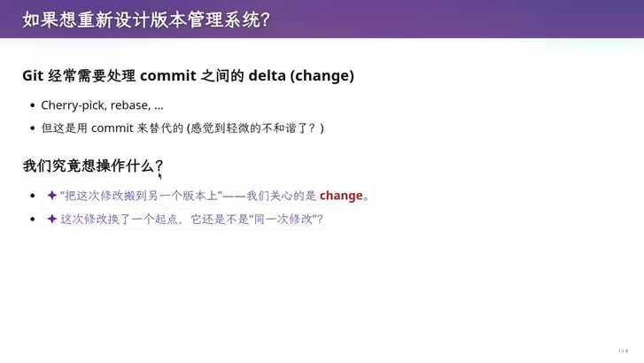

图：如果想重新设计版本管理系统：Git 用 commit 代理 change 的不和谐

Git 经常需要处理 commit 之间的 delta，也就是 change：cherry-pick、rebase 都是如此。但 Git 是用 commit 来「代理」change 的------change 本身不是一等公民，于是总让人感觉到一丝轻微的不和谐。

我们究竟想操作什么？「把这次修改挪到另一个版本上」------我们关心的其实是 change 本身。更进一步：这次修改换了一个起点，它还是不是「同一次修改」？这个语义问题，在 commit 模型里无法直接表达。

**任何时候的编辑过程都是 change。** 不需要等到 commit 才承认「发生了修改」：给 hello.c 加一行、减一行，都已经是 change。所以工作副本本身就可以是一个 commit------改一个字节就立即提交，并把上一个 commit 替换掉，仓库永远处于「可记录」的状态：

```
Base Snapshot → Current Change → Current Snapshot
```

无论当前修改是否编译成功、测试是否通过，它都能作为一个 change 被持续记录。Snapshot / Commit 表示某一个可记录的项目状态，Change 表示当前正在进行的修改，二者分工明确。

**于是 staging area 也可以不要了。** Git 是 Working Tree → Staging Area → Commit 的三层模型，之所以需要暂存区，是因为「我正在改什么」和「我准备提交什么」是两个状态。而在 change-first 模型里，系统天然知道「这些内容就是当前这个 change」，不再需要中间层------**当前的工作状态本身就是工作状态的正式抽象**，而不是 commit 之前的「临时脏状态」。

## **4.3 Jujutsu：让 change 成为一等公民**

如果把 change 也作为 first-class
citizen，你会得到下一代更好用的版本控制系统------Jujutsu（jj，老师现场演示的正是它）。它和
Git 底层完全兼容，可以直接当 Git 用，但额外引入了 change 的概念：

- commit 在 rebase 时不应该变成一个 ID 不同的「新 commit」；以 change
  为单位，同一份修改可以保持身份。

- 不再需要 staging area（暂存区）：change 本身就是「当前正在进行的修改」，你一直在编辑，随时都在产生 change。

- 以 change 为单位，抽象层级变高，冲突的搬运与解决都更自然。

- 冲突可以显式记录、之后统一处理（老师称之为 killer feature）：rebase
  带下来的冲突不会立刻打断你，而是先记录，事后一次性 resolve。

# **五、Agent 时代的版本管理**

## **5.1 课程定位：不是「怎么用 Git」，而是「为什么 Agent 需要新的版本控制」**

老师再次强调课程定位：这不是传统的软件工程课程，而是**生成式软件工程（Generative Software Engineering）**。因此真正值得研究的问题不是：

- 「如何让 Agent 学会 Git？」

而是：

- 「在 Agent 成为主要软件开发者之后，版本控制系统本身是不是也应该重新设计？」

**让 Agent 使用 Git，只是第一步。**

**只把一个对人类更友好的 Git 换掉，帮助有限。** 前面讨论的 Change-first 模型，对人类来说可能已经是一个很大的进步------ stash 堆积、staging area 这些麻烦都消失了。但对 Agent 来说，提升可能没有那么巨大。原因是：**Agent 本来就很擅长执行复杂的 Git 操作，例如 rebase。**

也就是说，一个人可能会觉得「Rebase 怎么这么复杂，我完全不知道现在发生了什么」；但 Agent 可以读取 Git 状态、Commit、Conflict 等信息，再按照步骤执行。因此，如果只是把一个对人类更友好的 Git 替换成另一个类似的工具，并不一定真正解决 Agent 时代的问题。

**真正需要改变的是：版本控制系统默认假设「使用者是人类」。** SVN、Git 等传统系统共享一个基本假设------使用这个系统的主体是人。而 AI Agent 出现后，这个前提可能不再成立。于是应该重新问：

- **如果这个系统的主要使用者不是人，而是 Agent，系统应该怎样设计？**

这是 Agent-native 版本控制系统真正值得研究的核心问题。

## **5.2 人类的一个重要限制：Single-threaded**

讲者用操作系统课的类比说明这个问题：**可以把一个线程想象成一个人。** 线程访问共享内存只有 load 和 store（read / write）两个基本操作，读写不能同时发生；要同时，就得诉诸原子指令。

讲者把「人」放回这个模型：观察世界时手背在身后，只能看；要写变量必须闭眼，而闭眼期间寄存器里的值已经过期------中间可能被换下 CPU、被中断，换成另一个线程执行一会儿------于是他闭眼扔出的粉笔导弹很可能打错位置。人的 I/O 只有一份：一双手、一张嘴、一对眼睛。也就是说，人不可能真正做到同时观察世界、同时修改世界：

```
观察世界 ≈ Load / Read
修改世界 ≈ Store / Write
```

传统人类软件工程的工作过程因此具有强烈的串行性：观察 → 理解 → 修改，然后再重新观察。**Git 从设计之初就非常自然地建立在「人类一次进行一个有限修改，再记录一个 Commit」这样的工作模型上。**

## **5.3 人类的另一个限制：读到的值会过期**

线程读到 `x` 之后如果被调度器换下去，期间发生中断、另一个线程运行并修改了 `x`，等它重新获得 CPU 时，寄存器里的 `x` 已经是过期的旧值：

```
世界发生变化 → x 过期 → 基于旧值操作 → 错误
```

这正是并发程序里大量问题的来源，人类有完全一样的毛病：人与人之间存在无法逾越的物理屏障，谁也不能直接读到对方的思想状态；一个人改仓库时也只能「观察 → 理解 → 修改」，再重新观察。换成工程时间尺度：人产生一次 change 以小时为单位（看代码、理解上下文、思考设计、写代码、编译、测试、调试），一个软件团队的变化速度因此受限于人的工作速度。

## **5.4 传统团队其实已经在并行，但粒度很粗**

一个模块十几个人已经是不小的团队；即便如此，团队最多也就是以十分钟为单位产生一次提交，仍然远慢于人与人之间的沟通速度。人类协作实际上靠**提前划分 Scope** 来回避冲突：你不会闷头改一两个小时，而是先问同事「我准备做这个修改，可以吗」------工位旁二三十秒的确认就够；公司里则是每天早会用半小时分派任务、确定各人负责的模块。

```
整个项目
├── Task A → Developer A
├── Task B → Developer B
├── Task C → Developer C
└── Task D → Developer D
```

这就是一种非常重要的**并发控制策略**：在真正修改之前，先把彼此的工作范围分开。也正因如此，「古法编程」下 stash 是合理设计------导师在你改到一半时再打电话的概率很低，stash 通常只有一层；而人知道「切换太多会变麻烦」，会主动控制 stash 深度，还能直接拒绝低优先级的工作、自己排队。

**所以 Git 并不是「设计得很麻烦」，而是在很大程度上适应了人类开发者的生理和协作限制**：Stash、Branch、Merge、Rebase 都有意义，提前划分 Scope 很重要，让一个人暂时停止工作也很正常。

## **5.5 Agent 与人类的根本差异：可能不是「更聪明」，而是「并行能力不同」**
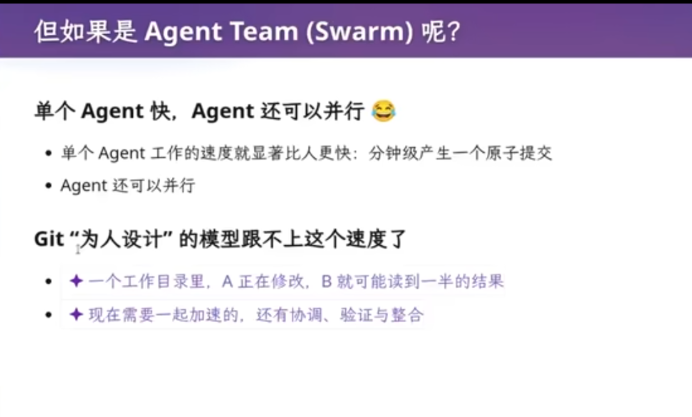

如果人类天然受到 Single-threaded 限制，那么 **Agent 不一定需要遵守同样的限制**。单个 Agent 生产 AI slop 以分钟级为单位，甚至更快；上下文热的时候，让它修一个东西可能只需几十秒甚至几秒。再乘上十倍、百倍规模的 Agent team，为一个「人」设计的 Git 模型就跟不上这个速度了。

而一个 Agent 系统可以同时处理：多个任务、多个文件、多个 Change、多条修改路线、多个测试、多个候选方案。因此未来版本控制系统真正该回答的问题可能不是「怎么让 Agent 更容易使用 Git？」，而是：**如果软件的主要修改者本身可以高度并行地生成和处理 Change，Version Control 的基本模型是不是也应该围绕并行 Change 重新设计？**

这也让前面「Change 作为 First-class Citizen」的讨论变得更关键：版本控制要从「以人类串行为核心」转向「以大量可组合、可追踪的 Change 为核心」。

## **5.6 workaround：让 Agent 沿用人类的 Git 模型（一机一 Agent）**

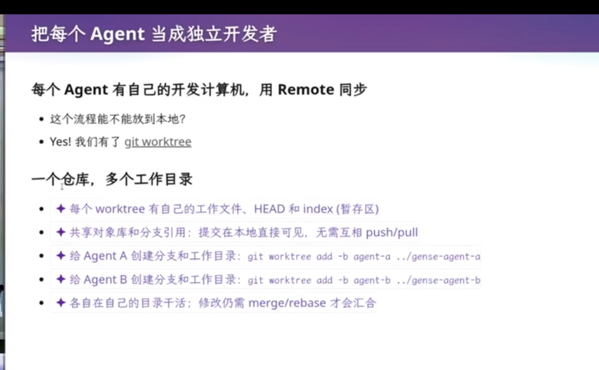

最省事的方案是**对 Agent 和人类做严格的一一对应**：每个 Agent 拥有一台独立的开发机器（可能是容器）、一个独立的工作环境、自己的 Git Repository / Branch：

```
Agent A                        Agent B
┌──────────────────┐          ┌──────────────────┐
│ 独立机器 / 容器    │          │ 独立机器 / 容器    │
│ Git Workspace    │          │ Git Workspace    │
└──────────────────┘          └──────────────────┘
```

两个 Agent 看不到对方的工作区、不直接共享本地状态，各自向 Remote Repository 提交------本质上仍然是传统的多人 Git 协作模型，只不过「人」换成了 Agent。多 Agent 形态就是一个监工 Agent 协调子 Agent：主 Agent 负责规划与调度，接收任务、观看子 Agent 的输出、总结报告并 inject prompt。老师现场的组合是**较强的模型负责 design / coding、另一个较强的模型负责 review**，让它们互相打架再达成一致，用多个强模型之间的相互约束减少单个 Agent 出错。

**现场演示。** 老师开了 tmux session，把 Agent 命名为 slave-a、slave-b 送进各自的工作环境干活，自己当「工头」用 send-keys 把指令打给它们，靠 capture-pane 判断忙闲，空闲才发键，避免指令糊进正在生成的输入框。它们可以合并到远端、拉取别人的提交，冲突了自己修，必要时给 master agent 发消息汇报。

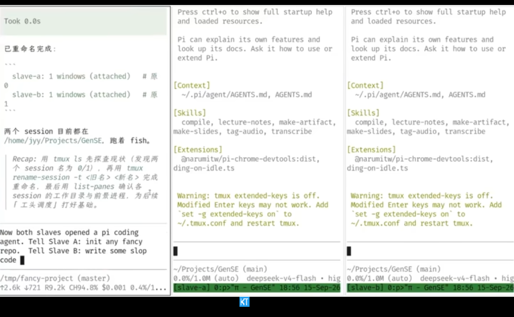

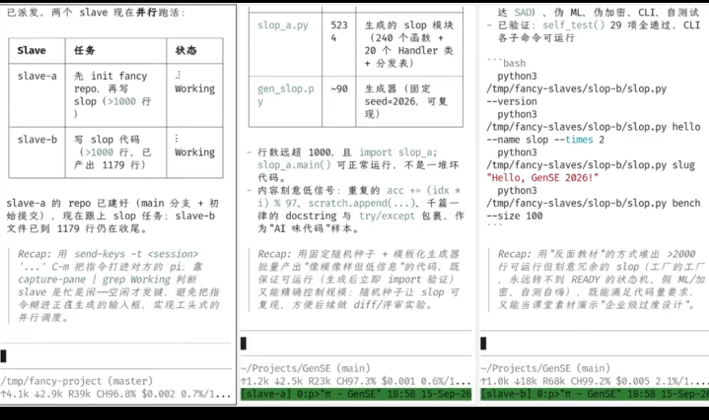

**老师提出：如果大家工作在同一个 Git 仓库上，就会有一些麻烦；如果工作在不同的 repo 上，就完全可以------你立即就能构建出一个多 Agent 系统。** 如果多个高速 Agent 直接在同一个 Repository 上工作，就会同时改同一个文件、同时产生 Commit、Branch 状态不断变化、Rebase / Merge 频繁发生，而且 **Agent 很难知道自己看到的 Repository 状态是否已经发生变化**（这正是 5.3 里「读到的值会过期」在多 Agent 场景下的复现）。先隔离再合并则好得多：每个 Agent 各自修改、自由尝试、不影响别人，最后再整合。

**Agent 时代的核心矛盾是生产速度 vs. 协调成本**：传统 Git 服务的是「有限数量的人类开发者协调有限速度的修改」，而 Agent Team 面临的是「大量高速生成的 Change 如何被隔离、验证、组合和追踪」。这也说明 Change 作为 First-class Citizen 不只是让人类少敲几个命令，而是为了适应 Agent 高速并行的生产模型。

## **5.7 更轻量的 workaround：Git Worktree**

多 Agent 协作已经可以通过现有 Git 机制实现：各自在独立环境开发、从 Remote 拉取别人的提交、处理不了的冲突汇报给 master。**而 git worktree 把这件事做得更轻**------它允许一个 Git Repository 同时拥有多个独立的 Working Tree（工作树）：

```
              Git Repository
                    │
          ┌─────────┼─────────┐
          ↓         ↓         ↓
      Worktree A Worktree B Worktree C
          ↓         ↓         ↓
       Agent A   Agent B   Agent C
```

每个 worktree 有自己的工作文件、HEAD 和 index（暂存区），共享对象库与分支引用；彼此隔离，可以同时修改、互不覆盖工作目录、分别 Commit。在人类开发时代，通常一个开发者对应一个独立开发目录；到了 Agent Team，「一个仓库 + 多个隔离工作区」突然变得非常有价值。

**一个习惯：看到信息就立刻让 Agent 验证。** 老师强调，发现一个技术概念不要只停留在「我看到了它」，而应该马上让 Agent 实际试一下------比如看到「Git Worktree 很适合改善并行开发」，就问 Agent「帮我实际试一下」。这类查询工具能力、写测试脚本、执行命令、观察结果的任务成本很低，却能很快把模糊概念变成理解。

**底层机制：worktree 并不是一个完整独立的 Git Repository。** 常规仓库里 `.git` 是目录（含 objects、logs 等内部数据）；而在 worktree 里，`.git` 是一个普通文本文件，写着 `gitdir: <path>`，指向主仓库下为它保存的一个「微型 Git 目录」（同样有 HEAD、index、logs）。也就是说它依附原有 `.git` 而生，极大程度复用了操作系统的机制。

| 共享部分 | 隔离部分 |
| ----------------------------- | --------------------- |
| 对象库、Commit 历史、分支引用、Remote 信息 | 工作目录、当前分支、工作状态、修改内容 |

因此提交在本地直接可见，不需要互相 push / pull，比开好几台虚拟机各放一个 Agent 更轻量。

**但 worktree 不是合并方案。** 隔离工作区 ≠ 自动解决冲突：两个 Agent 改了互相冲突的内容，仍然要用 merge / rebase 整合。它解决的是「工作目录互相踩踏」，不解决修改语义上的冲突------更像是**在现有 Git 模型上打的一个补丁**，而不是重新设计版本控制的核心抽象。

# **六、重新设计协调：主 Agent 规划，子 Agent 上锁**

## **6.1 为什么需要版本控制：回到人的限制**

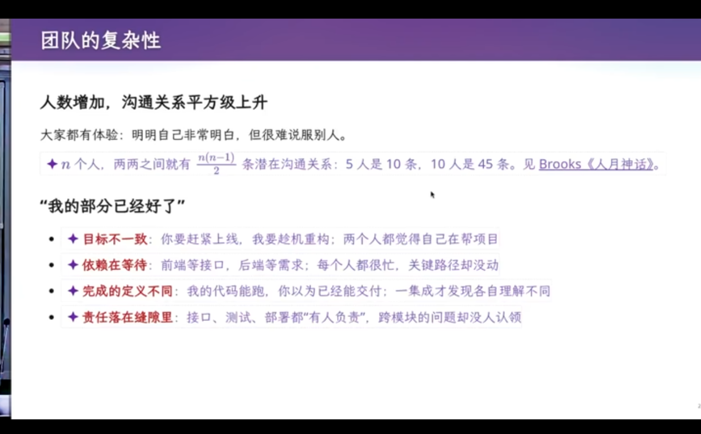

到这里，我们已经可以用独立 Container、独立 Repository、Git Worktree、Branch、Merge / Rebase 搭出一个能工作的 Agent Team------但讲者认为不能停在这里，值得重新追问：**我们为什么需要 Version Control？Version Management 到底在管理什么？** 传统答案是「管理代码的不同版本」，但经过前面的讨论，这个答案已经显得过于简单。

**版本控制工具是被人的限制塑造出来的。** 人生产效率有限、彼此之间存在 communication gap，就算沟通也可能出错。他用量化成本的方式举例：室友来问一道你自己会做的数学题，你明明会做却怎么都讲不明白，除非你是很好的老师、能共情并站在别人角度思考。沟通成本既然如此之高，团队才需要每天早会同步进展、再分派任务：

```
Leader / Team → 每日同步 → 拆分任务 → 分配 Scope → 个人开发
```

这些步骤本身不产生代码，却是多人协作不可避免的成本。沟通成本还决定了团队能长到多大：系统变大、人变多、沟通效率下降，产出速度就跟着下降------**100 人的团队不可能达到 10 人团队效率的 10 倍，能有两三倍已经不错**。

因此才有了快照与小步前进：改一个 typo 也做一次 commit，每个小 commit 都可追溯，而这套「可追溯」依赖的正是有记忆、可追问的人。

**版本管理只是工具，真正困难的是进度与团队管理。** 人越多沟通关系越密：n 个人之间有 n(n-1)/2 对关系（5 人 10 条、10 人 45 条），所以「我的部分已经好了」并不等于项目在推进------目标不一致（你要赶紧上线、我要趁机重构）、依赖在等待（前端等接口、后端等需求）、完成的定义不同（我的代码能跑，你以为能交付）、责任落在缝隙里（跨模块的问题没人认领），都会让关键路径卡住。也正因如此，最稀缺的是能把 100 人拆成 10 个小团队、再拼回一个团队的人；讲者给学生的练习就是把自己当主 Agent，用两三个 Agent 想清楚任务如何分解、以及何时提交、何时合并。

**老师：AI 时代的斩杀线以下的价值会全部归零**------学习操作系统、编译器、软件工程这些经典课程的智慧，是为了让你形成自己的理解，而不是被 Agent 替代。

## **6.2 「永远向前」：从「追责历史」转向「持续前进」**

**Agent Team 的理想状态是不再频繁回头研究整个历史**：系统不断「发现问题 → 修复 → 增加功能 → 验证 → 继续前进」，不必每次都问「这个问题是谁造成的」，而是问「现在是什么状态？下一步如何改进」。

| 维度 | 人类团队 | Agent Team / Swarm |
| ------------ | ---------------- | ---------------------- |
| Change 速度 | 慢，分钟～小时 | 快，可能秒级 |
| 团队规模 | 扩大后沟通成本很高 | 可以大量并行 |
| 历史的作用 | 找原因、找责任人、恢复上下文 | 恢复状态、继续开发 |
| git blame | 很有价值 | 价值大幅下降 |
| Snapshot | 追溯历史 | 保存可恢复状态 |
| 核心目标 | 理解过去并控制协作 | 持续向前并快速修复 |

**为什么人类需要可追溯的 Commit。** 系统出了 Bug，开发者会找到是哪个 Commit 引入的、是谁写的，然后去问那个人「你当时为什么这么写」------因为**人类开发者拥有长期记忆和上下文**，他能想起当天早会、收到的需求与沟通记录。git bisect / git blame 正是为这种「有记忆、可追问的人」设计的：把问题定位到「某个人做某件事的那一刻」。

**执行者换成 Agent，blame 的前提就消失了。** 人可以 blame，是因为被 blame 者会承担后果；Agent 没有被开除、没有坐牢的能力，而且每个 Agent 都是相同的模型、完全相同的克隆体，同一件事交给它们，方向性的结果大概率收敛。于是历史的价值从「谁写错了」变成「我怎么把它修好」：不必追查是哪个提交引入错误，只要把错误修掉。项目管理目标从 **History / Accountability** 转向 **Forward Progress（持续向前）**。

**但 Snapshot 仍然不能被完全抛弃。** 方向走错后，如果没有历史里的某个 snapshot，走远了再回头的代价更大：

```
正确状态 S0 → S1 → S2 → S3 → S4 → 发现方向根本错了
```

「修修补补」可能不如「回到 S0 重新发展」划算。所以历史仍然要留，只是姿态变成「大步向前」：commit 里留下一些 lessons 和项目演化的轨迹。传统 Git 更强调「这个变化是谁造成的？」，Agent-native VCS 更可能强调「**哪个状态是值得恢复的**」------价值重心从解释过去转向帮助未来继续前进。

讲者还给了一条判据叫**斩杀线**：如果哪天一句「做一个 AI 时代的微信」就能直接产出爆款产品，软件工程就死了；但他明确说这条线暂时还没到，至少还没到团队管理这一层------这是判据与预测，不是已经发生的事实。

## **6.3 从数据库与操作系统重新理解 Git：Git 是一种「乐观并发控制」**

讲者用并发控制的框架理解 Git 与 Agent 协作，措辞是「有点像」「像是」，因此这是类比，不是 Git 的官方定义。

数据库里，两条 SQL 各自是一个很大的 transaction，中间可以混任何代码：先 select 读，再执行图灵完备的计算（Python、JavaScript，甚至读当前时间），最后 update：

```
BEGIN → SELECT → 读取结果 → 任意代码计算 → UPDATE → COMMIT
```

两个事务交叉读写就会冲突；update 互相要读对方、或我要锁你的对象而你要锁我的对象，就形成循环依赖（死锁），事务只能 abort、回滚重来。

**Git 属于乐观一侧**：先假设两个 transaction 不冲突，让双方各自往前跑，到合并（merge 或 rebase）时再检测。这个假设靠访问局部性成立------学生选课读写的都是自己那块数据，两人同时选课也互不干扰；软件工程里则是事前开过会（「今天早上开过会了」），各人分头做，合并大概率顺利。**人类的会议、分任务、划 Scope 本质上都在降低 Conflict Probability**，所以 Git 的乐观并发模型与「古法编程」的协作方式高度匹配。

失效边界也很清楚：一旦执行体极快、主 Agent 又不够克制、把任务一次性大量分发，abort 就会频繁。

## **6.4 Agent 时代：乐观并发的参数变了**

Agent 能把开发速度提高几个数量级，又能轻易扩展出 10 倍、100 倍的 team，于是原本很低的冲突概率被大幅放大，出现「高频事务冲突」------这正是「Agent 快 1000 倍」所针对的失效边界。

**但对 Agent 来说，Conflict 不再是致命问题**：对人来说 rebase / merge 冲突要停下来读冲突、理解两边代码、判断语义、手动解决、重新测试，非常痛苦；对 Agent 来说冲突只是**另一个待处理任务**（分析冲突、重新组织 Change、跑测试、继续执行）。**关键是冲突处理的成本从「人力成本」变成了「计算成本」**，冲突因此可能变成系统内部的正常事件。

于是设计目标也可能变化：传统 Git 的协作习惯都在「尽量避免冲突」（提前开会、划分 Scope、小步 Commit），而在 Agent 时代可以换一种思路------**不一定非要避免所有冲突，而是让系统能低成本地处理冲突**。

## **6.5 悲观并发控制：主 Agent 规划，子 Agent 上锁**

既然 Agent 足够快、冲突又高频，就可以采用更偏向 **Pessimistic Concurrency Control（悲观并发控制）** 的模型：**在访问可能冲突的资源之前，先声明自己要使用它。**

```
Agent A                Agent B
  ↓                      ↓
Lock(Resource X)       想 Lock(Resource X)
  ↓                      ↓
修改 X                 发现 X 已经被锁
  ↓                      ↓
Commit                 等待
  ↓
Release(X)
```

讲者把这概括为「**一把大锁保平安**」：冲突不是发生后再解决，而是在发生之前就被阻止。

| 对比 | 乐观并发（Git 一类） | 悲观并发（锁） |
| -------- | ------------------------------- | ---------------- |
| 核心假设 | 两个事务大概率不冲突 | 冲突随时可能发生 |
| 协调时机 | 事前开会，事后检测 | 使用资源前先约定 |
| 冲突表现 | 合并时冲突、abort 回滚 | 冲突变成等待 |
| 主要代价 | 大量并行时 abort 频繁 | 把可并发的部分退回串行 |

落到 Agent 协作，规则是：主 Agent 规划完立刻锁住要做的 scope，锁住后才动手，做完 commit 再解锁；目标已被别人锁住就等待。粒度可以选**文件级锁**，避免两个 Agent 同写一个测试或配置文件。锁保护的边界不在被修改的文件本身，而在「把活干完所依赖的共享状态」：只锁正在写的文件，可能漏掉别人正在改的接口；完整协议是**上锁、读取最新状态、修改、验证并留下可恢复快照、解锁**，并且要靠所有参与者自愿遵守------锁只保证互斥，不保证正确。

**悲观并不必然低吞吐。** 只有存在冲突的任务需要等待：

```
Agent A → Lock(A) → 工作
Agent B → Lock(B) → 工作
Agent C → Lock(C) → 工作
Agent D → 等待 A
```

只要彼此访问的是不同资源，它们仍然可以同时运行，这与操作系统里的 Mutex 只限制临界区完全对应。代价是锁把本来可并发的程序退回串行，与多处理器并行存在根本矛盾，细粒度锁只能缓解、无法取消；但在 Agent 时代，「等待几秒」往往比「冲突后修复几分钟」便宜。

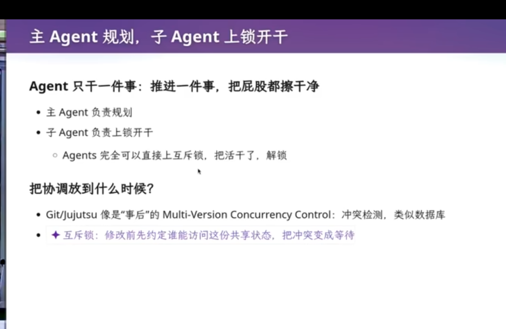

于是就有了这一节的做法：主 Agent 负责规划，规划完立即把项目的某个部分「锁上」；子 Agent 只干一件事------上锁、干活、把屁股擦干净、解锁。

# **七、版本控制留给我们的启发：First Principles**

## **7.1 项目不只是「当前状态」**

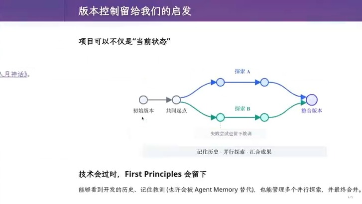

图：版本控制留给我们的启发：并行探索、汇合成果、First Principles

版本控制留下的第一个启发是：项目不仅可以是一个「当前状态」。它从初始版本出发，到达一个共同起点后，分叉为探索
A 与探索
B，最后再汇合为整合版本。这要求我们能够：看到开发的历史、记住教训、管理多个并行探索，并最终合并。

这里和 6.2 是呼应的：在 Agent 时代，历史的价值重心正在从「解释过去」转向「帮助未来继续前进」------保存历史的主要目的不再是追责，而是随时能回到一个值得恢复的状态。

**WHY 解释：**

为什么说「技术会过时，First Principles 会留下」？SVN
的具体机制会过时，Git
也会。但「记住历史、并行探索、汇合成果」这些第一性原理不会过时。即便有一天
Git 被别的工具取代，「记住教训」这一职能也许会被 Agent Memory
替代，但「能看到历史、能并行探索、能最终合并」的需求始终存在。

## **7.2 从信任老师到形成自己的理解**

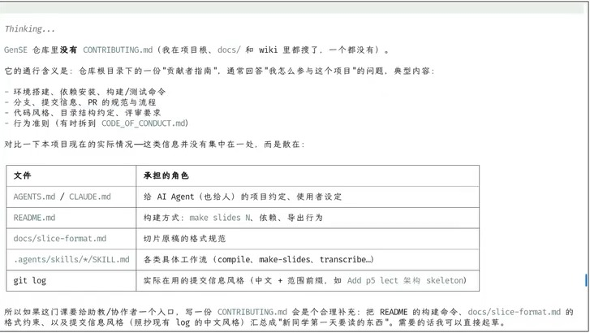

图：贡献者指南应该写什么，以及它在 GenSE 仓库里散落在哪些文件中

老师借一个同学提的问题展开：学生时代大多数人不会和他人共同合作、只是做作业，所以
rebase、merge
的使用场景很少------这个观察是对的。但如果你真的去外面的世界中走一走，会发现互联网开发者社区铺天盖地都是文档。

你总有一天会留意到别人的项目里有一个
CONTRIBUTING.md（贡献者指南），它通常回答「我怎么参与这个项目」，里面写着项目的总体结构、分支与提交信息、PR
的规范和流程。如果你发现里面的东西你都已经知道，很好；如果不知道，比如看到一个项目要求「必须
rebase、禁止分叉式 merge、保持线性历史」，你就会去搞懂 rebase
到底是干什么的。

这里引出一个问题：为什么「老师不教、考试不考」的东西就「不需要会」？这是典型的学生思维------老师教什么就学什么、考试考什么就学什么。为了升学的利益最大化，这在高中是正确的；但到了大学仍带着这套思维，就会出现「新人类」与「旧人类」之间的
gap。老师举「会计从业者」等低级智力劳动面临被 Agent 替代为例：在 AI
时代，斩杀线以下的价值会归零。

**学习的目的不是应付考试，而是形成自己的理解（first principles）。**

# **八、现场演示：intent 与 specification 之间的鸿沟**

## **8.1 项目早期不应该马上上 Multi-Agent：先自己当「包工头」**

**项目的早期阶段不应该一开始就用 Multi-Agent**：此时 Intent 还不清晰、需求还在变化、项目结构还没有形成、架构还没有稳定、很多关键决策尚未确定。直接让很多 Agent 并行工作，只会把一个尚未想清楚的问题迅速放大------产生大量错误方向。

讲者把项目早期的角色描述为「**你就是包工头**」：先自己负责方向，再找你能用到的、能力最强的 Agent，与它做多轮对话。项目初期最重要的不是立即写大量代码，而是明确目标、讨论方案、澄清需求、发现遗漏、决定架构：

```
Human → Strong Agent → 讨论 / 澄清 → 重新理解 → 形成 Plan → 开始执行
```

而不是「一句 Prompt → 100 个 Agent → 疯狂写代码」。对于复杂任务，更值得先看 Agent 准备怎么做------一线模型面对开放需求往往会进入 **Plan Mode**：确认事实、询问缺失信息、拆分任务、生成 Workflow。**先看 Agent 的 Plan，通常比直接执行可靠得多。**

## **8.2 Agent 的 Plan 本身可以成为程序**

Claude Code 这类工具在复杂任务里会生成一段 JavaScript / TypeScript，其中有个名为 `agent` 的函数，函数体是自然语言，甚至用循环组织多个任务------也就是说，**Agent 可以用程序描述自己的 Agent Workflow**：

```
Workflow → Repeated Agent Execution
```

这背后是一个递归结构：用 AI 来设计 AI 的工作流程，模型本身开始承担部分 **Orchestration（编排）** 工作。讲者形容生成速度是「**这个 300 token per second，实在是太恐怖了**」------复杂 Workflow 的 Token 消耗也是现实约束，多层调用时成本会快速增加。

## **8.3 Context Engineering：Prompt 中的每个词都会进入 Self-Attention**

危险点在提示词工程的机制：**提示词里的每一句话、每一个词，self-attention 都会看到**，模型不会像人读说明书那样自动判断「这只是背景信息」。而模型已被训练成遵循指令，带着「没有办法往外拉的倾向」：面对讨论稿不会保留模糊性，反而过度遵循字面指令，于是 Prompt 中一个看似无关的小细节就可能让行为偏移。讲者用了一个夸张的说法：「AI 现在已经被训练成 Prompt 的舔狗。」

在复杂 Agent 系统中，System Prompt、User Prompt、Tool Instructions、Workflow、历史上下文会共同影响决策。因此 **Context Engineering 的核心不是「写一个更长、更详细的 Prompt」，而是控制哪些信息进入决策环境、以及它们之间如何组织**：

```
给更多信息  ≠  给更好的信息
```

困难的地方是让 Agent 在正确的任务阶段，看到正确范围、正确层级、正确可信度的信息。

## **8.4 现场演示：直接把需求丢给 Agent 会发生什么**

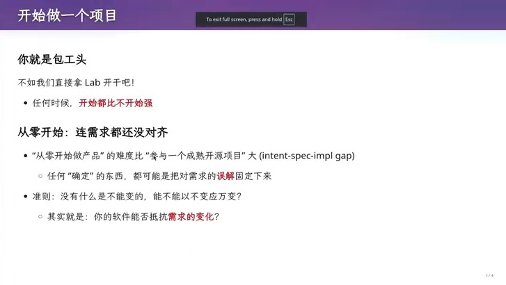

图：从零开始做项目------任何被「确定」的东西，都可能把对需求的误解固定下来

老师现场用 pi（0.85.1）+ deepseek-v4-flash 在 `/tmp/lab1` 起了一个空目录，把实验要求直接丢给它，事先完全没有准备。结果印证了前面的判断：它会做出很多看起来合理、却并不是你想要的决策。

| 你的需求 | 项目目前实现的部分 | 够不够 |
| ---------------------------- | ------------------------------------- | ---------------------------------------------------- |
| 收集外部信息、报告与研究，内外部之间的「外部接口层」 | `snail/transport` | 网页有了，只搞了邮件，还需要 ROS2 / Xr / Xrml |
| 综合总结 | `snail/reply.ts` 的功能（tasks/confirmation） | 报错了，没有「大模型的总结报告功能」 |
| 根据我的进度学习 | 没有，只有 `tasks/configuration.json` | 完全没有「知识管理、根据用户进度反馈、适配学习进度」 |

**讲者想要的第一个 feature 是学习**：高校学习与复习、要「捡成绩」，要能自动从外网收集数据、层次化归档、再给一个好用的界面。现场 Agent 没沿这条线走，它在做 database。而实验要求里真正的主句其实只有一句：**实现一个持续为你工作的个人助手**，其余都只是解读。这就是 intent 与 specification 之间巨大的 gap------你的 intent、你的 specification，彼此之间是有巨沟的。

## **8.5 「每件事都做对了」，依然可能得到错误产品**

**这是 AI Coding 最危险的一类失败。** 从 README 看，AI 做的每一件事可能都是对的：没有明显 Bug、代码能跑、文档合理、数据库设计合理。但它被当成业务逻辑系统来做------分层是入口层 / 编排层 / 能力层 / 数据层，看起来已像一个教务系统，把尚未确认的需求固化成了抽象。这不是 Coding Bug，而是**方向错误**。

**「教务系统」可能只是测试出口。** 需求里提到「把个人信息填到教务系统」，AI 很容易理解成整个项目要围绕教务系统建一套信息系统。但讲者真正需要的是一个 **browser use agent**，第一步不必在教育系统上做太多设计；ehall 只是测试出口和个人信息入口。

**Agent 甚至没有创建 Git Repository。** 它默认并不知道你希望这个项目作为一个「长期维护的软件系统」存在，可能把任务理解成「做一个能用一次的东西」。而**管理要先于编码**：成熟的产品经理在写下第一行代码之前，会先和团队谈协作、项目管理、每天何时开会、怎么验收。Agent 的默认行为恰恰相反------收到需求立即开干；在需求还没讨论清楚时，**它的执行速度越快，错误方向被放大的速度也越快**，最后代码写得越来越多，方向越来越难改。

**所以 AI 不缺执行能力，缺的是正确的方向。** 它擅长「你让我做什么我就做什么」，而成熟的软件工程需要的是「我真正应该让你做什么？」。项目早期该由人类负责 Intent、核心优先级、下一步小目标、哪些东西暂时不要设计、哪些能力必须可替换；Agent 负责探索、实现、验证与试错------**人类管方向与约束，Agent 管执行与探索**。

## **8.6 教训：从 MVP 开始，而不是从大而全开始**

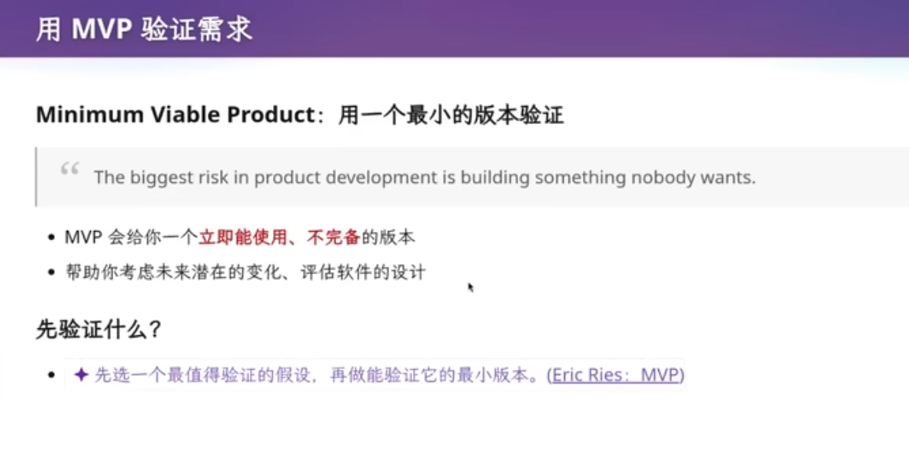

**第一件事是创建一个空项目**，再想下一步迈向哪里，而且只能往前迈一小步：不要试图一次跨过整个问题，而是不断做能够理解、验证和回退的小变化。讲者判断，**AI 从零做 slop 的难度比在成熟项目里做维护性任务大很多**------从零开始时，目标、架构、模块划分、该抽象什么、哪些是临时需求、未来哪里会变全都没有答案，Agent 只能不断做局部决策。

开发方式大致有两种：一上来就做大系统，几步把需求实现完，然后拖着技术债迭代；或者从最小处开始，得到一个个精巧的架构、逐步生长。后者就是 **MVP（Minimum Viable Product，最小可行产品）**：不是「先做简化版再加功能」，而是**先选一个最值得验证的假设，只做能验证它的最小版本**。

> The biggest risk in product development is building something nobody wants.

产品开发最大的风险不是代码写错，而是做出根本没人需要的东西。MVP 迫使你回答「什么样的需求才是绝对要的」：对个人助手而言，就是提升学习效率与提升工作效率两条能力。

**第一个选型改变是：第一个 MVP 可以没有任何数据库。** 一旦引入数据库，每次重构都要让 Agent 做 database migration；而文件系统可以自己调整目录结构。调文件与调 database schema 的心智负担也不同------人从小熟悉文件目录，不熟悉的 schema 要先做一次概念翻译。讲者自己的回邮件 Agent 就不用数据库：

```
Email → Pipeline 1 → Cloud Drive → Pipeline 2 → Pipeline 3
```

收邮箱、把 Email ID 放到共享云盘同步，ID 上带回复草稿与邮件分类，再由下一级流水线处理。关键是先想清楚**有哪几级流水线、如何协作、哪些通过云盘传递**，而不是「数据库用哪个产品」。

**需求变更出现：希望邮件与资料等和云盘同步。** 它检验架构------现在也许满足需求，但需求变化时的改动是摧毁性的、背上技术债，还是可控？当前把个人资料、邮件归档、索引、草稿都放在一个 `state/assistant.db`，短期不会有大问题；随着功能增加，它可能慢慢变成技术债。这也正是「先不用数据库」的意思：**不要为了未来可能发生的问题，过早支付今天就确定存在的复杂度成本。**

**云盘方案的第一条是硬红线：绝不把 `state/assistant.db` 放进云盘同步。** 它不是一个普通文件，而是 WAL 模式的二进制库，里面装着确认状态机、任务队列、IMAP 游标（uidvalidity / last_uid）和幂等键------两台设备同时写会把库写坏，甚至重复发信、重复提交 ehall，把「确认一次、执行一次」的保证变成重复提交。原则是：**云盘同步「记录」，SQLite 只是每台设备从记录派生出来的本地缓存。**

**另一个例子：记录做题轨迹也不需要数据库。** 讲者给小学生做的汉诺塔 Pico Playground 多了一条限制------所有盘子只能朝一个方向移动；这个产品要卖的不是答案而是过程，只存最终盘面看不出孩子卡在哪里，得把动作存成逐行文本才能回放、比较、点评。GPT 给的方案是「API 应用 + 关系数据库 + 对象存储」，讲者直接说不喜欢：因为真正要的是**版本管理**，而 Git 刚好有三样现成能力------树状版本历史留下「做到哪一步、从哪里可以重试」，两次提交之间的**免费 diff** 回答「到底改了什么」，Comment Commit 与 `git notes` 把点评关联到当时的版本、还能后补而不重写原提交。所以早期先用可读可改的文件与仓库承载，等目录格式、commit message 格式与使用方式都收敛了，再迁移到数据库。

**最后是 prompt 的杠杆效应：早期的 prompt 对整个项目的走向影响最大。** 一句「做一个教育管理系统，要有数据库、账户、邮件、教务模块」和一句「做一个能持续提升我学习和工作效率的个人助手，先用最小版本验证核心价值」，会让 Agent 的架构方向完全不同。每一次被「确定」下来的设计都会变成潜在的技术债，所以能回退、能重做，比一次做对更现实。

## **8.7 以不变应万变：让设计能够抵抗未来变化**

讲者用「你能不能以不变应万变」收束：**现在设计的架构和流程，能不能抵抗未来需求发生根本性的变化？** AI 助教可能是文字的、图像的、有交互的、无交互的，底层模型也可能不断更换------好的架构要用最少的变化去应对，让变化集中在应该变化的地方。

这也是软件工程与数据库课、操作系统课最不同的地方：那些课解释「今天的东西为什么长这样」，而软件工程要回答的是「**未来变了，你怎么办**」。真实软件会经历需求变化、功能增加、结构重构，所以除了「当前系统是否正确」，还要问「下一次变化时，修改会不会非常痛苦」------**Maintainability（可维护性）与 Changeability（可变更性）** 因此是软件工程的核心问题。

老师自己处理邮件的流水线就是例子：需求从「只处理邮件」变成「邮件与资料都要同步到云盘」时，架构能不能自然吸收这个变化，才是真正要回答的问题。

## **8.8 版本管理的三个核心价值：记住现在、记住历史、记住教训**
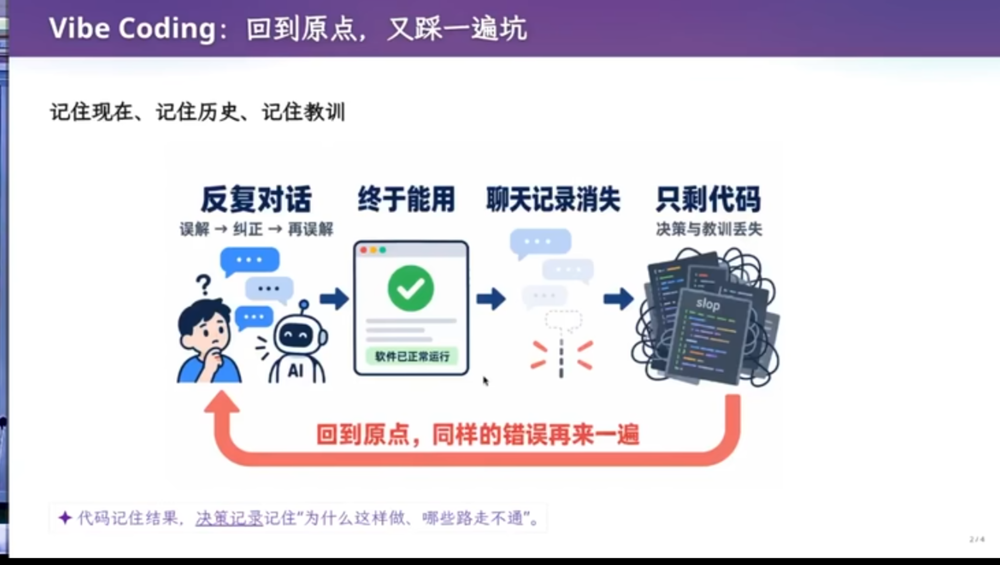

老师用一句话收束两节版本管理课：**版本管理做的三件事是记住现在、记住历史、记住教训**，这三件事在古法编程时代和 Agent 时代都成立：

1. **记住现在**：要有一个 Repository 把文件管起来（C、C++、Python、JS 都一样）；传统情况下它就是文件 + 目录 + Git，未来也可能变成 Artifact + Relationship 的结构化仓库。
2. **记住历史**：删掉的东西可能还有用，得能捞回来；提交历史让你看到项目是如何演进的。
3. **记住教训**：某条路失败后，可以回到另一个点走正确路线------保存的不只是代码，还有「为什么这样做、哪些路走不通」。

这也是版本管理留给我们的定位：代码记住结果，决策记录记住「为什么」；它是工具，凝结了人类过去很多年软件工程的经验，在此之上才长出你自己的直觉。版本控制解决「怎么安全地变化」，软件架构解决「变化时改哪里、改多少」，MVP 解决「我们到底应该先做什么」。

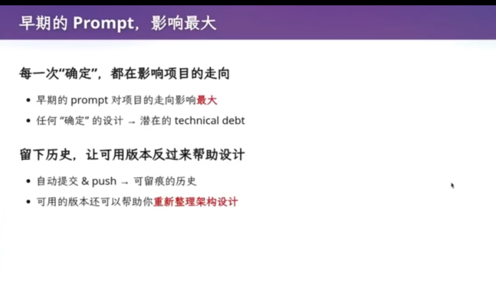
