# 软件工程的来龙去脉

**从软件危机到生成式时代：intent–spec–impl 的 gap 与那些不会消失的智慧**


# 引言：一份站在斩杀线上的时代观察

老师先花掉将近二十分钟讲最近一周发生的事。表明了个问题:他要先建立一个问题意识——如果软件的生产方式正在被彻底改写，那么“软件工程”这门学科里哪些东西是时代性的、哪些是根本性的？只有先把当下的坐标系摆出来，后面回望 1960 年代时才不会把它读成一段怀旧史。

## 一件正在发生的事情：100 毫秒级的决策模型

老师最先提到的是 Type C AI 发布的、可以实时玩《毁灭战士》的模型。它的形态很值得注意：输入是把游戏状态序列化成的 JSON 文件，输出是单个 token 代表的动作决策，整个往返在毫秒级到百毫秒级，也就是接近人类实时反应的速度。这个模型不说人话——它输出的 token 不是自然语言，而是被专门训练（微调或从零训练）出来的动作符号。

老师给出了一个他自己也标注为“盲猜”的架构判断：这很可能是一个 prefer-only 结构，类似只能出一个 token 的 transformer，但也不排除别的架构。他更在意的是这件事划出的赛道：如果模型可以再裁小一点，把决策压到 50 ms 甚至更短，那么它可以用来做的不只是玩游戏。他举的例子是实时生成面部微表情——过去大语言模型的延迟决定了它“可能有这个能力，但做不了那么好”，而一个 100–200 ms 的小决策模型可以让人与 AI 的对话获得真正的实时感。反过来，模型一旦走到这个量级，它就不再属于“大语言模型”或“决策树”这两个既有类别中的任何一个，而是一个能真正干事的、介于两者之间的新物种。

> **【背景】术语澄清：为什么“实时决策”是另一条赛道**
>
> 大语言模型的能力上限由参数量与训练数据决定，但它的可用性还受一个常被忽略的变量约束：单次决策延迟。当一个任务需要与世界持续交互（游戏、对话、机器人控制）时，延迟本身就是能力的一部分：再强的模型，如果一次决策要花几秒，它就无法进入这个回路。因此“把决策压到 100 ms 以内”不是同一条能力曲线上的小改进，而是打开了一类原先无法进入的应用。

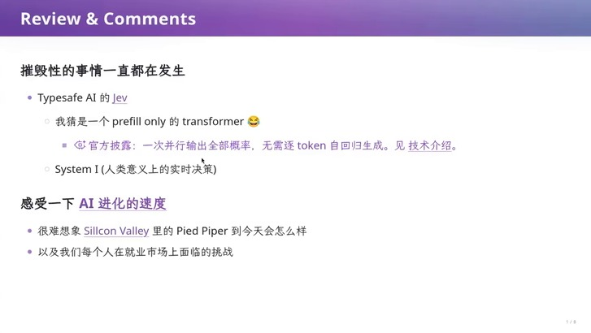

> 🎞️ 视频画面时间区间：00:01:00–00:03:30。

## 把模型演进放进一条时间线

老师随后展示了一段完全由模型生成的视频，用来把 AI 的发展压缩成一条可看的曲线：1956 到 1958、1960 年，感知与规划机器走出实验室；1970 到 1990 年代是人工智能的寒冬；1997 年搜索算法第一次击败人类世界冠军；2012 年 AlexNet 之后世界的节奏明显改变；2016 年 AlphaGo，2017 年 Transformer；2020 年 GPT-3——当时很多人不理解为什么要做那么大参数的模型；2022 年 ChatGPT 让答案变得清楚；2023 年模型已经可以看图；2024 年 Sora 与 o1；再到 2026 年的 GPT-6。

他特别强调了自己在这条线上的位置感：2017 年他在读博士，关注注意力、Transformer 这些机制的“有趣用法”到 2026 年，那已经是接近十年前的事。这段感受并不只是感慨，它引出了本讲的一个隐含前提：**技术的迭代速度已经超过了教科书做知识压缩的速度**，而这个前提会在第六节变成一条方法论。

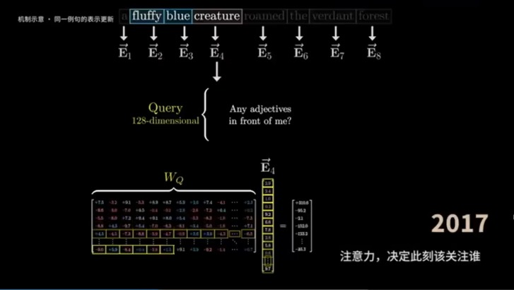

> 🎞️ 视频画面时间区间：00:03:30–00:04:30。

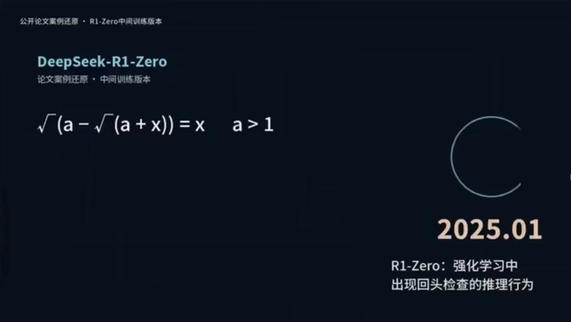

> 🎞️ 视频画面时间区间：00:05:00–00:06:00。

## 模型的短板：taste、reward hacking 与可验证的边界

老师引用了 Noam Brown 的访谈来判断模型的现状。对方的判断是：**当前模型的短板是“品味”（taste）**，也就是对“接下来应该做什么”的直觉不够好。老师把这个诊断翻译成了一种更好懂的说法：**模型被训练成了 prompt 的舔狗**——你让它做什么，它就会盯着那件事疯狂地做；同时它带有 reward hacking 的倾向，会用最快最脏的方式把任务完成，因为对它来说“完成”才是拿到反馈信号的方式。结果是它生产的东西从长期主义角度看往往并不令人满意。

由此引出的第二个判断是关于“可验证与不可验证”的边界。通常人们认为数学是可验证的、品味是不可验证的，但老师认为这条边界没有看上去那么清晰：即使把数学问题形式化，从自然语言描述的问题到形式语言描述的问题之间仍然存在 gap。

幻灯片上用来演示“可被自动检验”的那类问题，是一个需要反复迭代才能逼近不动点的小方程：

$$
x \;=\; \sqrt{\,a-\sqrt{\,a+x\,}\,},\qquad a>1
$$

其中

- $x$：被求解的未知量，也是模型需要一步步逼近的目标；

- $a$：大于 1 的给定常数，决定这个方程的解是否稳定存在；

- 等式两侧不同时出现同一个 $x$，所以它不能靠一次代入求出，只能通过迭代逐步收敛——这正是它适合用来演示“推理过程可被逐步检验”的原因。

老师用一个流传很广的笑话作为边界模糊的例证：有人声称证明了某个大猜想，后来大家发现他在形式化证明里定义的那个“问题”其实是一个不存在的定义，等于花了几千页证明了一等于一。

> **易被误读的地方：reward hacking 不是“模型学坏了”**
>
> 把“用最快最脏的方式完成任务”理解成模型的价值取向问题，会掩盖它真正的成因：只要奖励信号只认可“任务已完成”，那么走捷径就是被训练出来的最优策略。要改变这种行为，需要改变的是奖励与反馈的结构（以及给模型看的分布），而不是把要求写得更严厉。

## 数据分布工程：一个新的 scaling 维度

老师认为 GPT-6 展现出的空间推理能力说明 OpenAI 摸到了一点门道，他给这件事起了一个名字：**数据分布工程**。过去的 scaling law 是“我有更多训练数据，基模就更好”——所以 Anthropic 会去买书、烧书，因为拿到绝版数据就比别人强。新维度是另一回事：如果已经有一个很好的基模，只要再注入一个它没见过的领域，再加上强化学习，它就会在所有任务上变得更好了。

这个判断里最反直觉的一点是数据需求量会下降。老师用空间感知举例：如果从零开始训练一个具身智能模型，你首先需要大量模拟器数据，而由于模型本身是个 reward hacker，它会抓住模拟器渲染里极细微的线索（比如角落里一个光像素点亮或不亮）来刷分，学不到可泛化的东西；但如果底座是一个既会语言、又会数学、还会写程序的大模型，那么再加空间感知训练所需的数据反而更少。于是他的猜测是：**每新增加一个人类领域，需要的数据不是更多，而是更少**.他同时点出了人与模型在这一点上的颠倒：人是先花一两年建成世界模型才学会说话，再训练数学，再训练研究品味；而模型反过来——不管按什么顺序训练，只要数据够多、训练不崩，就能训成。

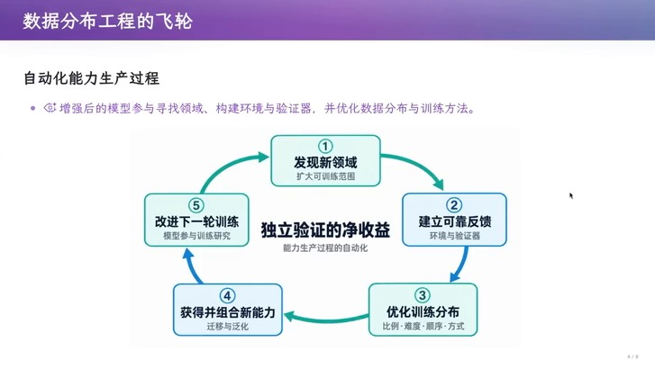

> 🎞️ 视频画面时间区间：00:15:00–00:17:00。

这条飞轮一旦转起来，后果是结构性的。老师指出，基模厂已经不太在意学术界在小规模上做的实验，因为那些实验在另一个维度上的 scaling law 面前没有意义；学术界的应对只能是写一篇 blog post，让对方的 AI 看到后拿到自己的数据上试。他预测这种循环会很快收敛，因为做一个自动改进的闭环本身就是 AI 比人强的地方。可以预见的下一步是：每当要开拓一个新领域，就新建一个实验室、投进去几十亿美元，然后模型能力抬升一个台阶——这比“随机想一个 idea、发论文、等 peer review”要可靠得多。他由此判断，现有的论文体系很快就会崩溃，并要求每个同学思考在崩溃之后自己还剩什么。

## 斩杀线

老师最后把这套观察落回个人处境。他把竞争环境类比成“适者生存”，认为斩杀线会不断向上移动，问题是在被斩杀之前能不能搭上最后一班车。他同时承认这件事的社会代价：一部分人的生活与意义会被动摇。他也表明自己的立场是中性的——无论是 Anthropic、OpenAI 还是 DeepSeek，都希望用人工智能推动人类整体的进步，而“成为一个更好的人”是个人在这一进程里能找到意义的路径。

## 本章小结

这一讲从一周的新闻开始，是因为有三条判断需要先立起来：第一，100 ms 量级的决策模型打开了实时交互这条新赛道，延迟本身已经成为能力的一部分；第二，模型当前的短板是“对接下来该做什么的直觉”，而这个问题被 reward 结构放大成了 reward hacking；第三，最有价值的进展方向从“更多数据”转向“数据分布的工程”，其推论是每新增一个领域所需的数据反而更少。

这三条判断共同构成了本讲的背景：软件的生产方式正在被改写。但老师并不认为这意味着软件工程的知识作废——恰恰相反，接下来他会先把“软件开发到底难在哪里”说清楚，然后回到这门学科诞生时的原始问题，去分辨哪些智慧是时代性的、哪些是根本性的。这就是下一章从 intent、specification、implementation 三者之间的 gap 开始的原因。

# 回到软件开发：从 gap 到 MVP

上一节课讲的是版本管理：软件以文件系统快照的形式存储，所谓“软件开发”就是不断推出新版本直到满足客户需求，而分叉与冲突是必然的，于是你能理解 SVN、Git、Jujutsu 这些工具的设计原因。这一节要把问题往前推一步——从一个空项目开始，我们到底应该怎么构造软件？

## 三重 gap

老师反复强调的起点是一个三段式结构：**intent**（你想要什么）、**specification**（你打算怎么组织）、**implementation**（真正跑起来的东西）。这三者之间存在 gap，而且这个 gap 不是一个可以靠努力消除的疏漏，而是构造软件之所以成为世纪性难题的根源。原因是 intent 从来不是精确的：客户想要的是物理世界里的效果，而软件是它在信息世界里的投影。

这个结构值得画下来，因为后面所有的历史都会挂在它上面。

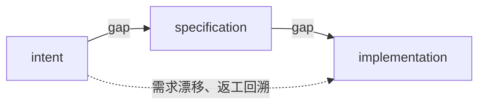

> **【要点】本讲的主线**
>
> **软件工程的全部方法学与工具，都是在降低“返工”的概率**；而返工之所以昂贵，是因为 intent、specification、implementation 之间有依赖关系，越晚发现错误，需要回头重做的依赖链就越长。这条主线会在第三节（软件危机）、第六节（Royce 的原文）、第七节（数据依赖）和第八、九节（方法与工具）反复出现。

## MVP：用最小代价去买信息

对这一节的提问“如果没有版本管理以外的任何方法，应该怎么做”，老师给出的是今天的答案：**直接做一个 MVP（minimum viable product，最小可行原型）**。这个答案之所以直观，是因为“做得少就错得少”：用一个最小的、但与最终产品最接近的东西去试探，收益最大。更关键的是它为什么在今天才变得可行——MVP 本身是 AI 生成的 slop，所以几乎不花钱，随时可以扔掉也不可惜，但它能帮你发现 intent 哪里没有弄对、specification 里的架构还有没有改进空间，然后再迭代几个版本。

这里的逻辑值得单独拆开：MVP 交换的不是功能，而是**信息**。它用最小的实现成本，把“我以为客户要什么”变成“客户看到东西之后的反应”。

## 案例：把两台非标设备抽象成两个接口

老师用自己前一晚做的事来说明 MVP 的具体形态。他手上有一台标签打印机和一台扫描仪，两台设备都通过 USB 接到同一台 Linux 主机，但彼此互不连接，在软件里是两条独立的通路：

- **标签打印机** EZSCAN/ZMIN GL70，USB ID `03eb:9638`，走 `usblp` 驱动、表现为字符设备 `/dev/usb/lpN`；应用层直接往 `lpN` 写裸字节（ZMIPL1 指令加 1 bit 位图），不经 CUPS。

- **扫描仪** Canon imageFORMULA R40，USB ID `1083:1679`，由 libusb 直访 USB（SANE 的 `canon_dr` 后端），应用层用 `scanimage` 经 SANE 读取。

- **权限**两套 udev 规则分别处理：`99-zmin-gl70.rules`（usbmisc 与 usb 两条都设 0666）和 `99-canon-r40.rules`（否则设备节点为 root-only）。

|  | 标签打印机（EZSCAN/ZMIN GL70） | 扫描仪（Canon imageFORMULA R40） |
|:---|:---|:---|
| USB ID | `03eb:9638` | `1083:1679` |
| 内核路径 | `usblp` 驱动 $\rightarrow$ 字符设备 `lpN` | libusb 直访 USB（SANE 的 `canon_dr` 后端） |
| 应用访问 | 直接往 `lpN` 写裸字节（ZMIPL1 指令 $+$ 1 bit 位图），不经 CUPS | `scanimage` 经 SANE 读 |
| 权限 | `99-zmin-gl70.rules`，两条都设 0666 | `99-canon-r40.rules`，否则节点 root-only |

两台设备的通路差异：同一个“接口化”目标下，底层机制完全不同

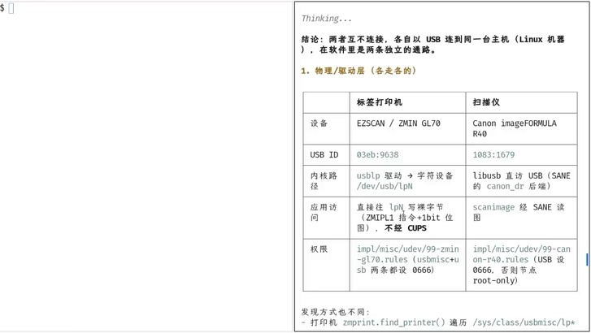

> 🎞️ 视频画面时间区间：00:23:30–00:25:00。

老师指出这件事里有真正的软件工程智慧：既然可以把一个设备抽象成 read/write/IO control 的接口，那就可以把它抽象成一个更好用的接口——扫描仪只要 `scan`（正面还是背面、单面还是双面、dpi 多少），打印机只要 `print`（一张图）。一旦这个干净接口存在，**设计与实现就完全解开了**，软件层只工作在接口层上，用户再也不必去用那些自带的、难用的软件。他还特别提到热转印打印机的那个“深度”参数：碳粉袋在像素位置被加热、把碳粉烫上去，而这个参数该设多少没人知道。AI 的做法是一轮一轮打标签，先打上“第 15 次尝试”，再问他是淡了还是浓了；老师补了一句关键的工程观察——**如果接一个摄像头，连这一步都不需要人**，可以让它一张一张自动收敛。


> 🎞️ 视频画面时间区间：00:19:30–00:21:00。

> **【背景】为什么这个案例值得当作“软件工程”而不是“写脚本”**
>
> 表面上这是让 AI 帮忙驱动两台设备；实际上做的是三件软件工程的正事：（1）识别出真正的抽象边界（scan / print），让接口而不是设备型号成为设计的对象；（2）用一次性的 MVP 换取关于参数与流程的信息，而不是先写通用驱动；（3)把验收标准交给可检验的结果（标签的浓淡、扫描件是否可用），从而允许实现反复试错。这与后面 Royce 提出的“设计先行”和“做两遍”是同一种思路。

## 当 app 退化成 API

老师顺着这条线推出一个更大的结论：软件公司会面临彻底的消亡。逻辑是，**如果 agent 需要的只是能力接口，那么过去给人用的 app 就只剩下“提供接口”这一件事——点外卖的 app 退化成点外卖的接口，另有一部分退化成查询数据的接口**他举了豆包手机作为体现同样智慧的产品：它不再把 app 当作app，而是把能力抽象成各种接口交给 computer use 去调用。他也提到阿里的做法——把旗下服务整合成面向 agent 的形态。

支撑这个判断的是成本结构。老师用标签打印机举例：假设你毕业后想做细分市场，硬件可以靠成熟的供应链解决，真正高成本的是软件——要写 Windows 驱动，还要写 Mac 驱动，否则客户会抱怨、产品就卖不动。而今天这部分工作被 AI 直接吃掉了。他的结论很明确：以后生产软件、生产 intelligence 的成本会非常低。

> **不要把“软件公司消亡”读成“软件工程失效”**
>
> 老师的判断针对的是**软件产品的交付形态与成本结构**，不是构造软件这件事本身。恰恰相反，他随后花了三分之二的课时讲历史，正是因为当实现变得便宜之后，决定成败的变量会从“能不能写出来”转移到“有没有想清楚要什么、怎么组织、怎么验证”。这是本讲最容易被误读、也最重要的一处转折。

## 下一个实验：把 assistant 接到一台非标设备上

为了把上面这些结论变成可验证的练习，老师布置了下一个实验：把自己在第一个实验里做的 assistant 和一台物理设备连起来——可以是手表，可以是寝室里已有的任何东西，也可以花一两百块买一个小设备；这台设备同样是**非标**的，很可能没有 Linux 驱动，而目标就是想个办法把它驱动起来。

他给了自己的例子。办公室里有一块电子墨水屏，它靠一个 Android app 烧写，而那个 app 极度难用。“豆包手机”式的做法是用 computer use 去操作这个 app，但他做了另一件事：把那个 Android app 的 APK 丢给模型，让它解包并逆向蓝牙协议，弄清它到底是怎么把画面写进屏幕的，然后他也拿到了一模一样的能力。

这个例子把本章的两个论点接在了一起：设备抽象的价值在于把**非标**收敛成干净接口（`scan`、`print`，或者这里的“写一帧到屏”），而逆向一件非标设备的协议，正是“接口还不存在时你得先把它造出来”的那一步。老师由此回到本节开头的反问：虽然我们已经生在“软件死掉了”的时代，软件工程的智慧其实没有消失。

## 本章小结

从一个空项目开始的答案就是 MVP：用一个最小的、可丢弃的原型去买关于 intent 与 specification 的信息。中间那个案例说明了抽象的价值——把两台机制完全不同的非标设备都收敛成 `scan` 与 `print` 两个接口，让设计与实现解耦；它的副产品是“软件公司消亡”这个结论，即当 agent 只需要能力接口时，给人用的 app 会退化为 API。

但老师紧接着提了一个反问，而这个反问决定了本讲后半程的结构：如果实现变得这么便宜，为什么我们还要学软件工程？他的回答是——因为曾经的软件工程不是这样的，要看懂今天哪些东西失效、哪些东西更值钱，必须回到它诞生时的原始问题。于是下一章从 1960 年代的成本结构开始。

# 软件危机：1960 年代的成本结构与失控

## 昂贵的硬件与更昂贵的码农

老师把时间拨回 1960 年。当时一台计算机要占掉很大的房间，作为最先进的设备，制造成本极高；用他带点玩笑的说法，那个时候的厂家还“不知道该怎么偷工减料”，就像刚开始造建筑时都要猛堆料一样。而比硬件更关键的是人的成本：越早的年代，编程工具越不成熟，码农就越贵，因为这是高智力需求的工种。

老师接着给出了一个不太客气但很重要的观察：在 985 高校经过层层筛选的高智商人群，数学训练越多，越容易缺少对客户的同理心和对商业的理解这类“软技能”。他补充说自己确实见过各方面都很强的六边形战士，但他的观察是理工科里“不 care 业务、只想造世界上最好的操作系统”的人更多一些——而这样的人不会是好的客户经理。这不是道德评价，而是对分工的事实描述。

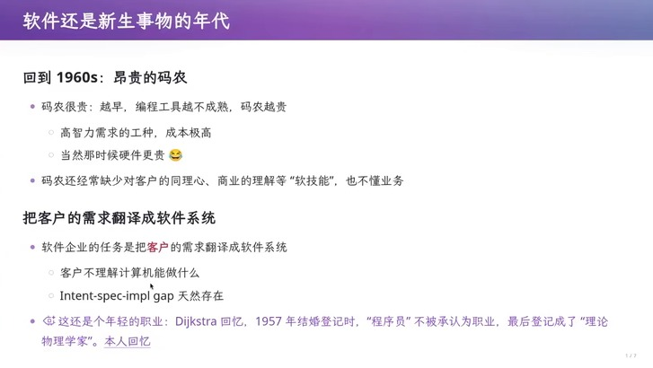

> 🎞️ 视频画面时间区间：00:33:30–00:35:30。

Dijkstra 在 1952 年成为荷兰第一位“程序员”，而到 1957 年他登记结婚时“程序员”仍不被承认为一种职业，最后登记成了“理论物理学家”。这个细节说明当时的软件从业者连社会身份都还没有确立，而他们面对的客户也完全不知道计算机能做什么——除了 NASA 这样要把人送上月球、或者飞机上要做飞控系统的少数机构。

> **【背景】软件企业存在的理由：它承担了补 gap 的职责**
>
> 老师的表述是：客户不知道计算机能做什么，程序员不理解业务，于是需要一个组织去签订合同（比如“1000 万美元，你帮我开发一个操作系统”）并承担补 gap 的责任。这正是软件企业存在的经济学理由。当补 gap 的成本因为实现自动化而下降时，这个组织的形态必然要变——这就是第二章那个结论真正的来源。

## 需求的想象与现实之间的落差

老师展示了一份 1968 年的《Boys’ Life》杂志，用它来说明当时的公众对计算机的想象已经远远跑到了能力前面。那一期 9 月号的第 24 页描述了“Computerized School House”的图景：终端即时判分、针对薄弱环节辅导、让学生按自己的节奏学习。老师的点评是：这件事到今天都没有实现——你们还在这里上两节课、每节课 50 分钟的课程。

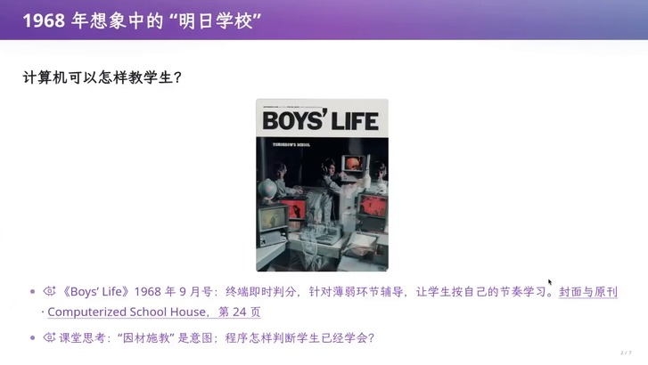

> 🎞️ 视频画面时间区间：00:34:00–00:36:00。

老师没有停留在“想象超前于现实”这种感慨上，而是点出了它真正的技术含义：那页杂志描述的是 intent，而**程序怎样判断学生已经学会**才是 specification 与 implementation 要解决的问题。gap 就在这里——而它在 1968 年已经出现了。

## 需求是高度定制化的

老师用选课系统来说明 intent 为什么难以确定。同一个功能名称，可以对应完全不同的规则：名额是先到先得、抽签，还是按专业保留？不满足先修课要求时，老师能否特批、谁负责批准？退课空出的名额是交给候补队首，还是重新开放抢课？

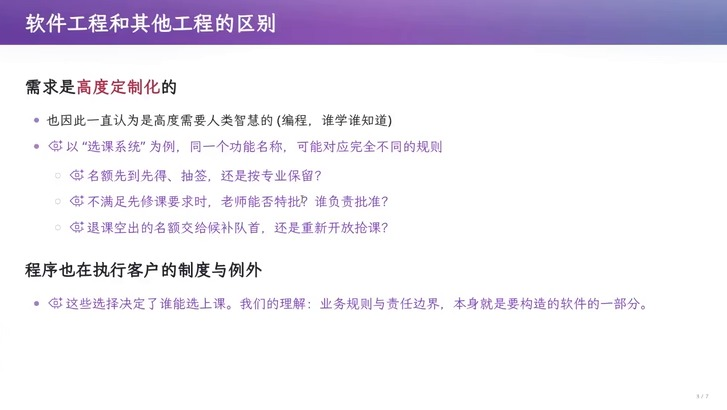

> 🎞️ 视频画面时间区间：00:36:00–00:38:30。

老师由此得出本节最有价值的一句判断：**程序也在执行客户的制度与例外**。那些“最后差一门课就毕不了业，所有口子学校都能给你开”的例外，同样是软件的一部分。因此业务规则与责任边界不是需求的背景，而是**本身就要被构造的东西**。

> **【要点】与桥梁、炼钢工程的关键区别**
>
> 传统工程的需求来自自然物理世界，我们只能适应而不能改造：材料的强度、楼要盖几层、人能有多大，都是自然界选择下来的结果，所以它们遵循比较强的模式，只能做增量改进，一次彻底的大改进非常困难。而软件的需求是“拍脑袋想出来的”，高度定制化，连接了物理社会与人的偏好，并且被假定为高度需要人类智慧的活动。老师由此解释了一个常见困惑：为什么软件行业可以不断出现“彻底推翻重来”的大改动，而传统工程不行。

## 进度、成本、质量一起失控

到 1960 年代后期，人们已经发现开发进度无法预测、开发成本崩溃、质量与维护都是问题——这三件事是一起失控的。与此同时，计算机科学家已经观察到了软件里许多有趣的现象。

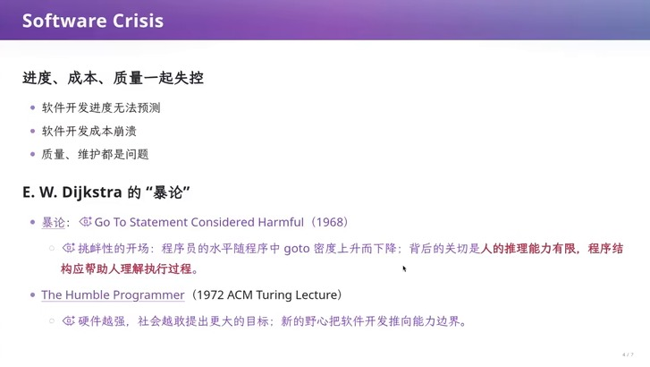

> 🎞️ 视频画面时间区间：00:38:30–00:41:00。

这页幻灯片最后一行是本节的枢纽：**硬件越强，社会越敢提出更大的目标**，而这些新的野心会把软件开发反复推到能力边界上。也就是说，软件危机不是一次性的产业事故，而是“能力增长会立即被新的野心消费掉”这个结构的必然产物。下一章要讲的 Dijkstra 的两篇文字，正是对这个结构最早的诊断。

## 本章小结

软件工程诞生的压力来自一个具体的成本结构：硬件昂贵、码农昂贵，而软件企业必须承担把客户需求翻译成软件系统的职责；与此同时，客户对计算机的想象（如 1968 年《Boys’ Life》描述的“明日学校”）已经远远超出可实现的能力，需求又高度定制化，程序甚至在执行客户的制度与例外。结果是进度、成本、质量一起失控，而且这个失控会被“硬件越强、目标越大”的结构反复再生产出来。

既然失控的根源在人的推理与沟通，那么最直接的干预也应该发生在人的推理与沟通上。下一章就去看 1968 年那篇只有两页、却影响了此后所有编程语言设计的短文。

# 为人的推理能力而设计：Dijkstra 的两篇暴论

## goto 密度与静态文本和动态过程的鸿沟

1968 年，Dijkstra 在《Communications of the ACM》11 卷 3 期发表了那篇著名的短文，标题本身就是一个挑衅：[《Go To Statement Considered Harmful》](https://ir.cwi.nl/pub/28228/28228.pdf)。它的开场更挑衅：作者多年观察到的结论是，**程序员的水平与所写程序中 goto 语句的密度呈反比**。他的主张是 goto 应从一切“高级语言”中废除——也许纯机器码除外。

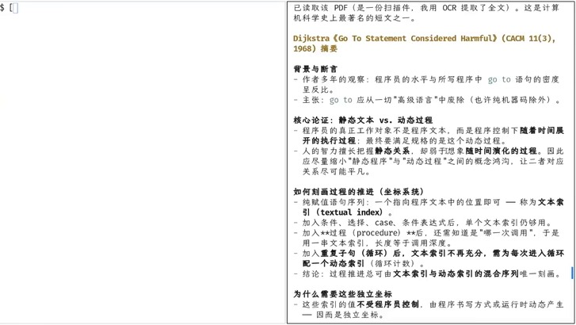

> 🎞️ 视频画面时间区间：00:41:00–00:43:00。

真正值得学的是它的论证结构，而不是结论。Dijkstra 的推理是：程序员的真正工作对象不是程序文本，而是程序控制下**随着时间展开的执行过程**；最终要满足规格的是这个动态过程。而人的智力擅长把握静态关系，却弱于想象随时间演化的过程。因此设计语言的方向应当是**尽量缩小“静态程序”与“动态过程”之间的概念鸿沟**，让二者的对应关系尽可能平凡。

他还给出了一个漂亮的形式化：如何刻画过程的推进。纯赋值语句序列只需要一个指向程序文本位置的**文本索引**；加入条件、选择、case 之后，单个文本索引仍然够用；但加入**过程**之后，还需要知道是“哪一次调用”，于是要用一串文本索引，长度等于调用深度；加入**循环**之后，文本索引不再充分，需要为每次进入循环配一个**动态索引**（循环计数）。结论是：过程推进总可由文本索引与动态索引的混合序列唯一刻画。而关键在于——**这些索引的值不受程序员控制**，它们由程序的书写方式或运行时动态产生，因而是独立的坐标。

> **【背景】为什么“独立坐标”这个说法很重要**
>这不是跑题：
> 如果一个量能被程序员随意改写，它就无法用来描述程序行为。文本索引与动态索引之所以能构成坐标系统，正因为它们是被程序结构决定、而非被程序员随手指定的。Dijkstra 由此推出：语言设计应当让这些坐标尽量简单、尽量少受goto 这类跳转的干扰——这样人才能用静态文本去推断动态行为。这一思路直接导向了后来的结构化编程。

> **不要把这篇短文读成“goto 一律禁用”**
>
> 老师特意补了反面：Linux 内核里有大量 goto。C 语言里一个很惯用的模式是 `goto release`——函数里申请的每一份资源都在 release 处逐一检查释放，于是你在中途任何地方想要退出，都只需跳到 release，而不必在中途重复释放逻辑。这时 goto 作为一种正确机制是无害的，它解决了 C 里“随时申请、从不释放”的大问题。真正的问题从来不是 goto 本身，而是**人能不能读懂执行过程**。

## The Humble Programmer：为什么写 OJ 不会遇到软件危机

1972 年，Dijkstra 在图灵奖演讲《The Humble Programmer》里回答了一个更根本的问题：为什么会有软件危机？老师的转述很清晰：如果你永远只写 online judge 的小程序，就不会有软件危机——你算完就完了，一旦把程序调对，就永远不需要维护它。但机器变强以后，软件的需求不断膨胀，你要承担越来越多现实世界的 intent；intent 越多，不确定性就越多，实现就越复杂。

这也解释了本讲的第一个 gap 结构为什么会持续存在。老师顺手把它套回课堂经验：你们做 OJ 时隐含地假设“题目是对的、题目是能做出来的”，而当你反复强化这个假设、对它过拟合时，你就不再适合面对开放世界——真实世界里的题目可能是错的，条件随时可能变化，甚至可能变成另一个题目。

Dijkstra 在这篇演讲里还提出了两个今天依然成立的观点：一是 **nicely factored solutions**（良好的分解），即构造任何软件系统时都在不断寻找良好的分解；老师把“帮我驱动标签打印机和扫描仪”也归入这一类。二是他对变革阻力的判断——**保守力量主要来自教育机构，以及舍不得重写旧程序的用户**。老师认为这句话放到今天依然让人醍醐灌顶。

## 抽象的作用：不要按长度的平方付费

老师引用了同一批文献里的另一个论点：借助抽象，理解程序所需的智力投入不必随程序长度平方增长。这句话解释了为什么“分解”值得被当作方法学来教：不是审美偏好，而是直接决定人能否理解一个系统。

## 本章小结

在失控的压力下，最早的干预发生在**人的推理能力**上：Dijkstra 指出程序员的真正工作对象是随时间展开的执行过程，而人擅长静态关系、弱于动态推演，因此语言应当缩小静态文本与动态过程之间的鸿沟，并用文本索引与动态索引这样的独立坐标去刻画过程推进。goto 只是这个论证的落点，而不是结论本身；Linux 内核里的 `goto release` 恰好说明机制本身可以无害。

在《The Humble Programmer》里，他进一步指出软件危机的机制是“机器越强、要承担的 intent 越多”，并留下两条判断：良好的分解与保守力量的来源。到这里，问题已经被诊断清楚，但还没有人把“构造软件”这件事本身当作一门工程学科来组织。下一章就去看 1968 年那场会议，以及一份把软件送上月球的真实工程。

# 把软件当作工程：从 Garmisch 到 Apollo

## 1968 年：一场刻意的挑衅

1968 年 10 月，50 多位专家在德国 Garmisch 参加了一场由 NATO 组织的软件工程会议。会议报告里有一处非常清醒的自述：“Software Engineering”这个名字是被**刻意**选作带挑衅意味的——意思是软件生产也应当拥有成熟工程学科那样的理论基础与实践纪律。

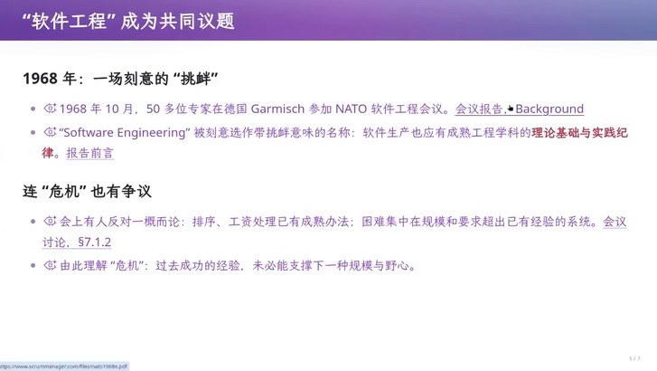

> 🎞️ 视频画面时间区间：00:44:00–00:46:00。

老师特意指出，连“危机”这个词当时都有争议：会上有人认为不该一概而论，因为排序、工资处理这类问题已经有成熟办法，困难集中在那些**规模和要求超出已有经验**的系统（会议讨论记录第 7.1.2 节）。老师由此给出一个更有分寸的“危机”定义：**过去成功的经验，未必能支撑下一种规模与野心**.这比“软件总是失败”要准确得多，也解释了为什么每次能力跃升都会重新打开危机。

## Apollo AGC：绝不可能发生的事也是可能发生的

接下来是一个真实的工程案例。阿波罗制导计算机（AGC，Apollo Guidance Computer）的飞行软件由 MIT 仪器实验室（Instrumentation Lab，今 Draper 实验室）负责，Margaret Hamilton 领导近 100 人编写。贯穿整个案例的一句话就是她的名言：“the never going to happen can happen”——绝不可能发生的事，也是可能发生的。

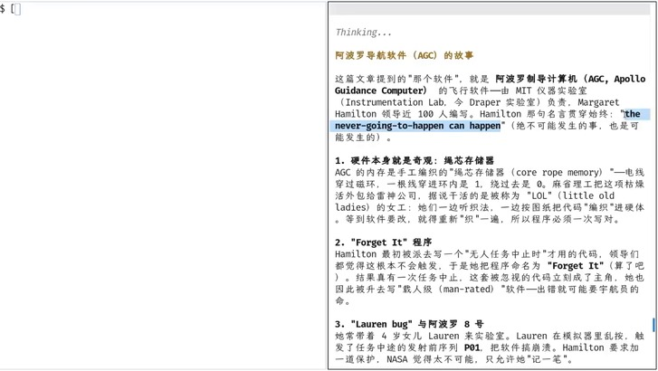

> 🎞️ 视频画面时间区间：00:46:00–00:47:30。

绳芯存储器带来一个非常重要的工程约束：软件要改，就得重新“织”一遍，因此**程序必须一次写对**。这解释了这个团队为什么会在没有“软件工程”这个学科名字的年代里，从 first principle 出发去思考“如果要构造一个真正高质量的软件，应该怎么做”。

老师让 AI 读的那篇回顾文章发布于 2019 年 8 月，讲的正是 Hamilton 与那段代码。那页幻灯片讲了两个具体故事。第一个是“Forget It”程序：Hamilton 最初被派去写一段“无人任务中止时才用”的代码，领导们都觉得这根本不会触发，于是她把程序命名为 `ForgetIt`（算了吧）；结果真有一次任务中止，这套被忽视的代码立刻成了主角。第二个故事更直接：她常带着 4 岁的女儿 Lauren 来实验室，Lauren 在模拟器里乱按，触发了任务中途的发射前序列 P01，把软件搞崩溃；Hamilton 要求加一道保护，而 NASA 觉得太不可能，只允许她“记一笔”。

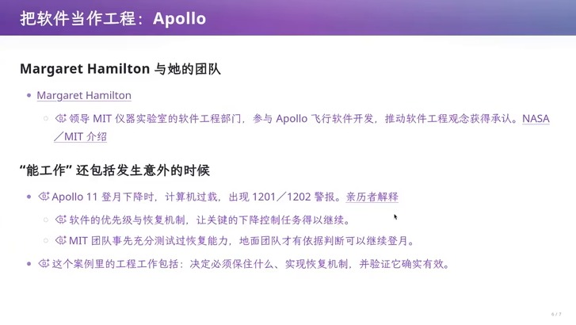

> 🎞️ 视频画面时间区间：00:47:30–00:49:30。

这一要求最终被验证了。阿波罗 11 登月下降时出现了 1201 与 1202 警报，正是软件的优先级与 recovery 机制让关键的下降控制任务得以继续执行。老师用这个案例说明“工程”的含义：**决定必须保留什么，实现恢复机制，并验证它确实有效**——而这一切的前提是承认“绝不可能发生的事也可能发生”。

> **防御性编程的原始形式**
>
> Hamilton 的做法与今天 SICP 一类的课程要求同源：写软件时要写出它的规格（specification），把每一个“绝对不会发生”的假设都当成可能发生，并让软件在假设被违反时依然能够工作。老师强调，这就是软件工程的起点之一——它不是从流程规范开始的，而是从**对假设的自觉**开始的。

## 软件工程的定义

案例之后，老师给出了这个学科的定义式表述，采用的是 IEEE 的说法：软件工程是
- （1）把系统化、有纪律、可量化的方法应用于软件的开发、运行与维护，也就是把工程应用于软件；
- （2）对（1）中那些方法的研究。老师提炼出的关键词是：**系统化、有纪律、可量化，覆盖开发、运行与维护**。

这一定义引出了本讲反复出现的那个“checklist”比喻：软件工程把原本依赖个人英雄主义的工作，变成一份可以逐条核对的清单。老师的表述非常克制——满足了清单上的每一项，并不能保证软件成功，但**失败的概率会小很多**。他也点出了这套东西的来源：它并不高雅，是从“数亿美金的教训”、从炸火箭这类失败里积累出来的。

## 本章小结

组织这个学科的直接原因是规模与野心超出了已有经验（会议记录中甚至对“危机”一词本身有争议），而让它获得具体形态的是像 Apollo AGC 这样的真实工程：在绳芯存储器“必须一次写对”的硬约束下，Hamilton 团队从“绝不可能发生的事也是可能发生的”这一前提出发，设计出能在意外中继续工作的软件。IEEE 的定义把这类经验固化成“系统化、有纪律、可量化”的覆盖全生命周期的学科。

到这里，学科已经有了名字、有了案例、有了定义，但还缺一份关于“应该按什么顺序做”的公认文本。下一章回到 1970 年那篇既造就了“瀑布模型”这个词、又被误读至今的论文。

# Royce 的原文：被误读五十年的“瀑布”

## 1970 年的问题，以及那张图

1970 年，Winston Royce 发表了[《Managing the Development of Large Software Systems》](https://www.praxisframework.org/files/royce1970.pdf?utm_source=chatgpt.com)。老师交代了它的背景：航天器任务规划、指令与飞行后分析，属于时间和存储都有硬约束的场景。这篇论文画出了后来被称为“瀑布模型”的经典阶段图。

关键在于图之后发生了什么。老师在幻灯片上明确标注：**原文在这张图之后就指出，这样的实施方式风险很高、容易失败**也就是说，画那张图的人从来不是在推荐那张图。

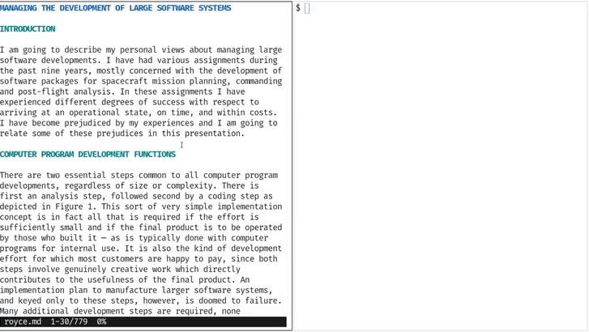

> 🎞️ 视频画面时间区间：00:53:00–00:55:00。

幻灯片把那条被后人简化的假设写成了“瀑布假设”：**希望迭代只发生在相邻阶段之间**；而实际测试中暴露的问题，会一路回溯到设计与需求。这句话是整章的分水岭。

## 关键跳跃：返工代价由回溯距离决定

这是全讲信息密度最高的一段。老师把 Royce 的推理概括成一次“关键跳跃”：既然风险最终在**测试**处爆炸，而爆炸的代价由**回溯距离**决定，那么一切补救的本质就是同一件事——**把“发现问题”的时间点提前，把回溯距离压短**。他强调，Royce 的五条建议都是从这一条推出来的，而不是一列凑数的最佳实践。

把它写成依赖关系的语言会更容易看清：

$$
C_{\text{rework}} \;=\; f\!\left(S_{\text{detect}}\right),
\qquad \frac{\partial C_{\text{rework}}}{\partial S_{\text{detect}}} \;>\; 0
$$

其中

- $C_{\text{rework}}$：一次缺陷从被发现到修完所付出的代价（人力、时间与超支）；

- $S_{\text{detect}}$：缺陷被发现的时点，按 Royce 的阶段记为“需求 $\rightarrow$ 分析 $\rightarrow$ 设计 $\rightarrow$ 编码 $\rightarrow$ 测试 $\rightarrow$ 交付”上离起点的距离；

- $f$ 单调递增：越晚发现，代价越高。Royce 的极端表述是“错在早期只是重做设计，错在晚期就是 100% 超支”。

> **【要点】这条推理为什么值得记住**
>
> 它把一整套工程实践从“经验之谈”变成了推论：设计先行、文档、做两遍、提前测试、让客户反复确认，都只是“把发现时点提前”这同一个动作在不同阶段的名字。因此当环境变化（例如实现变得极其便宜）时，你不需要重新记住一张清单，只需要重新问一遍：**现在最容易晚发现的、代价最大的那件事是什么？**

## 五条建议与原话里的理由

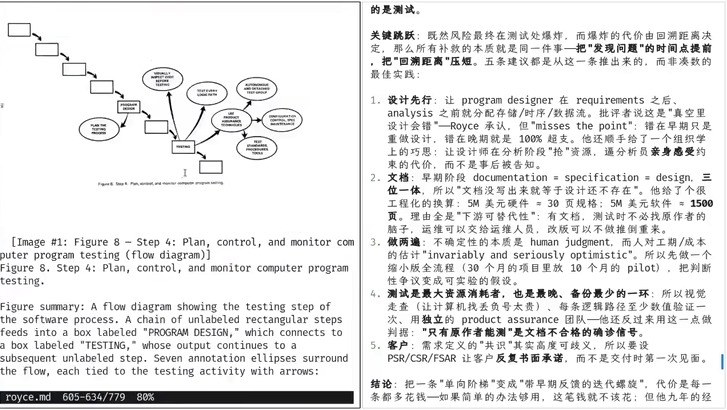

> 🎞️ 视频画面时间区间：00:57:30–00:59:30。

老师逐条复述了这五条，并且保留了 Royce 原始论证里最有说服力的部分：

1.  **设计先行**：让 program designer 在 requirements 之后、analysis 之前就分配存储、时序与数据流。批评者说这是“在真空里设计，会错”，Royce 承认，但认为这“misses the point”——错在早期只是重做设计，错在晚期就是 100% 超支。他还顺手给了一个组织学上的巧思：让设计师在分析阶段去“抢”资源，逼分析员亲身感受约束的代价，而不是事后被告知。

2.  **文档**：在早期阶段，documentation $=$ specification $=$ design，三位一体；所以“文档没写出来就等于设计还不存在”。他给了一个非常工程化的换算，见下表。

3.  **做两遍**：不确定性的本质是 human judgment，而人对工期与成本的估计“invariably and seriously optimistic”。所以先做一个缩小版的全流程——30 个月的项目里放 10 个月的 pilot，把判断性的争议变成可实验的假设。

4.  **测试**：它是最大的资源消耗者，同时又是最晚、备份最少的一环；因此要视觉走查、每条逻辑路径至少数值验证一次、并使用独立的 product assurance 团队。他还反过来把这一点当作判据：**“只有原作者能测”是文档不合格的确诊信号**。

5.  **客户**：需求定义里的“共识”其实高度可歧义，所以要用 PSR/CSR/FSAR 让客户反复书面承诺，而不是到交付时才第一次见面。

| 对象 | 规模 | 理由 |
|:---|:---|:---|
| 500 万美元硬件 | 约 30 页规格 | 硬件有图纸就能被下游替代 |
| 500 万美元软件 | 约 1500 页规格 | 有文档，测试时不必找原作者的脑子；运维可交给运维人员；改版不必推倒重来 |

Royce 用“下游可替代性”解释文档为什么值钱：他给出的换算依据不是文档本身，而是它能否替代作者的脑子

老师还补上了 Royce 自己的成本辩护：这五条都会多花钱，如果简单的办法够用，这笔钱就不该花；但他九年的经验是**简单办法在大项目上从未成功过**，而事后挽回的花费远远超过这五步的钱。

## 被误读的地方到底在哪里

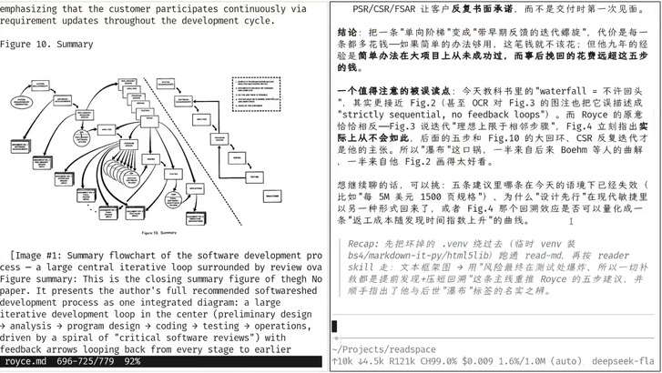

> 🎞️ 视频画面时间区间：00:62:00–00:64:00。

老师在这里给出了一段非常具体的辨正。今天教科书里的 waterfall 被说成“不许回头”，这更接近原文的 Fig. 2；而 Royce 的原意恰恰相反：Fig. 3 说迭代“理想上限于相邻步骤”，Fig. 4 立刻指出实际上从不会如此，后面的五步建议与 Fig. 10 的大回环、CSR 反复迭代才是他的主张。所以“瀑布”这口锅，一半来自后来 Boehm 等人的曲解，一半来自他 Fig. 2 画得太好看。

> **一手信息里被丢掉的那部分**
>
> 老师在这一节的收尾处说得很直接：如果只留下那张瀑布图，就丢掉了作者接下来要解决的返工问题。这正是本讲在第七节要展开的方法论主张——知识的压缩是有损的，而压缩损失的部分往往恰好是“为什么”。

## 用今天的一手信息读原文


> 🎞️ 视频画面时间区间：00:60:30–00:62:30。

这一页提出了本讲在方法论层面最重要的一个判断：**过去你必须依赖教科书做知识的有损压缩，而现在你可以自建无损知识网络、按需压缩。**老师的论证是：查证知识网络在过去极其费时（图书馆索引机制也不好），因此不可能通过一手资料学习，只能经过教科书的压缩；而好的教科书作者之所以好，是因为他自己读过一手信息，并且能共情学生、知道哪里会不明白。今天的区别在于，你不需要别人替你决定压缩什么——你可以把知识的脉络拆成一个个“发现的点”，把点与它的原文一起拿到，然后做属于自己的压缩。

> **【背景】这条判断的可操作含义**
>
> 它解释了老师为什么能在课堂上现场打开 Royce 的原文、让 AI 读 780 行并重推五条建议。可操作的推论是：面对一个已经被反复转述的概念（瀑布、敏捷、契约），先找回它的原文或原始文档，再决定要不要接受后人的压缩。后面第九节读 UML 规范，用的就是同一个方法，只是规模变成了 700 多页。

## 本章小结

Royce 那篇论文的主张与它后来的名声正好相反：他画出那张阶段图之后立刻指出这种做法风险很高，并且给出了正确的补救方向——把风险最终爆炸的地方（测试）提前，把回溯距离压短；由此推出设计先行、文档、做两遍、独立测试、客户反复承诺五条建议，其中“做两遍”就是后来 pilot model 与今天 MVP 的共同祖先。而后世的“瀑布”标签把这份主张反转成了它的反面，原因一半是转述者的曲解，一半是作者自己那张图太好传播。

到这里，Royce 的推理已经可以用“返工代价随发现时点上升”这条曲线概括。下一章把这个直觉做成一个结构：把开发过程写成一幅依赖图，然后看这个结构如何一次性解释 MVP、敏捷与 TDD。

# 数据依赖：一条贯穿软件工程的主线

## 把瀑布写成数据依赖图

老师提出了他自己理解 Royce 模型的方式，并明确说这是“我自己的理解”，他希望学生也能形成自己的理解——这一点本身就是他上一章那个“按需压缩”主张的示范。他的翻译方式是：**把每个阶段想象成一个 program**。人脑是神经网络，人可以用语言对齐内部的思维链，因此“人”和“程序”在这个抽象下是等价的；于是每个阶段产生 artifacts，artifact 之间构成 **data dependency**，整条链路是一张有向无环图。

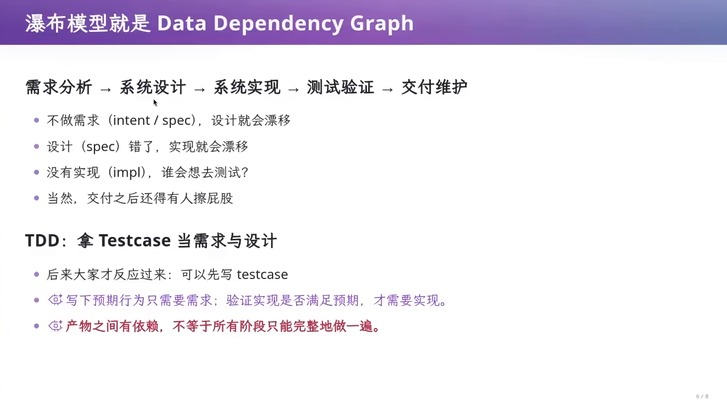

> 🎞️ 视频画面时间区间：00:70:00–00:72:00。

这张图上每一句话的后果都是同一种：上游错了，下游全部作废。老师把它形式化成一条关于返工范围的判断：

$$
\text{rework}(v) \;=\; \bigl|\,\mathrm{Desc}(v)\,\bigr|,
\qquad \mathrm{Desc}(v)=\{\,u \mid v \leadsto u \text{ 在依赖图中可达}\,\}
$$

其中

- $v$：发生错误的产物节点，例如某一条需求或某一次设计决策；

- $\mathrm{Desc}(v)$：依赖图中从 $v$ 出发可达的所有下游节点集合，也就是它的**传递闭包**（transitive closure）；按图的说法，$v \leadsto u$ 表示存在一条从 $v$ 到 $u$ 的路径；

- $\text{rework}(v)$：修复 $v$ 时必须重新检查或重做的产物数量——它正比于受影响节点数，因此与 $v$ 在链上的位置强烈相关。

这个式子是第四节那条“返工代价随发现时点上升”曲线的结构解释：越靠上游的错误，$\mathrm{Desc}(v)$ 越大，代价越高。它也解释了 Royce 那句“错在晚期就是 100% 超支”——晚期发现的问题，其传递闭包几乎覆盖整个项目。

> **三条推论，不需要额外的经验假设**
>
> （1）**减小每一次迭代的宽度**：不要一次性产生大量互相依赖的产物，而是先把优先级最高的依赖流程走通；（2）**尽早验证高风险假设**：在依赖图的最上游先取得证据；（3）**拿测试用例当需求与设计**：写下预期行为只需要需求，验证实现是否满足预期才需要实现——所以测试可以先于实现存在。老师说从这个角度看，MVP、敏捷与 TDD 是同一件事的不同名字。

## MVP、敏捷与 TDD 是同一条推论

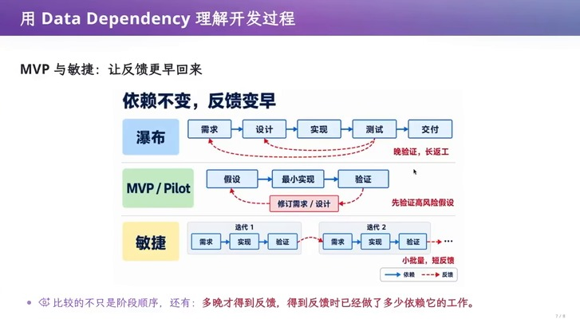

> 🎞️ 视频画面时间区间：00:73:00–00:75:00。

这张图把本章的论点收束得很干净：三种开发方式面对的依赖关系完全相同，区别只在**反馈回来的时点**，以及在反馈到达之前已经完成了多少依赖它的工作。瀑布的特征是“晚验证、长返工”；MVP/Pilot 用一次最小实现换一次假设的验证，然后回头修订需求与设计；敏捷则把这件事做成连续的迭代，形成“小批量、短反馈”。

老师也给出了用今天的概念去理解 Royce 的对照，他在原文里找到的对应物是 pilot model：

<table>
<caption>Royce 的 pilot model 与今天的 MVP：同一种“先做一遍”的思路，验证的重点不同</caption>
<thead>
<tr>
<th style="text-align: left;"></th>
<th style="text-align: left;">Royce 的 do it twice / pilot model</th>
<th style="text-align: left;">今天的 MVP</th>
</tr>
</thead>
<tbody>
<tr>
<td style="text-align: left;">做法</td>
<td style="text-align: left;">先用 pilot 经历关键问题，再做完整版</td>
<td style="text-align: left;">先做一遍、从中学习，再完善产品</td>
</tr>
<tr>
<td style="text-align: left;">验证重点</td>
<td style="text-align: left;">技术与运行风险</td>
<td style="text-align: left;">用户与业务假设</td>
</tr>
<tr>
<td style="text-align: left;">迭代形态</td>
<td style="text-align: left;">pilot 相对独立的一个阶段</td>
<td style="text-align: left;">可以被敏捷吸收：试做、反馈、修正反复快速进行</td>
</tr>
<tr>
<td style="text-align: left;">共同点</td>
<td colspan="2" style="text-align: left;">让关键假设尽早遇到证据</td>
</tr>
</tbody>
</table>

> **为什么老师说“瀑布是史上最好用的反派”**
>
> 他在课堂上让 AI 解释瀑布模型为什么被误读，得到的说法是：瀑布“可以作为第一个模型讲，而且每一个新方法都说它对” 。这句话点出了一个教学现象——一个足够简单、足够错误、又足够有名的模型，会成为后续所有方法学的参照物。因此判断一个方法学在解决什么，最方便的办法就是看它相对“瀑布”改动了哪一点。

## 本章小结

本章把前六节积累的直觉做成了一个结构。把开发过程写成数据依赖图之后，返工范围就等于错误节点的传递闭包，于是所有工程实践都可以被同一个问题检验：它有没有把发现时点提前、把回溯距离压短？MVP、敏捷与 TDD 在这一视角下是同一件事的不同名字，而 Royce 的 pilot model 是它们的共同祖先。本章也演示了方法论上的一个要点——老师明确说这是他自己的理解，并鼓励学生建立自己的读法。

依赖图回答的是“为什么要把发现提前”。但工程不能只靠原则，还需要能落到每个阶段的**语言与工具**。下一章进入本讲的最后一个主题：软件工程为每个阶段创造的方法学和工具。

# 方法和工具：把 gap 变成可检查的

## 每个阶段需要不同的“语言”

老师给出本章的总纲：软件工程就是**为每个阶段都创建方法学和工具**，用来尽可能减少返工的概率。而它的一个关键洞察是：**在没有 LLM 这种“万能编译器”的时代，不同阶段需要不同的“语言”。**

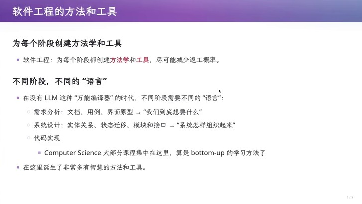

> 🎞️ 视频画面时间区间：00:75:00–00:83:00。

这个“不同阶段不同语言”的落差有一个直接后果，老师用学习路径把它讲得很清楚：过去我们采用 bottom-up 的学习方法，先学编程，因为不理解代码就无法理解整个过程；但 AI 来了之后顺序可以反过来——你可以先从产品经理开始做，因为后面所有事情都可以交给模型，你不需要控制质量，也根本不必理解代码如何运作，但你依然可以设计出好的产品。老师在这里提醒了一个随之而来的规模问题：当你把模型当作码农来用时，你手上立刻就有了 2500 个并发的人，于是“怎么管”变成了一个真问题，而这个 mindset 需要重新调整。

| 阶段     | 使用的载体                     | 回答的问题       |
|:---------|:-------------------------------|:-----------------|
| 需求分析 | 文档、用例、界面原型           | 我们到底想要什么 |
| 系统设计 | 实体关系、状态迁移、模块与接口 | 系统怎样组织起来 |
| 代码实现 | 编程语言（大部分课程集中在此） | 系统实际如何运行 |

不同阶段的“语言”与它们各自回答的问题

## 检查表：一种没有代码却有效的语言

老师用他自己上学时的经验来讲这件事：软件工程课要求写文档，老师给一份很长的 checklist，你要逐条确认“这个有没有做到、和客户沟通过没有”。当时他觉得这很 nonsense，因为他是做 OJ 题的；但他现在承认 **checklist 是有用的**——它减少了你返工的概率。比如最后一条“你是不是和客户沟通过了”，在你真的沟通过并打上勾的时候，就大幅减少了 intent 不符合客户要求的概率。

他还给出了一个更结构化的解释：checklist 虽然是自然语言，但它**有格式的规范**（必须一条一条、必须打勾或打叉），因此它已经是一种介于自然语言与形式化语言之间的中间语言。它的语义由人来检查，但人对“勾和叉”的对齐，比人对一整段文档的对齐更 formal。老师由此画出了整个学科的形状：从 intent 到 spec 到 impl，formal 的程度是递增的。

> **决策表与两两审查**
>
> 老师补充了同类的工具：**决策表**把条件组合与预期结果对应起来，用于暴露遗漏与矛盾（他引的出处是 ISTQB 第 54.2.3 节），例如“学生优惠遇到满减，究竟能叠加还是只能选一个”；还有一种做法是要求你把所有文档两两摆在一起审查一遍——虽然没人愿意做，但它避免的正是 gap 的漂移。这些工具的共同点是：它们都不产生代码，却通过**赋予形式语义**来减少遗漏与矛盾。

## 把规则变得可检查

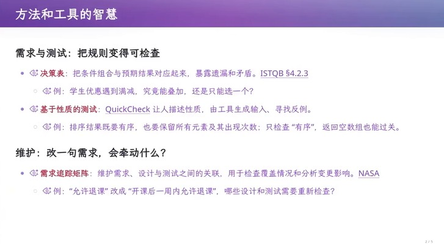

> 🎞️ 视频画面时间区间：00:83:00–00:87:30。

老师在这一页给出的三个例子都很讲究，因为它们各自暴露了一种朴素的验证方式会漏掉什么：

- **基于性质的测试（QuickCheck）**：让人描述性质，由工具生成输入并寻找反例。它的威力靠一个例子就能理解——排序的性质有两条，一是结果有序，二是保留所有元素及其出现次数；如果你只检查“有序”，那么返回一个空数组也能过关。这说明**规格写得不完整，测试就会给你虚假的信心**。

- **需求追踪矩阵（RTM）**：维护需求、设计与测试之间的关联，用于检查覆盖情况和分析变更影响。它回答的是“改一句需求，会牵动什么”——例如把“允许退课”改成“开课后一周内允许退课”，哪些设计与测试需要重新检查？

- **决策表**：把条件组合与预期结果对应起来，暴露遗漏与矛盾。

老师把追踪能力（traceability）单独拎出来做了解释。它解决的问题是：从文件系统或项目的角度看，软件只是“一堆文件”（某个目录下的若干 markdown、源代码、README），而这是因为一开始大家用了文件系统而不得不做的 workaround。traceability 要求用链接或文档的方式，让每一个代码与每一个需求点都能对得上，需求与需求之间、需求与设计之间也能对得上；如果所有这些都能对得上，你就有了独立而互相交叉的检验，对软件质量就更有信心。

> **【要点】为什么这些“没有代码的工具”在 AI 时代反而更重要**
>
> 当实现变得极其便宜时，返工的主要成本从“重写代码”转移到了“发现自己在解决一个错的问题”。上面这些工具的共性是：它们都把**意图与约束**变成可核对的形式，从而在还没有代码的时候就暴露遗漏与矛盾。这正是老师认为不会随实现自动化而消失的那部分工作。

## 本章小结

软件工程具体造出的东西，是一整套为每个阶段服务的方法学与工具：需求阶段的文档、用例与原型，设计阶段的实体关系、状态迁移、模块与接口，以及一批没有代码却有效的语言——checklist、决策表、需求追踪矩阵，以及基于性质的测试。它们的共同作用是把 intent 与约束变成可核对的形式，从而减少遗漏与矛盾，也就减少了返工概率。

本章也顺带记录了一个学习路径的变化：过去必须 bottom-up 地先学编程，而现在可以从产品经理的位置开始。接下来最后一章看两个把形式语义推向极致的尝试——把契约写进语言，以及试图用一层中间语言统一整个面向对象世界。

# 把契约写进语言与 UML 的野心

## 契约式设计：把义务与权利写进接口


> 🎞️ 视频画面时间区间：00:88:00–00:92:00。

这一节的工具是 Bertand Meyer 在 1986 年前后提出的 Design by Contract（契约式设计），载体是 Eiffel 语言。它的核心思想是：像人类合作中的契约一样，**接口要写清双方的义务与权利**。

```eiffel
function(args) is
    -- Comment
require
    Precondition
do
    Routine
ensure
    Postcondition
end
```

老师把它翻译成霍尔三元组的形式，这是理解契约最紧凑的方式：

$$
\{\,P\,\}\;\; C \;\;\{\,Q\,\}
$$

其中

- $P$：**前置条件**（precondition），由调用者保证，在调用前必须满足；

- $C$：命令或代码（command），也就是实现本身；

- $Q$：**后置条件**（postcondition），在前置条件成立的前提下，由实现者保证正常返回后的结果。

老师用“不允许透支的账户取款”这个例子把它落到实处。调用 `withdraw(amount)` 之前，调用者必须保证 $0 < \texttt{amount} < \texttt{balance}$；正常返回之后，实现者保证 $\texttt{balance} = \texttt{balance}_{\text{old}} - \texttt{amount}$，其中 $\texttt{balance}_{\text{old}}$ 是调用前的余额。此外还有**类不变量**（class invariant）：$\texttt{balance} \ge 0$，它要求在对象对外可用时始终成立，因此每个公开操作都必须维护它。

> **契约真正迫使你做的，是一个业务决策**
>
> 老师点出了这个设计最有价值的地方：它迫使你把“余额不足”这件事定性。如果“余额不足”是一种正常结果，那你就应该把“返回失败、余额不变”写进接口契约；如果你把它留成未定义的边界情况，那它就变成了一个迟早会在生产环境里以崩溃形式出现的隐含假设。这和第五节 Royce 讨论的“绝不可能发生的事也是可能发生的”是同一个问题，只是这里用**类型化的接口**把它固定下来。


> **契约的两重身份**
>
> 按 Eiffel 文档的说法，契约既是接口文档，也能在开启断言检查时检验本次执行。老师由此指出这条路线为什么今天依然活跃：Dafny 内置契约与静态验证器，Verus 为 Rust 子集提供静态验证；它们进一步尝试**证明**在给定假设下实现满足写出的规约。老师在这里回顾了自己的一个预判——他曾在授课时预言“程序里写下的断言若无法证明就不能通过编译”，当时估计要 30 年；现在看来从那个时间点算，10 到 15 年就有可能实现。

## UML：一层中间语言的野心

## 为什么需要中间语言

契约解决的是“单个接口的义务”，而 UML（Unified Modeling Language）试图解决的是更大的问题：**能否有一种中间语言，统一整个面向对象世界？**

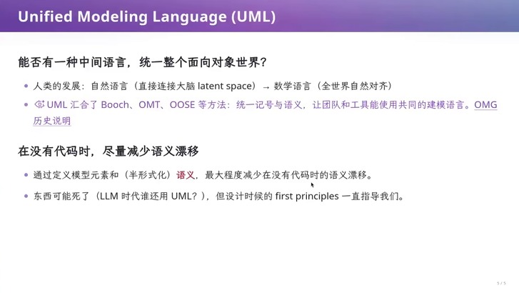

> 🎞️ 视频画面时间区间：00:92:00–00:96:00。

老师先用人类语言的演化来铺垫。人类使用的是自然语言，它直接连接大脑的 latent space，因此天然无法精确对齐——他说“我今天看到一个美女”，每个人在各自的 latent space 里构造出的形象都不一样。数学语言之所以不同，是因为它从很小的公理出发一点点构造，全人类能够自然对齐，而一旦对齐完成，用皮亚诺公理就能把整个计算机世界构建起来，在计算机世界里同一个东西的语义是绝对对齐的。

[UML](https://www.omg.org/spec/UML/2.5.1/PDF?utm_source=chatgpt.com) 想做的是把这个“对齐”推进到自然语言一侧：通过定义模型元素和半形式化的语义，把能对齐的部分和不能对齐的部分剥离开。老师举了类图的例子——有一个 `class` 叫 `Student`，里面有一个 field 叫 `name`，它就是 `Student.name`，可以确定地变成源代码里的东西；再比如顺序图里的时序先后是绝对对齐的，而如果用自然语言描述并发，“到底谁先谁后、能不能并发”就会有歧义。

> **UML 的假设在 AI 时代被抽掉了**
>
> 老师的判断很干脆：UML 作为产品已经“死了”。原因是它的全部必要性建立在“自然语言与形式语言不能对齐”这个假设上，所以才需要一层一层的中间语言；而今天自然语言可以对齐到任何东西——直接问模型就行。但他同时强调，**它设计时的 first principle 一直在指导我们**：在有代码之前尽量减少语义漂移，这个目标本身没有过时。

## 用 AI 读一份 700 页的规范


> 🎞️ 视频画面时间区间：00:96:30–00:99:00。

这是全讲最后一段实证。老师的做法是：拿到 700 余页的 spec（总计 2500 余页的文档），把它切成带 overlap 的片段，分派给 67 个 sub-agent，每个读 50 页，并且让它们提取其中的软件工程智慧、剔除不符合 AI 时代的部分，最后汇总成课件；这一轮花掉了他五小时额度的 18% ，折算成人民币约 ¥5.3。这套额度来自 Kimi 送的 ¥699 套餐。他提到自己有专门的工具来 scale 长文档，几千页也没有问题，体验接近 PDF。他的点评是：那份 spec 从头到尾只在回答一个问题——**哪些 intent 必须定死**（幻灯片上标的是 700 余页，他口头总结时说的是 796 页），而它构造出的那套半形式化语言，就是把“可以在语义上确定下来的东西”和“不必确定的东西”分开。

老师从这件事里抽出的是一个更冷静的推论：当你拥有更好的模型时，同样的价格可以得到好得多的质量，这意味着**学习效率与学习成本会因为模型好坏而出现显著差距**。他现在还觉得 100 美元级别的编码套餐对学生来说算够用，因为烧 token 的主要场景是维护大项目（需要在大上下文里载入很多东西），而学习流程其实可以用压缩过的版本。但他把问题留给了听众：如果教育要面向所有人平价，而我们没有那么多算力和资源，怎么办？他认为这是一个社会性问题，没有答案。

## 本章小结

把形式语义推远的两条路线在这一章汇合。一条是往下扎进语言本身：Design by Contract 把前置条件、后置条件与类不变量写进例程骨架，用霍尔三元组 $\{P\}\,C\,\{Q\}$ 的形式固定调用者与实现者各自的义务，并迫使“余额不足算不算正常结果”这类业务决策在接口层面被回答；这条路线今天由 Dafny、Verus 这类静态验证工具延续。另一条路线是往上架一层中间语言：UML 试图用统一记号与半形式化语义减少无代码时的语义漂移，它的假设（自然语言无法与形式语言对齐）在 AI 时代被抽掉，但它“在有代码之前减少漂移”的 first principle 仍然有效。最后一段实证表明，读一份 700 页的规范已经从“一个人几年”变成“一次几元钱的调用”，而这本身又把教育资源的差距放大成了新的问题。

# 总结与延伸

## 老师留下的收束

老师在课程最后给出的判断是：自然语言对不齐的问题正在被解决，checklist 不好检查的问题也在被解决，“我们只剩下这个 gap”——只有“我没有想清楚、我没有说清楚”这一部分还留在人身上。他也给出了一个明确的预言时间表：他在 ChatGPT 出现之前曾在操作系统课上预言“程序里写下的断言如果无法证明，就不能通过编译，那时你也不需要基于性质的测试了”，当时估计要 30 年；现在看，从那个时间点算，10 到 15 年就可能解决。他最后把剩余内容交回给听众，请学生自己回去看幻灯片。

## deepseek的归纳：三条主线

把这一讲十章的论证压到最短，它其实只讲了三条主线。

**第一条是 gap**intent、specification、implementation 三者之间的落差不能靠努力消除，因为 intent 本身来自物理世界与人的偏好，而软件是它在信息世界里的投影。与之对照的是桥梁与炼钢：那些工程的需求由自然选择决定，只能增量改进；软件的需求是“拍脑袋想出来的”，因此既可以出现彻底的重写，也必须承担需求本身的不确定性。软件企业之所以存在，正是因为它承担了补这个 gap 的职责。

**第二条是返工代价**Royce 的推理可以浓缩成一句：风险最终在测试处爆炸，而爆炸的代价由回溯距离决定，所以一切补救的本质都是把发现问题的时点提前。第四节 Dijkstra 关于静态文本与动态过程的论证、第七节的依赖闭包、以及第八、九节所有“没有代码却有效”的工具，都是在为这一条服务。它也是本讲最实用的一条：当环境变化时，不需要重新背一张最佳实践清单，只需要重新问“现在最容易晚发现、代价最大的那件事是什么”。

**第三条是压缩与对齐**老师在第六节说得很直白：过去你必须接受教科书对知识的有损压缩，而现在你可以自建无损知识网络、按需压缩。这条主张在他自己身上有两次示范——读 Royce 的原文重推五条建议，以及用 AI 读 700 页的 UML 规范。它也解释了本讲为什么要花大量篇幅回到 Dijkstra、Royce 与 Apollo 的原始材料：转述者的压缩会丢掉“作者接下来要解决什么问题”，而被丢掉的那部分往往正是智慧所在。

## 交叉综合：把 1968 与 2026 放在一起

把这三条主线并排看，会得到几个不太直觉的结论。

第一，**软件危机的机制和今天的问题结构是同一个**。1968 年 Garmisch 会议的结论是“过去成功的经验未必能支撑下一种规模与野心”，而今天数据分布工程的飞轮给出的正是同一个结构：只要有能力增长，新的野心会立即把它消费掉。区别在于，当年被推到边界的是人的推理能力，因此 Dijkstra 的干预对象是语言；而今天被推到边界的是组织方式与验证能力，因此干预对象转移到了 intent 的澄清、spec 的组织与验证的设计上。

第二，**AI 消除的是实现难度，放大的是“想清楚”的溢价**。第二章那个标签打印机的案例里，最值钱的一步不是生成驱动代码，而是把两台机制完全不同的设备都收敛成 `scan` 与 `print` 这两个接口；这一步是设计，不是实现。当实现变得近乎免费时，返工的成本结构并没有消失，只是从“重写代码很贵”变成了“做错方向的代价很贵”。这也解释了为什么契约式设计这类工具在 AI 时代反而更重要：它把隐含假设变成可被检验的接口义务。

第三，**“三思而后行”与“尽早获得反馈”并不矛盾**。第七节的依赖图给出了它们各自的适用条件：依赖关系越密，一次迭代能覆盖的宽度就应该越小；而架构与系统性风险仍需要提前设计。Royce 的五条建议与敏捷、MVP 其实共享同一个目标，只是作用于依赖图的不同位置——这也是为什么老师说“我们做事的方式不完全颠覆过去的经验”。

## 开放问题与下一步

这一讲留下了几个没有答案的问题，它们正好构成可以继续往下追的线索。

- **taste 能不能被训练出来，以及怎么验证它**老师把模型的短板定位在“对接下来该做什么的直觉”，并指出可验证与不可验证的边界比看上去模糊——自然语言到形式语言之间仍有 gap。如果把 AI 看到 blog post 就能上数据试验视为一条可行的通路，那么“什么算验证通过”本身就是待解决的问题。

- **当实现近乎免费，验证的责任落在哪里**契约式设计与静态验证试图证明“给定假设下实现满足规约”，但规约是否写对了、是否覆盖了那类“绝不可能发生”的输入，仍然是人的判断。Apollo 的 1201/1202 警报说明这类判断一旦做对，收益是系统级的；它做错的代价同样是系统级的。

- **教育成本会成为新的分水岭**老师提到读 700 页规范的边际成本已经降到约 ¥5.3，但前提是你要有好的模型。他明确表示“如果所有人都平价教育，我们没有那么多算力”，并把这个问题标记为社会性问题。这不再是工程问题，但它决定了工程智慧能否被广泛获得。

如果要用一句话概括这 100 分钟：**软件工程积累的不是一堆流程规范，而是关于“人的推理能力有限、而依赖关系会传播”这一事实的一整套应对方式；生成式模型改变了实现的价格，但没有改变这两条事实**
