# 需求和架构（1）

**AI 时代的技术债、架构与“跳出问题看问题”**


## 目录


---

# 1 开场：这一讲讲什么，以及为什么“软件不软”

上一讲留下了软件工程最经典的骨架：从一个模糊的意图（intent）出发，经过规格说明（specification），落到实现（implementation），然后进入漫长的维护期。这条路径画出来是一条瀑布，但真正重要的是它沿途产生的东西：需求阶段形成的认识进入规格说明空间，规格说明之间互相依赖，实现阶段又长出模块、接口、代码和测试，这些制品之间既有直接依赖也有间接依赖，最后交织成一张错综复杂的网络。讲者用这张网络引出本讲全部讨论的起点——在这张网上，任何一个早期错误都会顺着依赖关系向后污染，被污染的整片区域都得重做，成本极高。

软件工程就是在这样的背景下诞生的。人跟人很难对齐，所以人们发明了评审清单、自动化测试、自动化分析，也发明了一个在 AI 出现之前最有智慧的概念之一：可追踪性（traceability）。最理想的情况下，每一个测试用例、每一段代码都能被 trace 回某次真实发生过的设计决定，于是“我改这里会影响谁”这个问题才有答案。这个动机在本讲后半段会以另一种形态重新出现：AI 生成的需求说明书里，每一条需求都带编号和依据，本质上就是在做同一件事。

## 1.1 “软件不软”：从椅背到宇宙射线

讲者提出的第一个观察是：软件工程困难的一个本质原因是，软件其实一点都不“软”。教室里的椅背是软的，它有弹性，被压下去还能弹回来，下次坐上去依然好用。软件不是这样的物理制品，它是纯粹的逻辑制品，而逻辑制品容不下任何细微的差错。讲者给了一个极端但具体的例子：一段程序从标准输入读入整数 `N`，当 `N=1` 时一切正常；如果这段程序已经跑在卫星上，一粒宇宙射线击中了内存，把那个有符号整数的最高位翻成 1，这个 `1` 就突然变成一个巨大无比的数，循环于是无限制地继续读下去，程序要么等到输入耗尽，要么直接以内存错误崩掉。

这个例子听起来遥远，但讲者强调它并不只属于航天场景。在数据中心里，随着制程越来越先进、芯片密度越来越高，热噪声会让某些指令产生静默错误（silent error）：同一条指令在这台机器和那台机器上执行，结果就是不一样，甚至要等服务运行一段时间之后缺陷才暴露出来。软件可靠性问题的边界因此不是“程序员有没有写错”，而是“运行环境本身就在制造不确定性”。

> [!NOTE] 软件不软：这句话到底在说什么
>
> “软件是软的”是一种流行的隐喻，意思是软件容易改。讲者指出这个隐喻会误导人：软件容易*改写*，但不容易*改对*。它由形式语义定义，没有物理世界的容错余量，所以需求、设计、实现里任一层的细微偏差都不会像椅背那样自动恢复，而会沿着依赖网络传播出去。可改写是软件的优势，传播性是这个优势的代价。

## 1.2 依赖网络可以写成集合：把“污染”变成可检查的对象

讲者用自然语言描述了“错误顺着依赖向后污染”。本讲义把这句话写成集合，方便后面反复引用。设 `c` 是一次变更或一个错误，`⇝` 表示“依赖”关系，那么这次变更的影响范围是它的依赖闭包：

```text
Impact(c) = { x | c ⇝⁺ x }
```

- `Impact(c)`：会被 `c` 影响到的全部制品集合，包括需求、设计、接口、代码与测试用例；
- `⇝⁺`：依赖关系的传递闭包，也就是“直接依赖或间接依赖”；
- `x`：闭包中的单个制品，只要它在集合里，就必须被重新验证或重做。

这个写法本身没有超出讲者的论述，它只是把“污染到的部分都会失效”变成一个有大小、可以度量的集合。它给出的第一个判断是：影响范围由依赖结构决定，而不由变更的文本长度决定。后面所有关于技术债、CRUD 与 Event Sourcing 的讨论，都在比较不同设计下同一个 `Impact(c)` 会膨胀成多大。

> [!IMPORTANT] 本讲要回答的问题
>
> 如果 AI 已经让“把需求写成代码”变得极其便宜，那么软件的成败就不再取决于能不能写出来，而取决于别的东西。本讲的中心问题是：**什么决定了一个软件系统能走多远？**讲者给出的答案分成两半——需求一旦被固定成规则就会变成技术债，而架构是唯一能把复杂性重新分配、让变化只影响一个地方的手段。前半段的证据是教务系统，后半段的证据是三个规模递进的架构例子（10 行、2000 行、50 万行）。

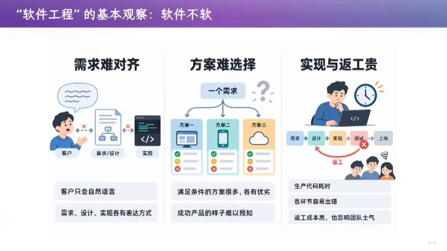

> 🎞️ 视频画面时间区间：00:05:30–00:05:45。


## 1.3 本章小结

软件工程的起点不是“写代码”，而是 intent、spec、implementation 之间那张依赖网络；软件是纯逻辑制品，没有物理世界的容错余量，因此错误会沿依赖传播，影响范围是一个可以用闭包描述的集合。上一讲留下的可追踪性，正是为了让人能回答“改这里会影响谁”。下一个问题是：当生成代码的成本被 AI 压到极低之后，这张网络上的成本结构发生了什么变化？

# 2 AI 把“把需求写成代码”变成了廉价操作

## 2.1 杠杆从“写代码”移到了需求、产品设计与架构

视频中段的这张幻灯片给出了整讲的成本判断。第一句话是“生产目标明确的代码，极为便宜”：只要边界划得清楚，模型不仅能写实现，还能写测试用例、断言，甚至给出证明；配上并行的 Agent Swarm，产能还可以继续放大。讲者自己的实践是，让 AI 生成代码时他已经不看实现了，只要边界清楚、并且知道怎样做有效的验证（validation），他就敢于相信结果。

第二句话是关键推论：既然实现便宜了，那么“需求、产品设计、架构”就变成了撬动软件生产力的杠杆。讲者用一句警告收尾——如果这三件事不认真对待，产出就会堆积成 AI Slop。

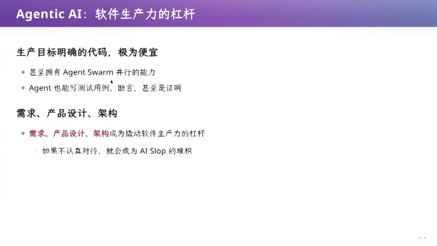

> 🎞️ 视频画面时间区间：00:09:30–00:09:45。


## 2.2 MVP 是切片，不是简化版产品

讲者接着解释为什么 MVP（最小可行产品）是正确的做法：它让人从 intent 到 spec 到 implementation 走完一个完整切片，从而验证整条链路。做 MVP 时人的本能是不做无用功——你不会在研究一个即将被扔掉的按钮样式上花时间，而会优先实现最重要的功能，然后立刻从可运行的版本里看出哪里做对了、哪里做错了。这个本能是对的，讲者明确说“AI 时代你做 MVP 没问题，正确，而且前所未有地容易”。

但 MVP 会带来一个副作用：它让人以为自己能驾驭 AI。讲者给出的机制很具体。同一个 MVP 需求，只差几个字的 prompt，就会得到架构完全不同的产物：让模型做一个 CLI，它可能只生成一个命令行库；让它做一个 client--server 结构，它会先设计数据存储、挑一个数据库。危险的地方在于这个决定的后续效应——数据层文件一旦被写进仓库，就进入了 agent 的上下文，接下来每实现一个新需求，模型都会带着之前所有的历史来思考。

## 2.3 技术债从第一个决定开始

讲者由此给出软件工程里那个名声在外的概念：技术债（technical debt）。它的含义是“债务”，也就是你在做任何决定的时候就已经背上了约束。技术上，MVP 阶段的每个结构选择都会压缩后面可选方案的空间，而这些压缩是靠几个字的 prompt 随机产生、而不是靠需求判断产生的。

讲者用一次现场事故做了旁证。某次上课时他的系统 UI 还在正常工作，OBS 还在正常推流，但他的鼠标和键盘全部失效，插上新鼠标也没用，全场不知道发生了什么。他借这件事说明一条工程实践：出了问题你必须能看日志，而这隐含着一个实现要求——软件必须输出足够多的日志。他的观察是：如果没有人明确要求，AI 不会主动做这件事，它会生成一个没有任何日志的系统；系统的“不可诊断性”就这样变成了新的技术债。

> [!IMPORTANT] 技术债的第一个来源是“决定”而不是“代码质量”
>
> 把技术债理解成“代码写得不够漂亮”会漏掉本讲的重点。讲者说的是：技术债在*做决定*的那一刻就产生，而 AI 恰恰让人可以在几乎没有思考的情况下产生大量决定（选哪个数据库、要不要数据层、日志写不写）。代码可以随时重写，但这些决定已经把后续需求钉在了某条路径上。

> [!WARNING] “能让 AI 往后修”不是架构正确的证据
>
> 讲者承认 AI 确实可以连续迭代三个版本，把功能修补下去，这让人产生一种“可以一直修”的安全感。但他同时指出，这种修补只在软件还没真正进入物理世界时成立。一旦系统上线、开始和环境以及其他系统交互，原来的设计就会在某个时刻集体失效——那时你需要还的不是三个版本，而是从第一个决定开始累积的全部债务。

## 2.4 本章小结

生成代码的边际成本下降之后，软件生产力的瓶颈从实现转移到了需求、产品设计和架构。MVP 仍然是正确的起点，因为它提供了一条从意图到实现的完整切片；但 MVP 顺利运行会制造“驾驭了 AI”的错觉，因为每个由几个字 prompt 产生的结构决定都已经变成约束。下一个问题很自然：这些约束在真实业务系统里究竟怎样积累？讲者选了一个他熟悉的系统来做证据——南大的教务系统。

# 3 一个真实的业务系统：教务系统

## 3.1 “史诗级的需求爆炸”

讲者用教务系统做案例，理由很实际：学生不会去见真正的客户，也做不了“需求”级别的软件系统，而教务系统提供了一个每个人都能亲自操作、又确实复杂到需求爆炸的对象。他用一个词的强度来描述现状——史诗级的需求爆炸。视频中的幻灯片只写了一句话的抱怨作为证据：系统里甚至还有隐藏的 AI 功能，而“有懂哥告诉我花了多少钱吗”这个问句，指向的是成本量级问题。

讲者选这个案例还有一个更直接的动机，写在同一套幻灯片的上一页：需求工程这门课曾经很难讲，因为学生不会去见真正的客户，也做不了“需求”级的软件系统。幻灯片用一个对照图说明变化——AI 之前，独立开发者是稀疏的少数，付费用户也稀疏；AI 之后，独立开发者的数量爆炸式增长，而付费用户仍然只是人群中的一小块。这个对照解释了为什么讲者敢让学生直接面对一个真实系统的需求。

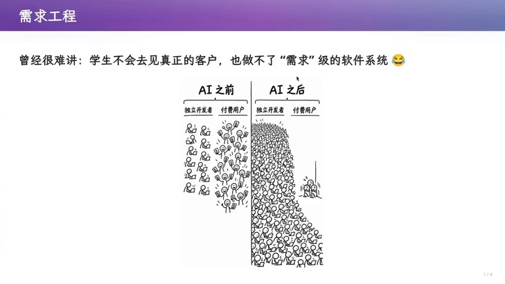

> 🎞️ 视频画面时间区间：00:15:30–00:15:45。


真实观察从一次登录开始。讲者在教务系统里搜索“仙林教学楼的灯一直没有解决，我应该打电话给谁”，系统返回了一段 AI 生成的答复，给出基建处的联系电话与职责范围。这个功能本身说明系统已经在做需求叠加；而讲者对它的评论更尖锐——这个系统显然花了很多钱，而这些钱在某种程度上还不如变成 token 的补贴发给大家，因为同样的调研如果用 agent 去做，可能只要一毛钱到两毛钱。这句话把“改造一个存量业务系统”的价格锚点立起来了：与生成式 AI 的调用成本相比，存量系统的功能开发是数量级更贵的操作。

## 3.2 功能是按“叠加”的方式长出来的

接下来是讲者“古法手工点击”式的功能巡视，这一段的证据价值在于每一条都能对应到一个具体需求点。教学任务里能编辑联系方式，能看到当前教学学期、最新排课学期和历史授课信息，历史授课信息还要先选学年学期；期末考试签导表在考试期未发布时点击会弹窗告诉你无法打印，说明这个需求做过了分析；编辑教材进入另一个页面并弹出窗口，讲者现场遭遇了一次“曾经好像可以”的失败；查看大纲能看到内容，教学安排要先选中一个教学班，而且页面刷新要等很久——讲者直接指出这可能不满足功能性需求里的响应要求。

学生名单里能看到电话号码，讲者评价这是一个比较糟糕的 feature。助教功能则是需求叠加的教科书式案例：起初没有 MOOC 教学班，疫情期间领导要求为老师添加 MOOC，添加完之后又需要 MOOC 的助教，而 MOOC 的助教不能当成普通教学班的助教来对待，于是系统里长出了这一整套分支；讲者现场尝试删除和新增，得到的提示是“请在可维护时段内操作”。他的结论很朴素：这就是你看到的教育系统，一个需求不断叠加、没人能完整说清的系统。

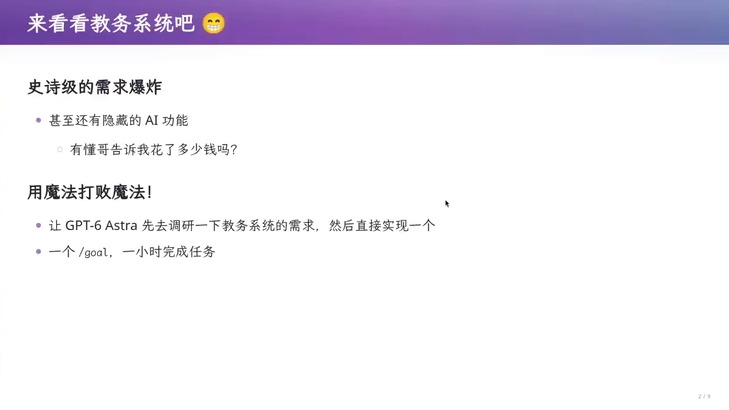

> 🎞️ 视频画面时间区间：00:22:30–00:22:45。


## 3.3 一个 -1 换来的连锁崩溃

讲者还留了一个会更详细展开的故事：他上课第一天第一次用教师端，发现可以给同学设置缺课次数。他绕过前端校验，把一位同学的缺课次数从 `0` 改成 `-1`。这个数字一进入数据库，所有能选出这位同学选课记录的页面立刻全部崩溃，直接返回 500。他只能打电话给教务说系统坏了，第二天工程师登录数据库把这条 `-1` 的记录修掉。这个故事在第 6 章还会回到“修改代价”的语境里，但在这里它已经展示了业务系统的一个特征：缺失校验的值不会安静地留在原地，它会顺着数据依赖让整片查询失效。

> [!WARNING] “-1 次缺课”不是一个输入校验问题
>
> 把这件事读成“前端应该校验非负整数”会低估它。真正的教训是：这个字段没有承载业务语义，缺课次数与选课记录、成绩单之间的关系从未被显式建模，所以任何一个越界值都能让依赖它的所有视图失效。校验只是局部止血，缺的是“这个数在业务上是什么意思、谁依赖它”。

## 3.4 本章小结

教务系统提供了本讲的实验对象：一个需求以叠加方式增长、成本以数量级计、且每一步叠加都有具体痕迹的存量系统。它同时给出了两个锚点：改造它的价格远高于调用生成式 AI 的价格；而它的功能增长方式说明需求不会收敛——每加一个概念（MOOC、MOOC 助教）就会带出新的例外。下一个问题是：既然生成代码便宜了，能不能直接让 AI 把需求也写出来？讲者真的这么做了一次。

# 4 让 AI 写需求说明书：能力与边界

## 4.1 让 agent 先调研需求，再实现一个原型

讲者的做法写在那张幻灯片上，标题叫“用魔法打败魔法”：让 agent 先去调研教务系统的需求，然后直接实现一个。他的实现路径分两步。第一步是让 GPT 探索教务系统里和教师相关的功能——注意范围被刻意限定在教师相关——产出一份需求说明书。第二步是只把这份说明书交给一个 subagent，不让它看任何其他教育系统的信息，让它据此实现一个“假”的教务系统。

值得记录的是第一步的产出形态。讲者生成的文档叫《南京大学本科教学服务平台需求说明书》，副标题是“教师视角·软件工程课程案例”，文档里带调研时间、主要使用者、编制依据等字段。他的评价是“AI 真的是很好用”：想教需求工程，既可以找一个经典案例，也可以把身边的案例直接变成需求说明书。

## 4.2 说明书的结构本身就是软件工程知识

讲者随后的评论比文档内容更值得记录。他说这份目录里有这么多项——从调研方法、证据边界到业务目标、成功标准，到详细用例规约和功能需求目录，最后还有术语、文档与配套文件——这说明模型“懂软件工程”。


> 🎞️ 视频画面时间区间：00:24:45–00:25:00。


其中两项值得单独说明。第一项是术语表：讲者指出，当你面对的是客户时，一个术语就很重要，客户看不懂的时候可以去查，然后就对齐了——即使这不是 UML、还处在早期意图沟通的阶段，这些内容显然是有一定用处的。第二项是每个模块的详细步骤与异常场景，这对应的是“实现者照着就能做”这一层需求。

## 4.3 需求 ID 与“依据”列：可追踪性的工程化形态

真正让讲者认为这份文档可用的，是功能需求表的形式结构。表中每一条需求都有 ID 与优先级（形如 FR-001/M），有“系统应提供的行为”、有“候选验收口径”、还有一列叫“依据”，其编号是 O-E01、E12/E13、P-E01/E12 这种形式；表头上方还有一段说明：“依据”包含 O/P 与证据编号，O 表示功能或字段来源于观察，右侧验收口径仍是待执行的候选测试；涉及未观察的服务器约束时按 P 处理。


> 🎞️ 视频画面时间区间：00:26:00–00:26:15。


这三列合起来做的事，正是第 1 章提到的 traceability：每条需求有一个带形式语义的 ID，因此可以被引用、被分配、被检查进度，而不是只能靠一句自然语言说“教学班和学生管理是有关的”。讲者的推论也很直接——有了 traceability，你作为管理者就可以把前 20 个需求分给一个团队、后 20 个分给另一个团队，然后 track 每个人的进度，看出哪个团队落后；这个能力在本科软件工程课上通常是不讲的。

> [!IMPORTANT] 需求文档的价值结构：ID、行为、验收口径、依据
>
> 把这条结构记住，比记住某一份文档的内容更有用。**ID** 让需求可以被引用与追踪；**行为** 规定系统该做什么；**验收口径** 规定怎么判断它做到了（并且被显式标记为“候选、待执行”）；**依据** 把需求连回证据来源。四者缺一，文档就会退化成一份愿望清单。幻灯片里“候选验收口径”这个措辞值得保留：它诚实地声明了这些验收条件还没有被执行。

## 4.4 需求写清楚之后，实现和验证都能自动化

功能需求目录本身提供了一个观察业务系统规模的窗口。目录按模块编号展开：门户与身份、教学任务、我的课表、我的选课、我的成绩、我的考级信息、我的奖励信息、学生管理、教学班名单、教学班、排课与教室、教师信息、学生信息、补考信息、成绩录入、成绩管理、毕业审核、学籍信息、辅修管理、系统管理、系统监控、数据字典、日志与安全、通知公告等；每个模块再拆成若干条带 ID 的需求，例如“门户与身份”下就有 FR-001 到 FR-004，其中 FR-002 专门管多种身份并存时的身份选择与切换。

讲者还用一个学生更熟悉的例子做对照：计算机系统基础课的 NEMU 实验。第一个 lab 是一句“实现一个调试器”，第二个 lab 是一句“实现指令的解释”，但“到底什么是指令”写在哪？写在文档里，于是学生拿到的是另一份更大的需求文档；一旦系统大到一定程度，训练是相通的——做 NEMU 的过程一定程度上就是在学软件工程。

讲者还展示了这份分解的另一面。把需求整理成“从入学到毕业”的六个环节之后，真正难的部分被压在最下面一行：权限、规则版本、数据同步、操作留痕。这四项都不是某个功能，而是贯穿所有环节的横切要求，也正是后面第 11、12 章要处理的失败点——CRUD 架构没有为“规则版本”和“操作留痕”留位置。

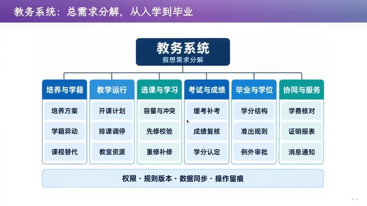

> 🎞️ 视频画面时间区间：00:33:45–00:34:00。


第二步的执行结果也符合讲者的预期。subagent 只拿到需求说明书，就实现出了一个能跑的假教务系统：教材管理能编辑并保存，学生名单能列出学生，界面甚至带了点自己的审美。讲者也顺手展示了它的缺陷：在“缺课次数”里输入超过总课次的值，系统没有拦住。这个细节恰好说明当前阶段的能力边界——需求清楚时实现可以自动化，但需求里没写清楚的约束，实现阶段也不会被补上。

> [!NOTE] AI 生成需求说明书这件事的边界
>
> 讲者给出的边界有两层。第一层是证据层面：这份文档仍是“教师视角”的，它来自观察与推断，所以“依据”列才需要区分观察（O）与推测（P）。第二层是判断层面：文档把需求写清楚了，不等于需求是对的；讲者在同一段里也说这是一份“完全的 slop”——它懂格式，但并不意味着它解决了需求的不确定性。

## 4.5 本章小结

当生成代码变便宜之后，讲者给出的第一个可复用做法是把需求本身也当成可生成、可结构化的制品：先让 agent 调研并产出带 ID、行为、验收口径与依据的需求说明书，再让只读说明书的 subagent 去实现。这个流程说明“需求写清楚”会带来巨大的收益——它可以被分配、被追踪、被验收，实现与测试都能自动化。但同期出现的反例是：写清楚的需求一旦被实现成规则，就会立刻变成技术债。下一个问题正是这个机制——为什么需求永远写不完？

# 5 需求泥潭：为什么需求永远写不完

## 5.1 访谈一遍，期末考试都结束了

讲者用一句很具体的话概括了传统软件工程思路的失败方式：按照经典路线，你要“把需求方访谈一遍”，而这句话的工作量有多大呢——等你访谈完，期末考试都结束了。他接着列出需求方名单：学生、老师、教务员、教务处、财务、辅导员，各有各的需求。更糟的是，客户往往说不清楚明确的需求，例如“必修课二选一”“准出规则”“先修规则”这些现实世界里的奇葩规则，以及永远存在的例外：转专业、交换生、缓考、补考、课程替代。

## 5.2 “说清楚了也未必达成一致”

讲者给出了本讲最锋利的一个判断：即使你把需求说清楚了，也未必能达成一致。他举的例子是“学生要选上课、教师要控制班额、教务员要保证毕业”，这三者在冲突时由谁裁决？这不是技术问题，而是利益与价值判断的问题。幻灯片把这一点连到了一个有出处的概念上：城市规划早已遇到过这种困境——问题怎样定义，也取决于各方的利益与价值判断（Rittel & Webber, 1973）。

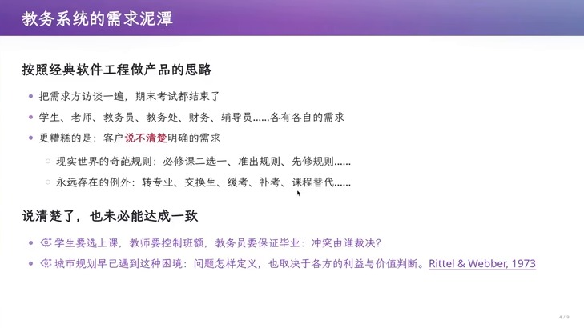

> 🎞️ 视频画面时间区间：00:35:15–00:35:30。


## 5.3 领域知识是需求质量的一部分

讲者把“谁能做好教务系统”这个问题拆成了经验问题。如果你是一个有行业资质、在这个行业里摸爬滚打了 20 年的公司，你手上有大量领域知识——你知道教务员想要什么，知道学位授予流程应该怎样变成需求文档里的条目列表；而一个本科生不知道教务员到底想要什么，设计出来的需求和真实业务很可能存在偏差。他也给出了一个价格锚点：如果学生真的拍胸脯说“给我 20 万，我找几个同学把南大的教务系统包了”，承担不了这个责任的时刻会在交付验收时到来——达不到功能需求或非功能需求时怎么办，签合同的时候就傻了。

同一段里，讲者用“人”的差别说明同理心的位置：要设计教务系统，既要为年轻人设计，也要为一位可能今天已经 53 岁、还有两年退休、上大学时甚至没怎么操作过电脑的教务员设计。他明确说这不是本讲的重点，但把它放在这里是有意的——它是“架构能力从哪来”的一部分。

## 5.4 本章小结

需求不会收敛的原因是结构性的：需求方是多方且目标冲突的，客户的表达是模糊的，现实世界的规则和例外是开放集合。所以“把需求访谈清楚”不是一个可以结束的任务，说清楚也不等于达成一致。讲者因此把话题从“需求能不能写全”转向“需求固定下来之后会发生什么”。下一个问题是：一份写得非常清楚的需求，如果被直接实现成业务规则，会以什么方式坏掉？

# 6 技术债的诞生：培养方案案例与“暗箱操作”

## 6.1 规则写进界面，就再也表达不了变化

讲者先用离散数学拆课的例子把机制说透。原本计算机学院的学生毕业要求里必须修“离散数学”；后来课程改革把离散数学拆成了上下两学期的两门课。这时毕业规则需要变成一个“或”关系：修过旧的离散数学，或者修过新的一和二。问题出在需求的第一版：当年沟通需求时没人想到这件事，所以系统里的“毕业要求”页面被设计成给教务员一个下拉框和一个“增加一条”的按钮，每一条可以选一门课程。

这个设计在它被写下的时刻是完全合理的，一旦需求固定下来就无法适应变化：下拉框里加不了“或”。于是你只能改系统——加一个“或”，再叠加就再改，史山开始累积。讲者强调这条路径的代价不只是改代码：“改需求会破坏你做了一个整体上一致的设计”，裂缝会传递到系统各个部分，一个看似很小的需求会牵动整个系统。

> [!WARNING] 把规则写进界面控件，等于把规则锁死在那个时刻
>
> “毕业要求 = 一个下拉框 + 若干条课程”是一个界面设计，但它同时是一次领域建模。它隐含了“毕业要求是一组课程的合取”这个假设。当业务需要析取、需要先修、需要学分抵扣替代时，系统里没有可以表达这些东西的位置，因为那个位置被 UI 控件占满了。这类债务的隐蔽之处在于：它不表现为 bug，而表现为“这个功能做不到”。

## 6.2 培养方案案例：一份合规到底有多复杂

讲者随后虚拟了一个“可能发生”的案例，用来展示合规判定的真实复杂度：一位 2024 级李同学在 2026 年转入计算机专业，适用目标专业的 2024 版培养方案；毕业至少需要 160 学分，其中通识 40、专业必修 72、专业选修 28、实践 20，并且各类别要分别达标；数学必修组二选一，可以选 5 学分的高数 A，也可以选 4 学分的高数 B 加 1 学分的桥接课；算法课必须先修数据结构，缓考生可以暂选但开课前仍未通过则撤销；两门交换课程获批可以合抵算法课、认定 4 学分，且不能再计入专业选修；重修学分只计一次，成绩单保留历次记录，绩点按较高成绩核算。

这些条款每一条都对应一个可以被“或”“且”“覆盖”表达的结构，也每一条都可能与另一条冲突。讲者由此推到系统外部：转专业的学生从别的院系带来一门离散数学，这门课能不能抵扣计算机学院的离散数学？应该抵扣“离散数学一和二的合计”，还是只抵扣“离散数学一”、还要再补一门二？在开放的物理世界面前，这种组合是无穷多的。

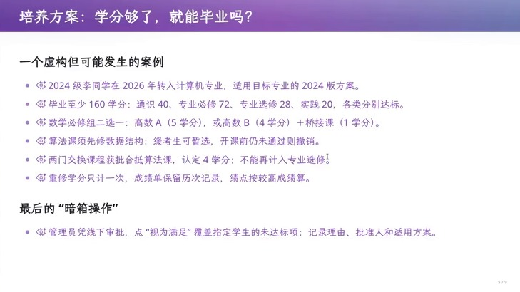

> 🎞️ 视频画面时间区间：00:40:30–00:40:45。


## 6.3 兜底一定存在，而且它是业务事实

讲者没有停在第 9 张图上，而是把它推到底：一个学生读了六年还拿不到本科学位，原因只是离散数学这一门课，而恰好你把离散数学拆成了两门。这时已经是春季学期，马上要毕业，旧课不再开，新课也来不及修，怎么办？教学主任说我认为这两门课之间存在替代关系——于是最终解决方式是打电话给工程师，让他改数据库，把这位同学的毕业条件改成“满足”。讲者特意补了一句：这个改动是档案可查的，层层审批流程会留下记录，最终是教学院长认为“这个同学学了旧的离散数学还是可以抵扣新的离散数学”，在人类世界的意义上，这个解释是合理的。

这段推演给出了一个对架构设计至关重要的结论：系统中的规则永远覆盖不了现实世界的全部事实，所以“例外”会以 override 的形式回到系统里。如果系统没有为“例外”设计可表达的位置，它就只能以直接改数据库的方式出现。

## 6.4 规则被绕过时的连锁代价

讲者用“上课第一天”的缺课次数故事补上了另一个方向的证据——他提到那应该是 2018 年，也就是他开始用教师端上课的时候。他绕过前端校验，把一位同学的缺课次数从 `0` 改成 `-1`，结果所有能选出这位同学选课记录的部分全部瘫痪。这件事有两个层面的含义：其一，业务系统里存在一些字段，它们自己没有语义，却处于很多视图的依赖路径上；其二，讲者在同一段里指出这个功能本身就该被质疑——缺课这件事在现实里是靠点名表和扫描件留证据的，把它做成系统字段未必是好需求。


> 🎞️ 视频画面时间区间：00:42:15–00:42:30。


> [!IMPORTANT] 关于需求的两条定律
>
> 讲者把这段经验压成两句可复用的判断：**第一，你永远不可能真的把用户的需求说清楚；第二，需求不是一成不变的。**两条合起来决定了任何“按需求清单实现一遍”的路线都必然留下债务：清单外的东西要靠在系统外兜底，清单内的东西会随业务变化而失效。因此“实现完成”不是终点，而是债务开始计息的时刻。

## 6.5 本章小结

技术债的产生机制在这一章变得具体：需求被固化成界面控件和字段的那一刻，系统就失去了表达未来变化的能力；而变化一定会来，于是规则外的例外只能靠人工改库兜底，规则内的字段一旦越界就会让依赖它的整片视图崩溃。下一章要把这个机制推到它的终点：为什么“持续维护”不能靠更努力地修补来解决，而需要换一种结构？

# 7 No Silver Bullet：MVP 的顺利为什么不可信

## 7.1 从“驾驭 AI”的错觉到 dark corners

讲者把 MVP 的价值和它的陷阱放在同一页幻灯片上。价值一侧是“有用，且前所未有地容易”：优先实现最重要的功能、看到产品就立即知道哪里做对了哪里做错了，而且让客户试用本身就是在发现尚未说出口的需求——幻灯片在这里引了 Brooks 在《没有银弹》里主张用快速原型和迭代澄清需求的立场（Brooks, 1987）。陷阱一侧只有一句话：*让你产生“驾驭了 AI”的错觉*，因为那些 dark corners 还没有露出獠牙。

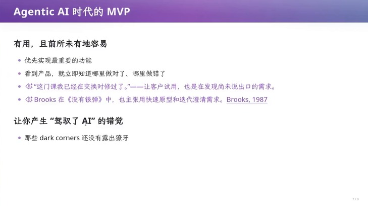

> 🎞️ 视频画面时间区间：00:43:15–00:43:30。


## 7.2 需求变更穿透整张依赖图

讲者接下来给出“为什么错觉不可持续”的机制。第一句是：需求的变更会穿透整个软件工程的 dependency graph。幻灯片举了一个很小、很具体的例子：只要允许“两门交换课程合抵一门必修课”，课程对应关系、学分统计、毕业审核、成绩单与测试用例都可能要改。这不是一个功能的改动，而是一次沿着依赖图的传播——正好对应第 1 章那个影响范围集合。

第二句是关于时间方向的：随着软件增长，维护成本不断增加，因为新规则上线之后，*已经认定的学分、已经批准的特例怎么办*？旧决定也成了新需求的约束。讲者在这里触及了本讲后半段的核心：系统里存的不只是事实，还有过去基于旧规则作出的决定；这些决定会反过来限制你今天能定义什么新规则。

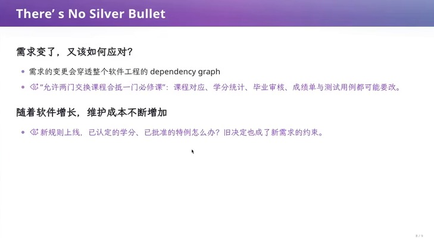

> 🎞️ 视频画面时间区间：00:44:00–00:44:15。


## 7.3 为什么“再努力一点”解决不了这个问题

讲者的结论是软件工程里那句名言：There is no silver bullet。他给出的推导值得完整保留：软件一旦上线，它就开始和物理世界产生交互，于是你必须持续背着技术债维护下去；如果你在前面做的决定不够前瞻，维护成本就会不断变得更糟。而“清零重做”这个选项在真实系统里不存在——讲者把课程项目和真实系统的差别说得很清楚：课程项目的软件“我随时可以把它清零，从头再做一遍”，而上线运行的软件不行。

> [!WARNING] 把“可重做”当成默认前提是危险的假设
>
> 课堂上和演示环境里，重做的成本接近于零，所以任何架构缺陷都可以靠重来掩盖。真实系统的三个前提都变了：数据不能丢（历史是资产）、用户不能停（可用性是承诺）、外部系统已经按你的接口对接（接口是契约）。三个前提里任意一个成立，“重做”就已经不是选项，架构决策因此变成不可逆决策。

## 7.4 本章小结

MVP 提供的是一条完整的意图到实现的切片，它确实能让人快速看到对错；但它的顺利不能证明架构正确，因为需求变更会穿透整张依赖图，而且新规则必须与旧决定共存。讲者由此把话题转向他的答案：如果问题不能靠“更努力地维护”解决，那么能不能在系统第一次被设计时就让变化只影响一个地方？这就进入了架构。

# 8 架构：把复杂性放到该放的地方

## 8.1 架构不是玄学，它是复杂性的分配方式

讲者先拆掉了“架构”这个词的神秘感。他承认讲到架构大家都觉得有玄学、好像很高大上，但架构其实从你第一次设计任何代码、任何系统的时候就已经存在，无论它多小，因为架构本质上就是*怎么样去控制一个东西的复杂性*。当代码开始有一点点规模，你就可以考虑这个复杂性应该怎样分解。

幻灯片给出的定义有两个动作。第一个是驾驭复杂性、应对变化：架构使我们得以驾驭问题的复杂性——简化问题、安放复杂性、减少依赖，从而能应对需求的变化、降低维护成本；幻灯片还强调“甚至更小的代码都有架构”。第二个是把变化安放在边界内：把容易变化的设计决策藏在模块内部，让一次变化尽量只影响一个地方。讲者明确标注这句话来自 Parnas, 1972。

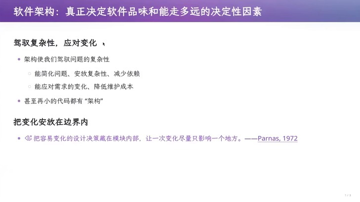

> 🎞️ 视频画面时间区间：00:45:30–00:45:45。


> [!IMPORTANT] 架构的两个可操作判据
>
> 把抽象的定义变成可以检查的判据：**（1）这次变化影响几个地方？**如果一次业务变化需要改动系统的很多处，说明变化没有被安放在边界内。**（2）复杂性有没有归处？**系统里总有无法消除的复杂性，架构决定的不是“有没有复杂性”，而是“复杂性被放在哪里、由谁承担”。第 10 章与第 11 章会用这两个判据评价 Excel 二维码与教务系统。

## 8.2 最小的代码也有架构：一个 main 函数和一次参数解析

讲者给的第一组例子小到不像架构。第一个是 OJ 里常见的写法：把程序写成 `read_input()`、`parse_input()`、`process_input()`、`write_output()` 四步。幻灯片把它称作“甚至最小的'状态机'就是架构”——这四个函数把一次计算拆成四个依次推进的阶段，复杂性被安放在阶段之间的边界上。讲者借此说明，你学习的语法、库函数都可能和架构有千丝万缕的联系，所以他不喜欢那种“语言律师”式的授课方式：只看语言特性而不看它们该怎样被使用。


> 🎞️ 视频画面时间区间：00:46:00–00:46:15。


第二个例子是命令行参数。操作系统与进程之间有一个约定，会传进来一个字符串数组；如果你在现场不得不用 string compare 去处理它，那就错过了一次现成的架构。所谓现成的架构就是 POSIX 标准化的 `getopt`：它把“任意字符串到规范选项”这个复杂转换收敛成一个解析状态，你只需要写一个 while 循环加一个 switch。

**代码 1**：getopt 把参数解析的复杂性收敛成一个解析状态（幻灯片上的标准写法）

```c
while ((opt = getopt(argc, argv, "abc:")) != -1) {
    switch (opt) {
        case 'a': flag_a = 1; break;
        case 'b': flag_b = 1; break;
        case 'c': arg_c = optarg; break;
        default:  usage(); return 2;
    }
}
```

讲者对这段代码的解读是它“也是架构、也是一种分解复杂性的方法”：argv 本身很复杂，有长参数、短参数、Unix 风格写法，在 C 时代手写一个 parser 是很麻烦的；getopt 依靠 POSIX 这组约定把复杂性隔开，你拿到的只是一个可以逐项消费的解析状态。这个模式在后面会以完全相同的形态重新出现——第 10 章处理 Excel 公式时，讲者的做法同样是先构造一个中间表示，再从中间表示出发做两件事。

> [!NOTE] Parnas 的信息隐藏与“变化边界”
>
> Parnas 在 1972 年提出的模块化判据不是“把功能相近的代码放在一起”，而是“把*可能变化的设计决策*封装起来”。讲者引用它的用意在实践中很直接：如果一个需求点可能变，就把它的实现藏在某个模块或某个中间表示之后，让使用它的代码不依赖它的具体实现。判据不是“这个模块大不大”，而是“它变化时有多少外部代码需要跟着改”。

## 8.3 本章小结

架构在本讲里被定义为复杂性的分配方式，它有两个可检查的判据：一次变化影响几个地方、复杂性被安放到哪里。随后两个极小的例子（四段式 main、getopt）说明架构不需要规模支撑：只要存在一个“把复杂输入收敛成简单状态”的位置，架构就已经在起作用。下一个问题是：这个“先得到中间状态，再从中间状态出发”的模式，能不能用来解释一个看起来完全不同的难题？讲者用十行的汉诺塔把它带到了极致。

# 9 十行的架构：非递归汉诺塔的四种表达

## 9.1 架构关乎你对需求“掌控到什么程度”

讲者用一个看似纯算法的问题作为第一个完整的架构案例：写一个非递归的汉诺塔。他选这个例子的理由是它同时很简单又很难——代码只有十行，但他曾问过自己的研究生能不能写出来，答案是摇头。幻灯片把这个问题定位成一类更普遍的现象：“架构关乎你对需求‘掌控到什么程度’”，并给出一个同构实验作为旁证：同一个问题换一种表示，难度就可能改变，汉诺塔的同构变体实验也观察到了这种差异（Zhang & Norman, 1994）。

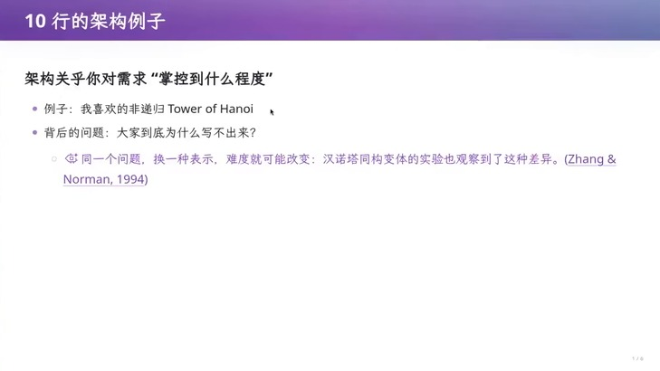

> 🎞️ 视频画面时间区间：00:52:00–00:52:15。


## 9.2 第一种表达：把规律写成公式

讲者说，如果把这个问题直接丢给 GPT-6，模型的反应是“反正我不当人了，你写不出来是因为你的数学不如我”。它给出的是一种纯数学表达：盘号等于 `1` 加上步号二进制末尾 `0` 的个数，每个盘子的移动方向固定。


> 🎞️ 视频画面时间区间：00:52:30–00:52:45。


把这个规律写成公式：设第 `n` 步移动的盘子编号为 `k(n)`，`ν₂(n)` 表示 `n` 的二进制末尾 `0` 的个数，则

```text
k(n) = 1 + ν₂(n), ν₂(n) = max{ t | 2ᵗ | n }
```

方向的规律是：当 `N - k(n)` 为偶数时向负方向移动，否则向正方向移动；设当前所在柱编号为 `s`，则目标柱编号为

```text
d(n) = (N − k(n)) mod 2 = 0 ? −1 : +1, target(n) = (s + d(n) + 3) mod 3
```

- `n`：步号，从 `1` 数到 `2ᴺ-1`；
- `N`：盘子总数；
- `k(n)`：第 `n` 步移动的盘子编号，由步号的二进制尾部零个数决定；
- `ν₂(n)`：`n` 的二进制末尾 `0` 的个数，也就是 `2` 在 `n` 中的指数；
- `d(n)`：移动方向（`-1` 或 `+1`），只由 `N` 与盘号的奇偶差决定；
- `s`：该盘子当前所在柱的编号；
- `target(n)`：第 `n` 步的目标柱编号，加 `3` 再取模是为了把负数归一到 `0..2`。

讲者的评价是“他这个应该是对的，反正你看不明白，但是 highly optimized 极度最优”。这段评价本身就是教学点：这是一种*正确但难以验证*的表达，验证它的唯一办法是相信数论推导或写测试，而不是读代码。

**代码 2**：GPT-6 的闭式解（幻灯片原代码）：盘号由步号尾零个数决定，方向只与 `N` 和盘号的奇偶差有关

```c
for (uint64_t step = 1; step <= total; step++) {
    int disk = 1;
    for (uint64_t x = step; (x & 1) == 0; x >>= 1) {
        disk++;
    }
    int direction = (n - disk) % 2 == 0 ? -1 : 1;
    int from = position[disk];
    int to = (from + direction + 3) % 3;
    printf("Move disk %d: %c -> %c\n", disk, pegs[from], pegs[to]);
    position[disk] = to;
}
```

## 9.3 第二种表达：把待办任务留在栈里

同一个 prompt 交给 DeepSeek，它给出的答案是另一种形态：不用公式，而是显式模拟“还有哪些任务没做”。它的做法是把待执行任务压栈，循环取出栈顶任务执行；如果栈顶任务的规模大于 `1`，就把它展开成三个子任务并按相反顺序压回去。讲者的评价是“更有人感”“非常优雅”“非常干净的架构”，因为它就是人在想递归时脑子里的那件事。


> 🎞️ 视频画面时间区间：00:53:30–00:53:45。


这段代码正确性的依据是一个可以直接写出来的分解等式。记 `T(n,a,b,c)` 表示“把 `n` 个盘子从 `a` 借助 `b` 移到 `c`”这一任务，则

```text
T(n,a,b,c) = T(n−1, a, c, b) + T(1, a, b, c) + T(n−1, c, b, a)
```

- `n`：本任务要移动的盘子数；
- `a`：源柱，`c`：目标柱，`b`：辅助柱；
- 右端三项：先把上面 `n-1` 个移到辅助柱，再把最大的一个移到目标柱，最后把 `n-1` 个从辅助柱移到目标柱；
- 在程序里这个等式是从右往左执行的，所以压栈顺序必须反过来：先压最后要做的 `T(n-1,c,b,a)`，再压 `T(1,a,b,c)`，最后压最先要做的 `T(n-1,a,c,b)`。

**代码 3**：栈式汉诺塔（幻灯片原代码）：把剩余任务留在栈里，总是执行栈顶任务

```c
push(&s, n, A, B, C);
while (!isEmpty(&s)) {
    Task t = pop(&s);
    if (t.n == 1) {
        printf("%c -> %c\n", t.src, t.dst);
    } else {
        push(&s, t.n - 1, t.aux, t.src, t.dst);
        push(&s, 1, t.src, t.aux, t.dst);
        push(&s, t.n - 1, t.src, t.dst, t.aux);
    }
}
```

讲者还补了一条关于能力边界的观察：他另外试了豆包，豆包选了这个方案但写出了有瑕疵的代码；也就是说矩阵里同一格的“选对架构”和“写对代码”是两件事。

## 9.4 第三种表达：把 C 语言的小步语义翻译成状态机

讲者给出的第三种表达来自他自己的课程。他没有去找汉诺塔的数学性质，而是问：为什么大家写不出来？他的答案是“大家对递归这件事情理解得不够深”。他给出的办法是把程序本身看成状态机——他讲过一整节课说明 C 语言有一个状态，状态转移的单个步骤就是 C 的操作语义（operational semantics），而像 `Hanoi(n-1)` 这种东西在程序语言的世界里是一个 well-defined 的小步操作。既然如此，就可以写一个 C 语言的解释器，把任意程序翻译成状态机表示。


> 🎞️ 视频画面时间区间：00:55:30–00:55:45。


形式化地说，他做的事情是把小步语义写成一条转移规则，再用一个显式的程序计数器把它变成解释循环：

```text
⟨s, σ⟩ ⟶ ⟨s′, σ′⟩
```

- `s`：当前要执行的语句或表达式（在汉诺塔里就是“移动 `n` 个盘子”这一次宏调用）；
- `σ`：当前状态（变量取值、柱子上的盘子分布）；
- `s'` 与 `σ'`：执行一个小步之后的新语句与新状态；
- 在实现里 `s` 被编码成“帧栈顶的 `pc` 值”，`⟶` 就是 `switch` 的一次分派加一次 `f->pc = next_pc`。

讲者对这个方案的评价很克制也很关键：“对于 Tower of Hanoi 来说 overkill 了，因为我可以把任意的程序翻译。”也就是说，这不是一个更聪明的汉诺塔算法，而是一个*能力更强*的架构：它解决的不是汉诺塔，而是一类问题。

## 9.5 第四种表达：互联网上的 slop

讲者还做了一次横向调查：在搜索引擎里找“非递归汉诺塔”，搜索结果的第一条给出的还是递归版本；继续往下找到的第一个非递归实现里，“有一个 move 但是 std 里其实是有 move 的”。他对此的评价是“我甚至觉得它比 AI slop 问题还要严重”，并给出一条忠告：如果在上学的时候被这种 slop 污染了，还不如跟着 DeepSeek 学。这一段的价值在于它展示了同一格矩阵里可以同时出现“表达选择正确”与“表达选择错误”两类结果：模型可能选对了架构却写错了代码，互联网上的实现甚至可能选错了架构。

## 9.6 同一道题的四种表达：复杂性被放到了哪里

幻灯片把上面四种实现并排放在一起，问题从“哪个算法对”换成了“复杂性放在哪里”，以及“改变表达时，哪些知识被保留”。这正是第 8 章那个判据的具体应用。

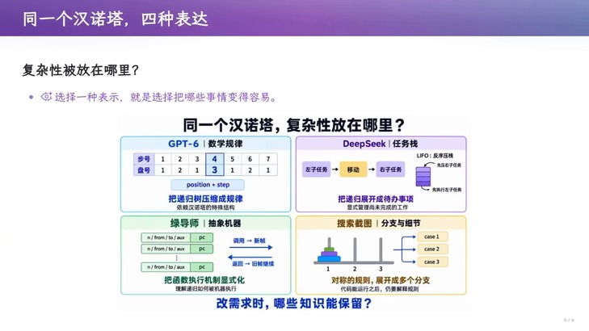

> 🎞️ 视频画面时间区间：00:57:30–00:57:45。


| 表达 | 核心机制 | 复杂性被放在哪里 | 改变表达时保留的知识 |
|---|---|---|---|
| GPT-6 数学规律 | 盘号由步号尾零个数决定，方向固定 | 放在数论规律里，代码只有循环与取模 | 保留“最优解序列”的规律，丢掉任务的层次结构 |
| DeepSeek 任务栈 | 把待办任务压栈，循环执行栈顶 | 放在显式栈与压栈顺序里 | 保留“任务分解”的知识，代码仍然对应递归结构 |
| 讲者抽象机器 | 把小步语义翻译成显式状态机 | 放在机器状态与分派逻辑里 | 保留“任意程序都能这样翻译”的能力，代价是 overkill |
| 互联网实现 | 依赖标准库中并不存在的函数 | 无（错误被掩盖） | 不保留正确性，也不保留可验证性 |

**表 1**　四种非递归汉诺塔实现放在一起后，比较的对象从“算法是否正确”变成了“复杂性被放在哪里、改变了什么才能改变行为”。

## 9.7 架构能力从哪里来

讲者用这段话给“10 行的架构”做总结：“我们展示的是*跳出问题看问题*。代码之外有客户的规律，客户之外有社会的规律，社会之外有宇宙的规律。”他随后回答了一个必然会被问到的问题——架构能力从哪里来。他的答案是它来自你在学校的学习和社会上积累的经验，而它们共同起作用的方式是压缩：*压缩就是智能*，你把问题压缩成 first principle，然后总是从 first principle 推导应该怎么做。

同一段里他给了两个不寻常的能力来源。第一是共情他人：你必须和做题之外的人打交道，才能知道一位马上要退休的教务老师怎么看待教务系统——她的想法可能只是“那个字大一点、点鼠标的时候不要手滑到旁边的按钮上”，而不是你想象的高性能数据库。第二个来源是对语言本身的理解：他在批评“语言律师”式授课时，把语义的价值定义为“把设计意图变成约束——谁能改数据、谁负责资源、谁可以依赖谁”，并把它和那四个函数（read/parse/process/write）连起来：真正要问的是“数据怎样穿过各阶段？换一种输入格式，需要改到哪里？”

> [!NOTE] “压缩就是智能”在工程上的含义
>
> 这句话不是修辞。它在本讲的语境里有一个可操作的版本：如果你能把一个具体任务压缩成“它其实是某一类结构下的实例”，你就能复用针对那一类结构设计的架构。讲者的三个例子——getopt 的解析状态、栈式汉诺塔的任务分解、C 语言的状态机——都是同一件事：先构造一个中间表示，再把问题变成对这个中间表示的操作。而设计不出中间表示，就只能对每个特例单独写代码。

## 9.8 本章小结

非递归汉诺塔的四种表达说明：同一个问题可以有多种正确实现，它们的差别在于复杂性被放在哪里、以及换一种表达时哪些知识被保留。GPT-6 把复杂性放进数论规律，DeepSeek 把它放进显式栈，讲者把它放进一个能做通用翻译的抽象机器，互联网上的实现则把正确性丢掉了。前一节的判据在这里第一次得到检验。下一个问题是：把 10 行的例子放大到 2000 行，“先构造中间表示”这个模式还能不能用？

# 10 两千行的架构：把 Excel 二维码当成编译问题

## 10.1 需求明确，但公式本身就是一堵墙

讲者选了一个和教育系统气质完全不同的例子：用 Excel 生成二维码。它需求非常明确——在一个单元格里放输入字符串，另外一些单元格输出 `01` 序列，整体是确定性的任务；讲者甚至现场演示了它的效果：输入任意字符串，Excel 能把它编码成一个可以直接扫描的二维码。

困难在实现形态上。二维码的完整规则无法用一个单元格公式写完，于是只能“直接写公式”，而公式会长成什么样子呢？幻灯片给出的评价是“公式极长且枯燥”，讲者的类比是：这好比让你用 Brainfuck 去实现“毁灭战士”这类非平凡程序——能写出来，但写出来的东西是一堵墙。

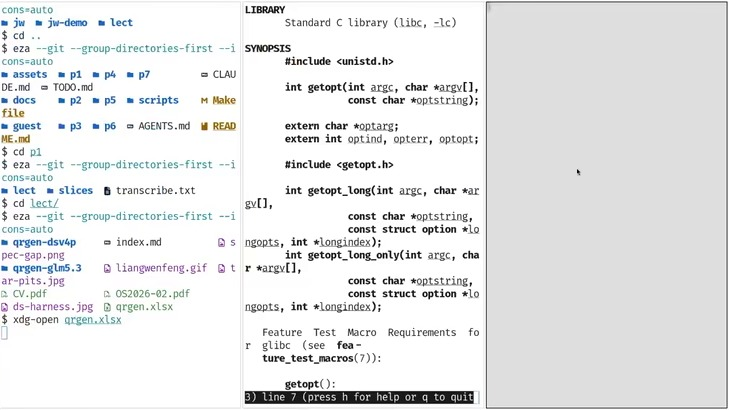

> 🎞️ 视频画面时间区间：00:59:15–00:59:30。


## 10.2 一个看似明确的需求，为什么会变模糊

讲者接着做了一个很重要的观察：需求看起来明确，其实有很多坑。第一个坑是 Excel 本身的版本演化。过去“查找学号对应的成绩”要用 `VLOOKUP`，微软在某一年推出了更方便的 `XLOOKUP`，Excel 在演化，于是需求立刻变得模糊：你到底是应该兼容旧版本标准，好让教务老师也能打开这个文件，还是应该做一个自己急用的版本、用最新语法写出最简单的公式？

第二个坑是版式与结构的变化。讲者列了几种：二维码最后要放到另一个位置，于是整个结果块要往右移一格；计算方式要改；要新增一个字符串单元格。这些变化在“所有单元格都硬编码”的设计下都是摧毁性的：你的设计和实现会从头回到原点、重新再做一遍。在 2000 行的项目里这还可以接受，但如果它已经嵌进了一个巨大无比的系统、和其他部分产生了关联，代价就会变成“我要加人、我要加钱”。讲者的总结是：这就是架构没有设计好的表现——它对需求变更的抵抗很糟糕。

> [!WARNING] “需求明确”通常只描述了第一个版本
>
> 这个案例的教训可以一般化：说一个需求“明确”，往往只是在说“当前这个版本可以被无歧义地实现”。一旦需要考虑兼容的目标版本、结果要放置的位置、需要保留的中间量，需求边界立刻变得模糊。因此判断需求是否明确，不能只看它今天的描述，要看它明天可能变成的形态。

## 10.3 为什么不能直接翻译：不存在 py-to-Excel 编译器

讲者随后给出了问题的真正形状。跳出问题看问题，这其实是一个编译问题：二维码算法很容易用伪代码或编程语言描述，讲者让 agent 生成了一份从字符串到二维码的代码，结果非常短——有版本与纠错等级、有数据编码、有一个纠错码、最后加上 ECC 放进矩阵。但同样的算法在 Excel 里实现极其困难，这个 gap 从哪来？

答案是不存在把一个 Python 程序编译成 Excel 公式的翻译器。讲者的解释是：Excel 本质上是为了财务报表这类场景设计的，它把学生成绩管理当成一个小数据库来用，并不是为图灵完全的计算设计的。所以没有 py-to-Excel 编译器。那用自然语言或伪代码加语言模型直接“编译”行不行？讲者指出这条路他试过了，模型会直接上手做，一旦需求漂移就会遇到很大的问题。


> 🎞️ 视频画面时间区间：01:07:45–01:08:00。


## 10.4 解法：构造一个中间语言，两种后端交付

讲者的方案是把问题改写成“先构造一个中间语言，再决定从它出发生成什么”。他给出的具体形态是一个表达式树式的小语言：一个节点可以是常量、可以是输入字符串、可以是两个子表达式的加法、也可以是对字符串取某个位置，还可以是输入决定的分支。归纳地写出来是

```text
E ::= c | s | E₁ + E₂ | index(E₁, E₂) | select(E_c, E₁, E₂)
```

- `c`：常量（例如二维码规范里的固定系数或固定表项）；
- `s`：输入字符串，在生成阶段*不代入实际文本*，保留为符号；
- `E₁+E₂`：两个子表达式相加，对应计算图中的一个内部节点；
- `index(E₁,E₂)`：取出字符串或序列中的某一段，对应截图里“取出一个字符串里面的某一个”这一步；
- `select(E_{c},E₁,E₂)`：由输入决定的二选一分支，讲者要求它*留到运行时判断*，而不是在生成阶段展开。

这个语言的好处是它可以有两个完全不同的后端：翻译成 Python 很容易（把一个表达式树递归地 dump 出来，左子树拼右子树），而翻译成 Excel 也可以，只要“要求每一个节点都有一个翻译成 Excel 的规则”，就能把任意节点的结果放进一个格子里，再用格子拼格子。形式地看，这就是两个结构递归的翻译函数：

```text
⟦E⟧_py 与 ⟦E⟧_xl, ⟦E₁ + E₂⟧_xl = concat( op(+), ⟦E₁⟧_xl, ⟦E₂⟧_xl )
```

- `⟦ · ⟧_{py}`：把 IR 节点翻译成 Python 表达式的函数，用于生成一份可执行、可调试的参考实现；
- `⟦ · ⟧_{xl}`：把同一个 IR 节点翻译成 Excel 公式文本的函数，它按目标版本决定使用哪些函数；
- `concat`：把若干段文本按顺序拼成一个字符串，表示 Excel 公式是逐节点拼出来的；
- `op(+)`：把 IR 里的运算符渲染成目标语言里的文本符号（Python 后端就是 `+` 本身，Excel 后端则是写进公式的那个字符）；
- 这个等式的意义是“翻译是结构递归的”：后端不需要理解二维码算法，只需要对每种节点类型各写一条规则。


> 🎞️ 视频画面时间区间：01:10:30–01:10:45。


讲者把这条路径的验证顺序也讲清楚了：让大语言模型生成这个中间语言的二维码计算逻辑，然后把它翻译成 Python 去验证公式写得对不对，等公式写对了再去写 Excel 后端。这与第 8 章 getopt 的设计是同一件事——先得到一个解析状态或中间表示，再从它出发做下一步。

**代码 4**：中间语言的两种翻译（依讲者描述复现的最小结构）：后端只需要按节点类型各写一条规则

```python
def to_python(e):
    if e.kind == "const":  return repr(e.value)
    if e.kind == "input":  return e.name
    if e.kind == "add":    return "(" + to_python(e.l) + " + " + to_python(e.r) + ")"
    if e.kind == "index":  return to_python(e.l) + "[" + to_python(e.r) + "]"
    if e.kind == "select": return "(" + to_python(e.l) + " if " + to_python(e.c) + " else " + to_python(e.r) + ")"

def to_excel(e, cell):
    # 每个节点把结果写进一个格子，父节点只引用子节点的格子
    if e.kind == "const":  return "=" + str(e.value)
    if e.kind == "input":  return "=" + e.name
    if e.kind == "add":    return "=" + cell(e.l) + "+" + cell(e.r)
    if e.kind == "select": return "=IF(" + cell(e.c) + "," + cell(e.l) + "," + cell(e.r) + ")"
```

## 10.5 中间语言还需要承载优化

讲者指出，有了中间表示之后，“优化”才有位置。所谓优化就是“把一个程序从一个形态改写成另一个形态”。他给的第一个例子是循环不变式外提：如果一个变量在循环里每次都被重新计算，但它的值其实不变，就可以把这个计算提到循环外面；编译器可以自动做，手写也可以。第二个例子是性能剖析引导优化（profiling guided optimization）：先知道性能瓶颈在哪里，再用性能剖析的结果指导代码应该怎么写——这正是计算机系统课上学过的概念。

幻灯片的细节更贴近 Excel 这个具体目标：常量折叠可以在生成阶段就把固定不变、取值范围有限的计算展开；公共子表达式消除要让相同的计算在计算图里只保留一个节点，从而避免把长公式重复粘贴；公式内的复用可以用 Excel 的 `LET`，而跨公式引用要评估目标版本是否支持，必要时用辅助单元格保存中间结果。讲者给出的选择标准也很清楚：按引用关系、计算次数与目标版本的公式原型来评估实际计算成本，再决定是否折叠或外提。

> [!IMPORTANT] 中间表示的三重收益
>
> 在这个案例里，IR 同时解决三件事：**（1）可移植**——同一个计算图生成 Python 与 Excel 两种目标代码；**（2）可验证**——先用 Python 后端确认算法正确，再交付 Excel；**（3）可优化**——优化规则写成“IR 到 IR”的改写，不必分别针对两个后端再实现一遍。这三重收益不是这个案例特有的，它正是“先构造中间表示”这个模式被反复使用的原因。

## 10.6 本章小结

两千行的例子把“架构是复杂性的分配方式”落到了具体工程上：Excel 没有 py-to-Excel 编译器，直接把算法写进公式会得到一堵无法维护的墙；把需求重新表述成编译问题、构造一个 IR、再让两个后端分别生成，则兼容性问题变成“后端使用哪些函数”的选择，版本变化变成一次算子替换，优化变成 IR 到 IR 的改写。下一个问题是：如果系统不是 2000 行而是 50 万行，并且它的需求来自一个开放的业务世界，这种“跳出问题看问题”还能不能做？

# 11 五十万行的架构：CRUD 为什么会死

## 11.1 AI 生成的教务系统原型：规模与评价

讲者先用一次真实实验校准预期。他让模型生成教务系统的 demo，得到的是一个 83KB 的 TSX 文件加一个 38KB 的 Services 文件组成的三层单体结构，前后端分离。他让“独立 session 里的 D 老师”评价这份代码能不能维护，得到的回答是：业务逻辑挤在几个大文件里，但维护完全没有问题；同时列出了几个生产级的横切设计——乐观锁、幂等、审计与事务。讲者的评价是这确实做到了“你们做不来、至少要摸爬滚打几年才理解的设计”，模型有软件工程的直觉。

但他紧接着给出了自己的判断：“如果我跳出问题看问题，我觉得这还不是一个非常好的架构，因为本质上这是一个 CRUD 的架构。”这句话把讨论从“AI 能不能写出工程上过得去的代码”推到了“这个架构本身能不能承受业务世界的需求”。

## 11.2 CRUD 的基本原理：投影与范式化

讲者先把这个架构的合理性讲清楚，而不是直接否定它。它的出发点是：软件是物理世界过程在信息世界里的投影，而物理世界是有状态的，所以软件系统很容易被建模成一个状态迁移系统——有一个当前状态，这个状态通常用关系数据库里的二维表来表示（学生表、学院表、选课表），每次业务操作是一次更新，把系统从一个状态迁移到下一个状态；前后端分离则是另一个经典选择。

为了让这个模型不自相矛盾，数据库课要求你做范式化：消除表里的冗余。讲者举了学生表同时存学号和姓名的例子——学号唯一，姓名可能重名，也可能改名；如果在另一张表里用姓名引用学生，就会出现“同一个事实存了两份”的状态，改名时两处都要改。正确的做法是只存学号这个链接，让它指向学生信息，从而“铲除依赖”。用函数依赖写出来就是：

```text
student(sid, name, dept), sid → name, sid → dept
```

- `sid`：学号，是这张表的候选键，取值唯一且稳定；
- `name`、`dept`：函数依赖于 `sid` 的属性，也就是说给定学号，姓名与院系就唯一确定；
- 函数依赖 `sid → name` 的存在意味着“凡是出现学生姓名的地方，都只应该保存 `sid`”；如果某处的姓名是硬编码字符串，它就与主表形成了两份事实。

讲者评价这个架构“非常经典，没有任何错误”——问题出在它做了什么假设。

## 11.3 “当前状态”里混着事实、规则和决定

讲者给出的核心批评是：当前状态看起来一片祥和，但它把历史丢掉了。幻灯片把这一点写成一句话：*“当前状态” = 历史事实 + 当时适用的规则 + 根据规则作出的决定*。也就是说，那批“结果型”字段（例如“是否允许毕业”）不是事实，而是某个时刻用某版规则算出来的结论；如果前面的事实被更正了，这些结论就应该被重新审核。

但系统只保存了结论的值。讲者的例子是“是否允许毕业”这个字段：它可以被算出来，也可以在某个触发点上被更新；教务员和辅导员需要一个能导出“现在还不能毕业的学生”的列表，所以这个字段有真实业务需求。问题在于依赖关系没有被管理起来。把依赖写出来就是

```text
allow_grad(s) = f( scores(s), substitutions(s), plan(s), waivers(s) )
```

- `allow_grad(s)`：学生 `s` 的“允许毕业”标志，是存进表里的结论；
- `scores(s)`：该生的课程成绩，可能被更正；
- `substitutions(s)`：课程替代或抵免的审批结果，属于“当时适用的规则”产生的决定；
- `plan(s)`：该生适用的培养方案版本，会随年级与转专业变化；
- `waivers(s)`：各类例外与豁免；
- `f`：判定规则本身，也会随制度修订而改变。

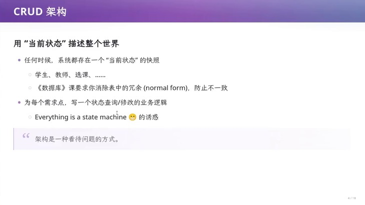

> 🎞️ 视频画面时间区间：01:19:30–01:19:45。


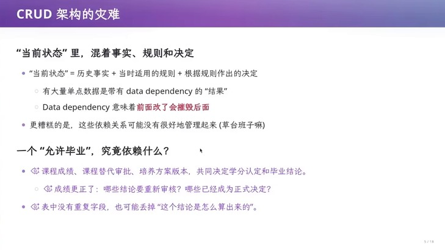

> 🎞️ 视频画面时间区间：01:22:00–01:22:15。


讲者由此得出那句话的后果：你知道这个学生可以毕业，但*你不知道他为什么可以毕业*；你知道他不能毕业，也不知道为什么不能——计算的过程丢掉了。而依赖关系在实践中往往“没有被很好地管理起来”，讲者对此的说法很直白：草台班子嘛。

> [!WARNING] 用当前状态表达历史结论，是 CRUD 最容易被忽视的缺陷
>
> 把“允许毕业”这样的结论当普通字段存储，会同时造成三种损失：**可解释性**（无法回答为什么）、**可重算性**（事实更正后无法定位需要重算的对象）、**可审计性**（无法区分正常审核、人工特批与某次救火）。三者叠加之后，任何一次规则修订都要靠人肉排查，而不是靠系统重算。

## 11.4 有损投影：系统外的事实会变成无法解释的黑洞

讲者把话题从“结论怎么算”推到“事实有没有被建模”。他的表述是：软件是现实世界物理过程的一个有损投影，所以物理世界里建模不了的东西，最后都要通过其他途径解决。幻灯片给了两个方向的例子。第一个方向是“政策更新、领导批准还没有进入教务系统”——现实里培养方案已经通过、学期已经开始、课已经在上，但系统里还没有这批数据，于是“过了今天这小朋友就不能毕业了”，最后的做法是赶紧在系统里 hack 成满足毕业条件。第二个方向是系统里建模了但现实不同步，讲者举的是第一周教室还在修——系统没有对“这个教室暂时不可用”建模，于是只能靠人工重新安排；他自己第一周就是在另一个教室上的课。

两个方向叠加的结果是系统里积累起大量不一致的数据，“随着时间变成无法解释的黑洞”：一个明明不该毕业的同学为什么毕业了？一个没有交学费应该毕不了业的人为什么能毕业？讲者给出的应对方式是把“例外”也变成可表达的业务：记录“谁批准了哪项豁免、适用于谁、依据什么”，再由审批产生业务决定；否则只留下一个布尔值，以后连“这是特批还是算错了”都分不清。

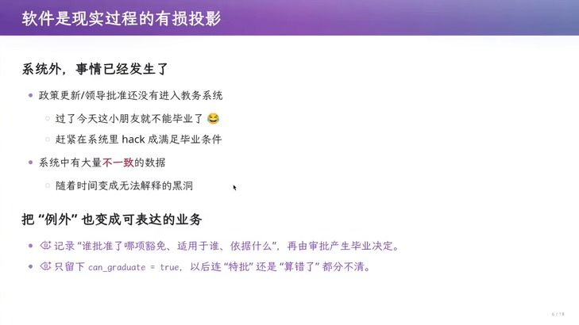

> 🎞️ 视频画面时间区间：01:23:45–01:24:00。


## 11.5 同一个 `dept_id`，还是新的 `dept_id`

讲者用自己的处境举了一个最具体的例子：南京大学已经没有“计算机系”了，它变成了计算机学院。在这个变化面前，CRUD 架构因为它是一个单一事实来源而“瑟瑟发抖”。他给出两个选择，并指出两者都在承诺一种业务语义。

选择一是沿用旧的 ID、只覆盖名称。好处是学生、课程、权限关联继续有效；代价是旧报表一 JOIN，历史上的“计算机系”也一起变成了“计算机学院”——讲者的原话是，系统如果打印一份证明，就会生成“2011 年毕业于南京大学计算机学院”，而他当年毕业时这个学院还不存在，这与事实不符。

选择二是新建一个 ID。好处是旧组织得以保留；代价是不迁关联时新学院像个空壳，而全量迁移关联时，学生和课程过去的归属又被改写了。幻灯片补充了必须一并定义的东西：跨年统计、权限继承、培养方案适用范围。它给出的设计方法是先判断身份是否延续、再给变化建模——如果业务认定组织身份延续，就保留稳定的 `org_id`，名称、层级、隶属关系按有效期保存版本；如果业务认定产生了新组织，就建立新 ID，记录带日期的承继关系，学生与课程按业务决定转移并保留原归属。最后一条是关于查询语义的：查询要明确选择“当时归属”还是“按今天口径汇总”，培养方案要单独绑定版本，不能让新名称自动触发新规则。

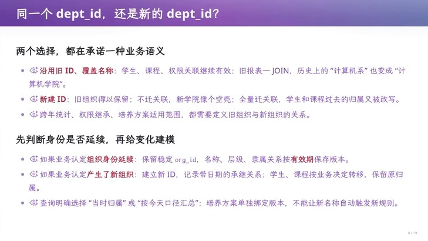

> 🎞️ 视频画面时间区间：01:26:15–01:26:30。


## 11.6 迁移的代价与“手艺活”

讲者随后把代价讲到底。幻灯片的核心句是：代码可以重写，历史不能凭空补出来。数据库迁移与业务逻辑重写都是风险极高的操作，因为不一致的数据无法解释——同样一个“已毕业”，可能来自正常审核、可能来自人工特批，也可能只是某次救火。他还有一句更冷的判断：迁移需要决定哪些历史语义继续成立；没有保存的依据，AI 也推不回来。幻灯片把这类系统的设计、实现、维护称为“手艺活”，并说这也是 ERP 类系统的护城河。

讲者用两个真实经历支撑这个判断。第一段是行业史：教务系统背后那家公司在 2000 年成立时，唯一的选择就是参考一个已有的企业架构做教务系统、抢占教育市场的第一桶金；它把系统做出来之后，就背上技术债，在中国大学教育改革几十年的时间里不断扛下所有。第二段是他读博时的亲身见闻：隔壁软件工程组接了学校研究生院的教务系统订单，二三十万的量级在定制软件里算比较小的订单，而后来研究生大规模扩招、培养类型变多、管理需求不断变化，这些在最初做需求设计时都是始料未及的；系统最终彻底变成史山，最后不再存在，改成由公司统一维护的系统。

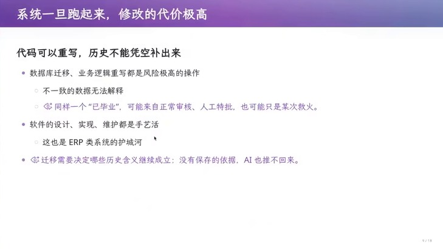

> 🎞️ 视频画面时间区间：01:28:15–01:28:30。


## 11.7 本章小结

CRUD 架构的前提是“世界的投影不变”：状态表加范式化在需求的投影稳定时是完美设计，一旦需求发生摧毁性变化就会失效。它失效的方式有三种：结论型字段丢掉了依赖关系，导致无法解释与无法重算；系统外的事实没有被建模，导致不一致随时间积累；身份与归属这类语义变化没有版本，导致历史记录被新口径改写。而修改的代价又因为数据不可重建而极高。下一个问题正是本讲的收束：如果“当前状态”这条路走不通，能不能换一个数据结构，让历史本身就是系统的一部分？

# 12 Event Sourcing 与 CQRS：把依赖变成 First-Class Citizens

## 12.1 从“依赖是问题”到“把依赖变成一等公民”

讲者用一句设问开启最后一段：如果我们跳出问题看问题，既然都知道 dependency 是问题，为什么不直接把它们变成 first-class citizens？幻灯片把数据结构的两面点出来：数据结构可以记录“当前状态”，也可以记录“操作历史”。他的例子就是教务业务里最普通的一件事——张三退学了；而在记录操作历史的表示里，同一件事是“张三退学了”这个事件，状态是它的回放结果。

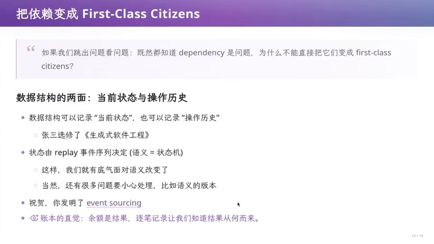

> 🎞️ 视频画面时间区间：01:35:00–01:35:15。


## 12.2 三种等价视图

讲者随后指出一个他在数据结构课讲过的事实：不只当前状态可以被持久化，历史也可以。幻灯片原本的意思可以写成三种视图的等价关系：

```text
Sₙ = replay(e₁, e₂, …, eₙ; S₀) ⟺ Sₙ = apply(δ₁ ∘ δ₂ ∘ ⋯ ∘ δₙ; S₀)
```

- `Sₙ`：第 `n` 步之后的当前状态；
- `S₀`：初始状态；
- `eᵢ`：第 `i` 个业务事件（“张三退学了”“张三复学了”这类已经受理的事实）；
- `δᵢ`：第 `i` 个事件对状态造成的增量（delta）；
- `replay`：按顺序把事件应用到状态上的过程；
- `apply`：把一串增量依次复合到状态上的过程；
- 三种视图指：只存当前状态（CRUD）、只存增量、只存事件日志；讲者说它们*是等价的*，因为都可以回放历史得到当前状态。

讲者提到，这其实就是数据库里的 redo journal、版本管理里 delta 的思想，以及 CRUD 的当前状态；而 persistent data structure 让它成为可能——你存一个数据结构（比如一棵树），每次修改不覆盖旧节点，而是从受影响的节点到根长出一条新路径，于是“无论多大都可以存得下来”。

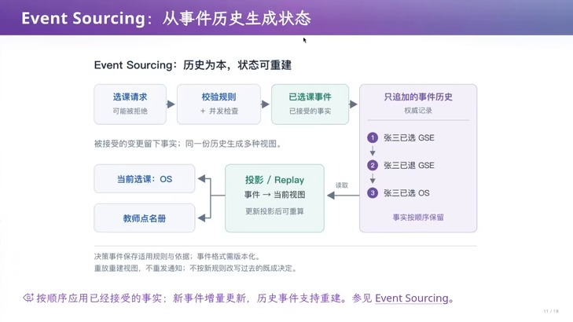

> 🎞️ 视频画面时间区间：01:35:15–01:35:30。


## 12.3 它到底解决了什么：退学、复学与院系调整

讲者用三个例子说明这种表示带来的能力。第一个是“复学”这个操作：假设系统里从来没有“复学”这个概念，在 CRUD 下“张三退学”就是把他的记录抹掉，同时可能删掉他和其他部分的关联；以后要支持复学，你就得把这些关联重建起来，代价很大。而在记录操作历史的表示下，你可以通过 replay 知道张三退学之前的状态是什么，把它取回来就行。讲者同时也诚实地划了边界：逻辑是不能减少的——即便用记录历史的方式，“复学”这件事之前没考虑过，依然要为它写一个逻辑。

第二个例子是数据库迁移时的底气。讲者的描述很形象：如果你在历史可回放的系统里改错了，你不会“手在抖”，因为你可以很快退回到过去的快照，再修复逻辑重来。

第三个例子回到院系调整。在记录事件之后，你可以把“院系调整”本身建模成一个事件：查询一个过去的人时得到他当时的版本，同时知道他经历了什么；如果你要查询他毕业时发生的事情，直接查毕业那个时刻就可以；如果你想要较新的信息，就把与这个人相关的事实截出来 replay 一遍。讲者用 2007 年入学、2011 年毕业、之后计算机系在 2024 年改为计算机学院这条时间线说明：你总是可以裁出一个与事实相关的历史，回放它得到现在需要的状态。

## 12.4 代价与边界

讲者没有把 Event Sourcing 讲成万能药，而是主动给出两个限制。第一是性能：你会立刻反应过来是不是会有性能问题，因为要大量 replay；他的回答是这都不是很大的问题，可以用快照、缓存等技巧优化。第二是迁移的现实性：如果你已经在一座史山上，把它改造成 Event Sourcing 会变得很困难；但如果你从一开始就做这样的设计，很多事情就不会发生。

## 12.5 CQRS：读写可以有不同的模型

讲者在最后一分钟把另一个概念摆出来：CQRS（Command Query Responsibility Segregation，命令与查询职责分离）。幻灯片的定义分三层。Command（写）表达业务意图，例如“申请选课”，它检查资格、容量、冲突，然后接受或拒绝；Query（读）按使用者组织信息，例如学生课表、教师点名册、教务统计；读模型可以针对查询做冗余和预计算，而写模型集中维护约束。分离之后要约定如何同步：如果采用异步更新视图，那么“选课已确认、但课表还没刷新”这个间隙需要界面能解释；读写模型可以共享进程和数据库，是否使用 Event Sourcing 则是另一项选择。幻灯片最后还补了一句历史定位：Pre-LLM 时代就有这些实践，我们开始分别设计“怎样做决定”和“怎样看结果”。

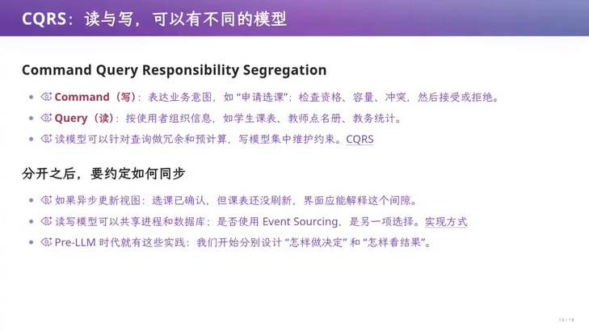

> 🎞️ 视频画面时间区间：01:36:15–01:36:30。


|   | CRUD | Event Sourcing / CQRS |
|---|---|---|
| 保存的内容 | 当前状态（表与字段） | 已受理的事实（事件）加由历史投影出的视图 |
| “为什么”的答案 | 依赖关系没有保存，只能回答“是什么” | 事件带适用规则与依据，可以解释结论的来源 |
| 事实更正 | 直接覆盖，旧结论与它的依据一起消失 | 追加新事件，旧事件保留，视图按需重建 |
| 身份/归属变化 | 改主数据会改写历史口径 | 把变化建模成事件，查询可分“当时归属”与“今天口径” |
| 主要代价 | 需求的摧毁性变化会让迁移与重写不可控 | 需要 replay，必须用快照与缓存控制成本 |
| 适用前提 | 世界的投影稳定、历史不重要 | 需要解释、审计，或预期语义会变 |

**表 2**　CRUD 与 Event Sourcing / CQRS 在“保存什么”和“能否回答为什么”上的差别。表中的取舍依据来自讲者对教务系统的分析，而不是通用结论。

> [!NOTE] 这些概念不需要背，first principle 更重要
>
> 讲者的收尾态度值得单独记下来：Event Sourcing、CQRS 以及 Domain Driven Design 这类“fancy 的软件工程概念”你都可以去看，但*都不需要*。真正要回到的是最初的第一性原理——当你设计一个 50 万行的教育系统时，跳出问题看到根源在哪里，你就能做出正确的架构设计，哪怕你从来没有听说过这些名词。

## 12.6 本章小结

把依赖变成一等公民的做法，是用“事件历史加投影视图”代替“唯一的当前状态”：历史是可回放的资产，结论可以解释、可以重算，身份与归属的语义变化可以建模成事件而不是改写主数据。代价是 replay 的性能，需要靠快照与缓存化解，而且从史山上改造比一开始就设计困难得多。CQRS 则把“怎样做决定”和“怎样看结果”分开，让读模型可以为查询做冗余与预计算。至此，从需求到架构的整条线索闭合：技术债来自被固定的规则，架构的价值在于让变化只影响一个地方。

# 13 总结与延伸

## 13.1 讲者自己的收束

讲者在结尾没有给鸡汤，只给了一条回到第一性原理的路径。他说，当你设计一个 50 万行的教育系统时，跳出这个问题去看教育系统根源的问题在哪里，你就能做出正确的架构设计；哪怕你没有听说过 Event Sourcing、CQRS 这些名字。他也把这条路径的前提讲清楚了：这是“跳出问题看问题”的能力，而不是某个框架的知识——这一点和他在十行汉诺塔处说的“代码之外有客户的规律，客户之外有社会的规律”是同一句话。

## 13.2 本讲的压缩

把 96 分钟的内容压成一条链，它是这样的。第一步，AI 让“把需求写成代码”变得极其便宜（§2），于是瓶颈从实现转移到需求、产品设计与架构。第二步，需求本身是不可收敛的：多方目标冲突、客户表达模糊、现实规则开放（§3--§5）。第三步，需求一旦被固定成界面控件、字段与硬编码规则，就变成技术债；此后规则外的例外只能靠人工改库兜底，规则内的字段一旦越界就会让依赖它的整片视图失效（§6--§7）。第四步，能改变这个局面的只有架构，因为架构决定了“一次变化影响几个地方”和“复杂性被放在哪里”（§8）。第五步，架构的手法有一个共同的形状：先构造一个中间表示，再从它出发做下一步——getopt 的解析状态、IR 加双后端、事件历史加投影视图都是同一件事（§8--§12）。

这条链上有一个反复出现的判据，可以作为本讲最值得带走的东西：*如果一个系统只能在“当前状态”上回答问题，它就无法回答“为什么”；而所有会被制度、身份、政策改变的领域，都必然需要回答“为什么”。*

## 13.3 三个具体的行动建议

第一，在需求阶段就为“例外”留位置。培养方案案例说明例外不会消失，它只会以 override 的形式出现。与其让管理员去改数据库，不如把“谁批准了哪项豁免、适用于谁、依据什么”建成可表达的业务，让审批本身产生业务决定。

第二，判断一个设计是否安全，问它不是“能不能跑”，而是“这个需求如果换一种形态，要改几处”。Excel 二维码的教训是：如果所有单元格都硬编码，那么把结果块右移一格就是一次重写；如果计算通过 IR 生成，那就只是一个位置参数。

第三，把“历史不可重建”当成架构的硬约束。数据、外部契约与用户可用性三者之一成立时，重做就不是选项（§7）；此时唯一能救你的是“事实不可篡改、系统里的一切都是对事实的投影”这条直觉——讲者把它称为账本的直觉：余额是结果，逐笔记录让我们知道结果从何而来。

## 13.4 边界与开放问题

本讲给出的证据全部来自一个业务领域（教务管理）与三个规模层次的例子（10 行、2000 行、50 万行），因此它对“何时该用 Event Sourcing”这个问题只给出了定性判断：已经在史山上改造困难，从一开始设计则代价小。至少有三个问题它没有回答，值得带着往下走。

其一，快照与缓存的引入会不会重新制造“当前状态”的同一个问题？如果快照本身被当作事实，那么“为什么”的能力就可能再次丢失。

其二，事件格式的版本化在实践中如何管理？幻灯片已经点出“决策事件保存适用规则与依据，事件格式需版本化”，以及“不按新规则改写过去的既成决定”；但当规则本身修订时，回放旧事件究竟应该用旧规则还是新规则，这需要领域内的明确约定。

其三，CQRS 的最终一致性与业务可接受性如何对齐？讲者给的判据是界面要能解释“选课已确认但课表还没刷新”这个间隙；在教务这种强约束场景里，哪些读模型允许滞后、哪些不允许，是一个需要业务参与而不只是技术决定的问题。

## 13.5 拓展阅读

讲者在视频中点名的资料有：Royce 关于瀑布式过程与管理风险的早期论文、Brooks 的《没有银弹》（No Silver Bullet，幻灯片标注 1987），Parnas 关于信息隐藏与变化边界的模块化论文（1972），Rittel & Webber 关于 wicked problem 的论文（1973），Zhang & Norman 关于汉诺塔同构变体的实验（1994）；除此之外，Event Sourcing 与 CQRS 是幻灯片在结尾点出的设计模式名称，视频没有给出处。这些是视频里明确出现的引用，本讲义没有补充视频之外的来源。
